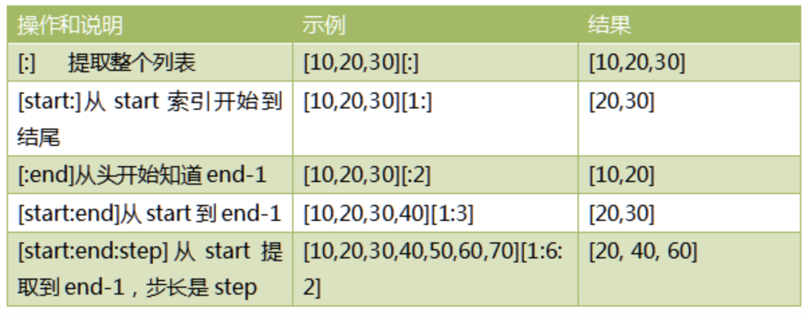
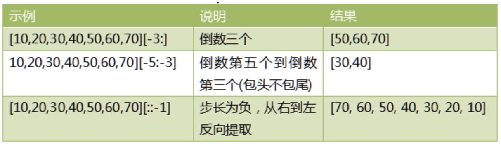

# 05-切片操作


切片是Python序列及其重要的操作，适用于列表、元祖、字符串等等。切片的格式如下：

切片slice操作可以让我们快速提取子列表或修改。标准格式为：

- [起始偏移量start:终止偏移量end[:步长step]]

**注意：当步长省略时顺便可以省略第二个冒号**


典型操作(三个量为正数的情况下)如下：



其它操作（三个量为负数）的情况：




切片操作时，起始偏移量和终止偏移量不在[0，列表长度-1]这个范围，也不会报错。起始偏移量小于0则会当作0，终止偏移量大于长度-1会被当成长度-1.


```
>>> [10,20,30,40][1:30]
[20, 30, 40]
```

我们发现正常输出了结果，没有报错。

## 列表的遍历

for obj in listobj:
    print(obj)


## 复制列表所有的元素到新列表对象

如下代码实现列表元素的复制了吗？

```
>>> list1 = [30,40,50]
>>> list2 = list1
```

只是将list2也指向了列表对象，也就是说list2和list1持有地址值是相同的，列表对象本身的元素并没有复制。


我们可以通过如下简单方式，实现列表元素内容的复制：

```
>>> list1 = [30,40,50]
>>> list2 = [] + list1
```

**后面会学习copy模块，使用浅复制或深复制实现我们的复制操作**


