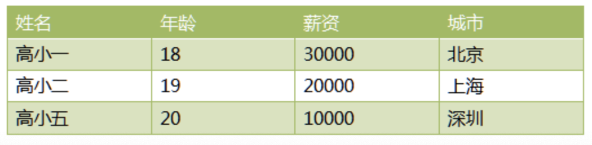
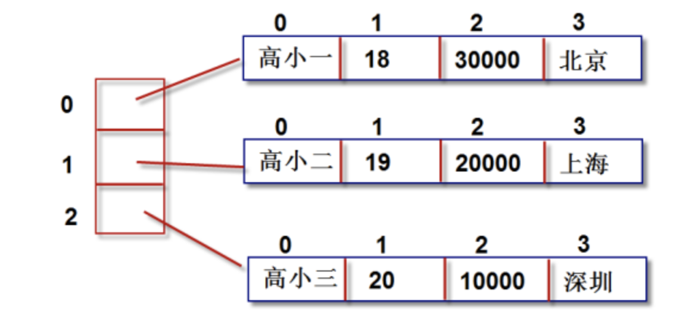

# 07-多维列表


## 二维列表

- 一维列表可以帮助我们存储一维、线性的数据。
- 二维列表可以帮助我们存储二维、表格的数据。



```
a = [
　　["高小一",18,30000,"北京"],
　　["高小二",19,20000,"上海"],
　　["高小一",20,10000,"深圳"],
　　]
```

**内存结构图**




嵌套循环打印二维列表所有的数据

```
a = [
　　["高小一",18,30000,"北京"],
　　["高小二",19,20000,"上海"],
　　["高小一",20,10000,"深圳"],
　　]
　　for m in range(3):
　　    for n in range(4):
　　        print(a[m][n],end="\t")
　　    print() #打印完一行，换行
```