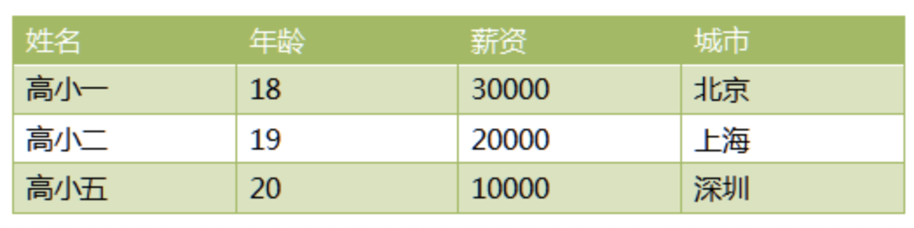

# 15-表格数据使用字典和列表存储





```
r1 = {"name": '高小一', 'age': 18, 'salary': 30000, 'city': '北京'}
r2 = {"name": '高小二', 'age': 19, 'salary': 20000, 'city': '上海'}
r3 = {"name": '高小五', 'age': 20, 'salary': 30000, 'city': '深圳'}

tb = [r1, r2, r3]
print(tb)
# 打印第二行的人的薪资
print(tb[1].get("salary"))

# 打印表中所有人的薪资
for i in range(3):
    print(tb[i].get("salary"))

# 打印表中所有数据
for i in range(3):
    print(tb[i].get("name"), tb[i].get("age"), tb[i].get("salary"), tb[i].get("city"))

```
