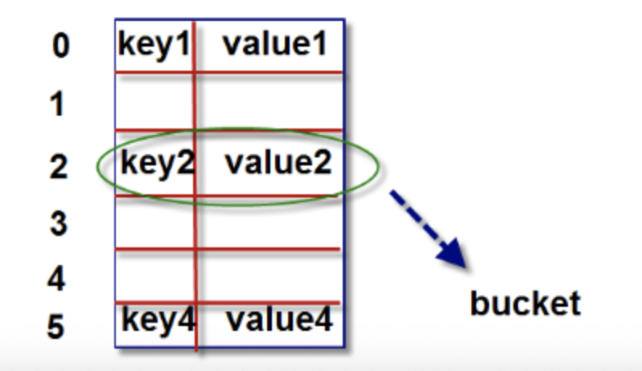
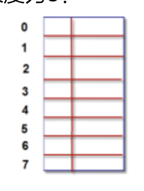
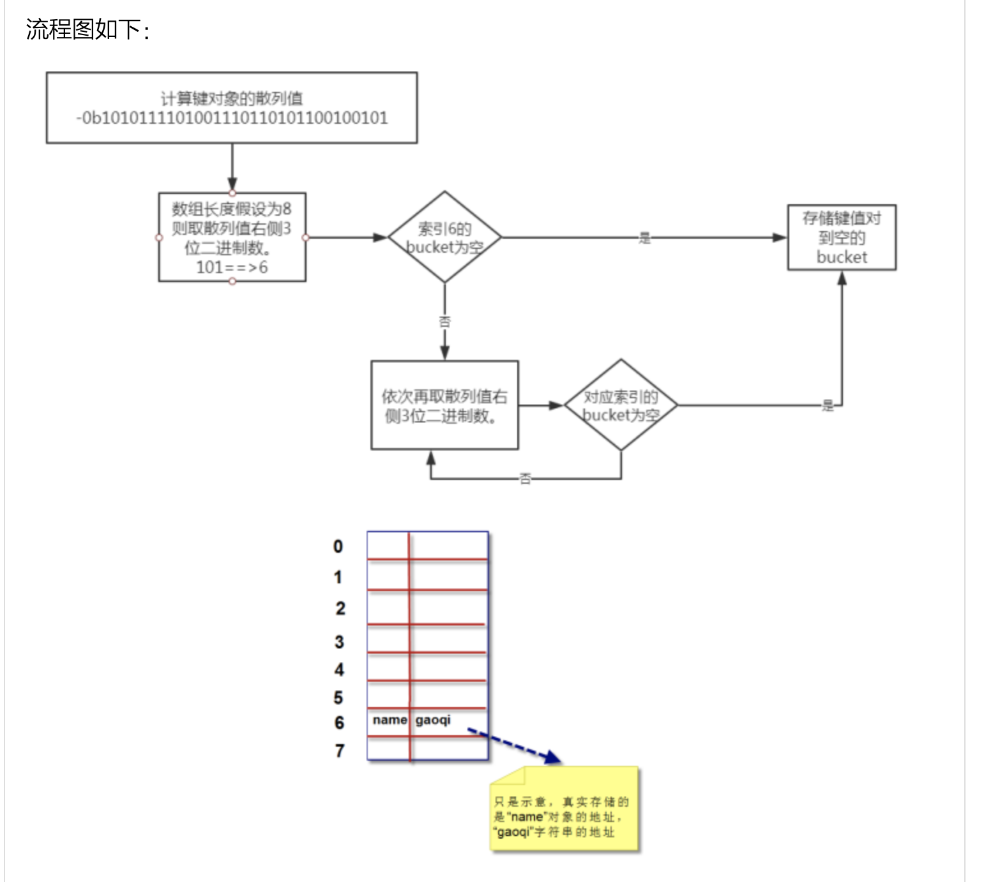
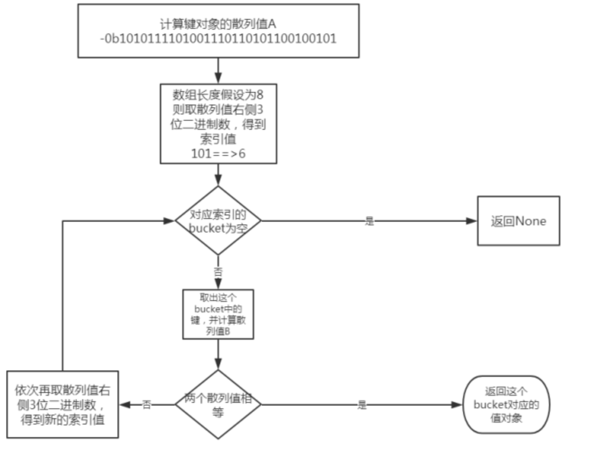

# 16-字典核心底层原理

字典的核心是散列表。散列表是一个稀疏数组(总是有空白元素的数组)，数组的每个单元叫做bucket。每个bucket有两部分：一个是键对象的引用，一个是值对象的引用。


由于，所有bucket结构和大小一致，我们可以通过偏移量来读取指定bucket。




## 将一个键值对放进字典的底层过程

```
a = {}
a['name'] = 'longyu'
```

假设字典a对象创建完后，数组长度为8:



我们要把‘name' = 'longyu'这个键值对放到字典对象a中，首先第一步需要计算键name的散列值。Python中可以通过hash()来计算。

```
>>> bin(hash('name'))
'-0b10010111001111110000000010010110011001010111110000110100111100'
```

由于数组长度为8，我们可以拿计算出的散列值的最右边3位数字作为偏移量，即100，十进制数字是4.我们查看偏移量4对应的bucket是否为空。如果为空，则将键值对放进去。如果不为空，则依次取右边3位作为偏移量，即111，十进制数字是7.再查看偏移量7的bucket是否为空。直到找到为空的bucket将键值对放进去，如果找完还没找到，则会扩容。




**扩容**

python会根据散列表的拥挤程度扩容。扩容指的是：创建更大的数组，将原有内容拷贝到新数组中。接近2/3时，数组就会扩容。


## 根据键查找键值对的底层过程

我们明白了，一个键值对是如何存储到数组中的，根据键对象取到值对象，理解起来就简单了。

```
>>> a.get("name")
'longyu'
```

当我们调用a.get('name')，就是根据键name查找到键值对，从而找到值对象"longyu"

第一步，我们仍要计算“name”对象对散列值：
```
>>> bin(hash('name'))
'-0b10010111001111110000000010010110011001010111110000110100111100'
```
和存储的底层流程算法一致，也是依次取散列值的不同位置的数字。 假设数组长度为8，我们可以拿计算出的散列值的最右边3位数字作为偏移量即“100”，十进制是数字4。我们查看偏移量4，对应的bucket是否为空。如果为空，则返回None。如果不为空，则将这个bucket的键对象计算对应散列值，和我们的散列值进行比较，如果相等。则将对应“值对象”返回。如果不相等，则再依次取其他几位数字，重新计算偏移量。依次取完后，仍然没有找到。则返回None。流程图如下：




**用法总结**

- 键必须可散列
  - 数字、字符串、元组，都是可散列的
  - 自定义对象需要支持下面三点
    - 支持hash()函数
    - 支持通过__eq__()方法检测相等性
    - 若a==b为真，则hash(a)==hash(b)也为真

- 字典在内存中开销巨大，典型的空间换时间。
- 键查询速度很快
- 往字典里面添加新键可能导致扩容，导致散列表中键的次序变化。因此，不要在遍历字典的同时进行字典的修改。

