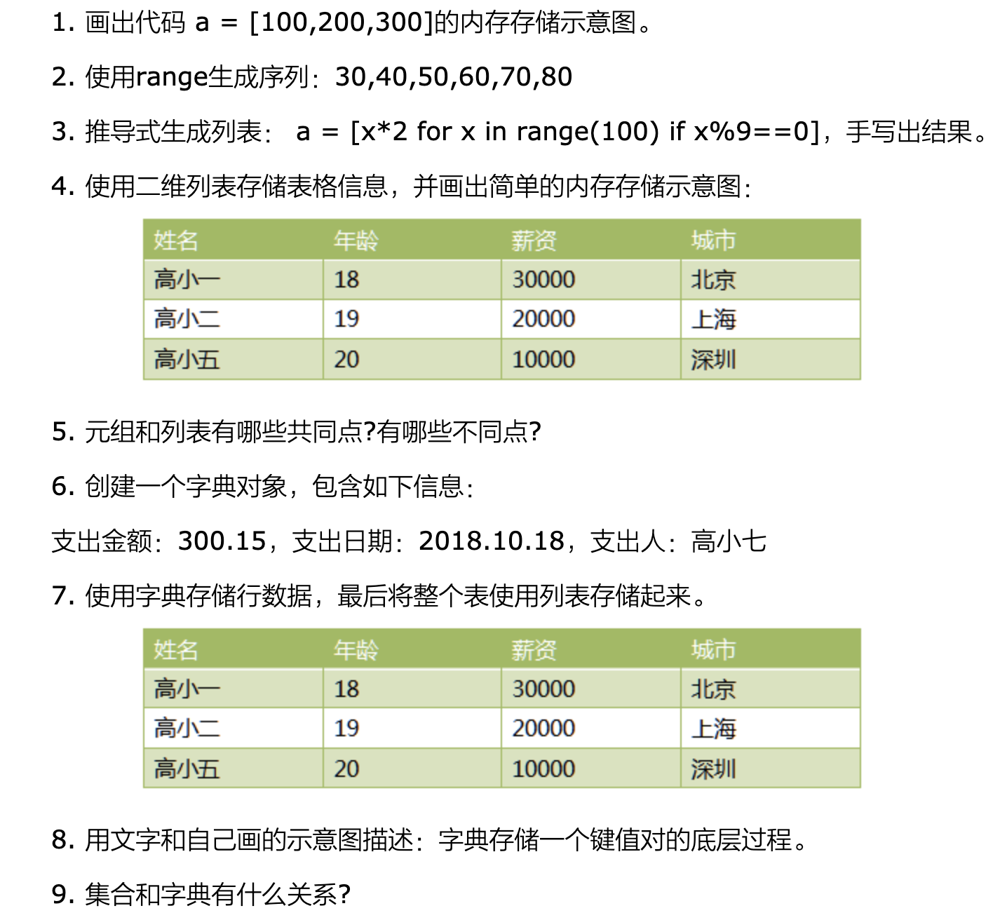

# 18-章节作业




```
## 第二题
>>> list(range(30,90,10))
[30, 40, 50, 60, 70, 80]

## 第三题
[0, 18, 36, 54, 72, 90, 108, 126, 144, 162, 180, 198]

## 第四题
a = [
    ['高小一', 18, 30000, '北京'],
    ['高小二', 19, 20000, '上海'],
    ['高小三', 20, 10000, '深圳']
]

## 第五题
1、元组和列表都是序列，都具备访问元素、删除元素方法，排序、切片，计数等操作方法
2、列表是可变序列，而元组是不可变序列，所以元组不支持元素的添加、修改、删除等方法

## 第六题
a = {'salary':300.15,'date':'2018.10.18','people':'高小七'}

## 第七题
r1 = {"name": '高小一', 'age': 18, 'salary': 30000, 'city': '北京'}
r2 = {"name": '高小二', 'age': 19, 'salary': 20000, 'city': '上海'}
r3 = {"name": '高小五', 'age': 20, 'salary': 30000, 'city': '深圳'}

tb = [r1, r2, r3]

## 第9题
集合底层实现是字典，集合中的值相当于字典中的键，所以集合中的值是不可重复且唯一的，而字典的键也是如此，但字典是键值对，而值是任意的。
```