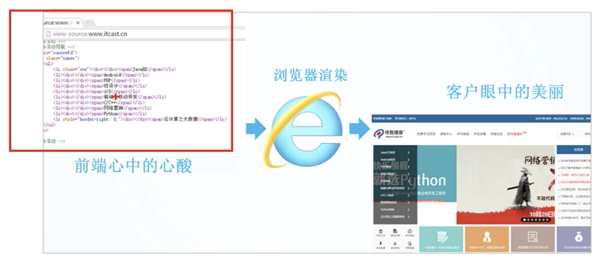
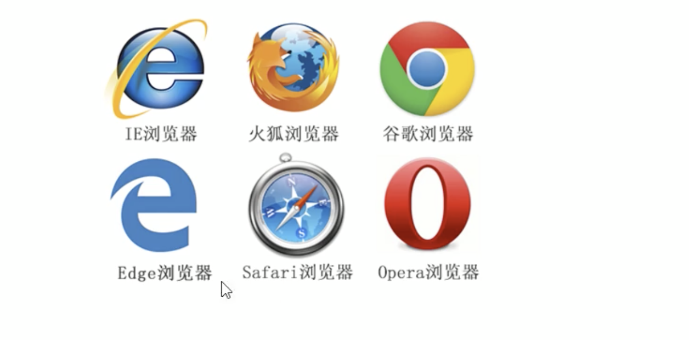
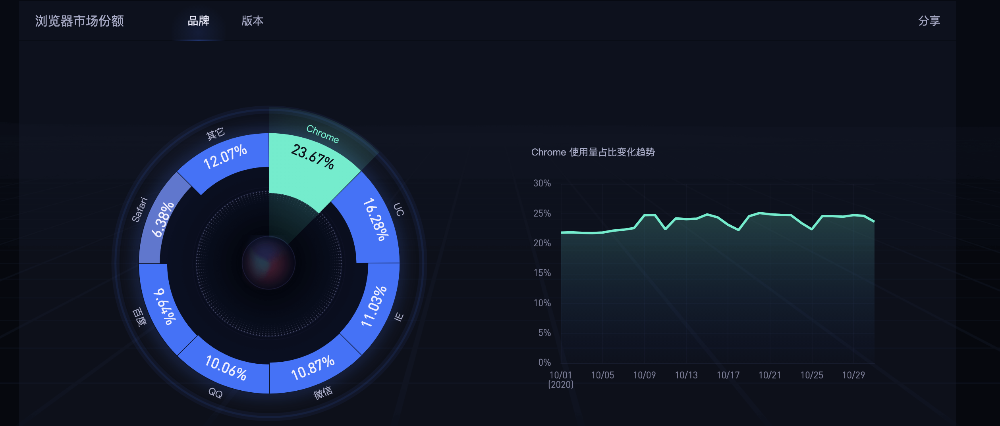
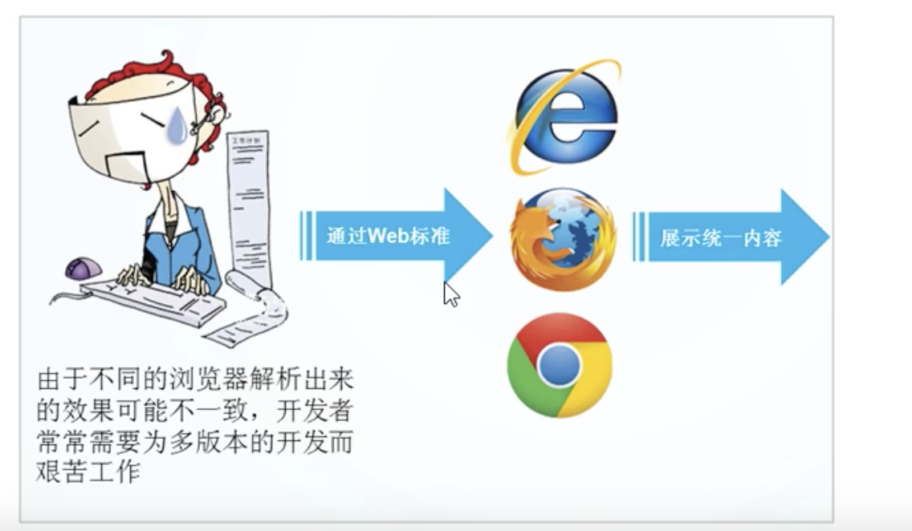

# 01-HTML简介

## 网页

### 什么是网页

网站是指在因特网上根据一定的规则，使用HTML等制作等用于展示特定内容相关等网页集合。

网页是网站中的一页，通常是HTML格式的文件，它要通过浏览器来阅读。

网页是构成网站的基本元素，它通常由图片、链接、文字、声音、视频等元素组成。通常我们看到的网页，常见以.html或.htm后缀结尾的文件，因此将其俗称为HTML文件。

### 什么是HTML

- HTML指的是超文本标记语言（Hyper Text Markup Language），它是用来描述网页的一种语言。

HTML不是一种编程语言，而是一种标记语言，相当简单。

标记语言是一套标记标签（markup tag）。

**所谓超文本，有2层含义：**

1、他可以加入图片、声音、动画、多媒体等类容（超越了文本限制）。
2、它还可以从一个文件跳转到另一个文件，与世界各地主机的文件连接（超级链接文本）。

### 网页的形成

网页是有网页元素组成的，这些元素利用html标签描述出来，然后通过浏览器解析来显示给用户的。

前端人员开发代码  ----> 浏览器显示代码（解析、渲染） ---->  生成最后的web页面

**网页的总结**

- 网页是图片、链接、文字、声音、视频等元素组成，其实就是一个html文件
- 网页生成制作：有前端开发人员书写HTML文件，然后浏览器打开，就能看到了网页
- HTML：超文本标记语言，用来制作网页的一门语言，有标签组成的。

## 常用浏览器

浏览器是网页显示、运行的平台。常用的浏览器有：IE、火狐（firefox）、谷歌（chrome）、safari和Opera等。平时称为5大浏览器！

目前使用谷歌浏览器的人数占比最多，推荐使用谷歌。

### 浏览器内核

浏览器内核（渲染引擎）：负责读取网页的内容，整理讯息，计算网页的显示方式并显示网页。

| 浏览器         | 内核     | 备注                                          |
| :------------ | :------ | :-------------------------------------------- |
| IE            | Trident | IE、猎豹安全、360极速浏览器、百度浏览器            |
| firefox       | Gecko   | 火狐浏览器内核                                  |
| Safari        | Webkit  | 苹果浏览器内核                                  |
| Chrome、Opera | Blink   | Chrome、Opera浏览器内核。Blink其实是webkit的分支 |

目前我们国内一般浏览器都会采用Webkit/Blink内核，如360、UC、搜狗等。

## web 标准

Web 标准是由W3C组织和其他标准组织制定等一系列标准的集合。W3C（万维网联盟）是国际最著名的标准化组织。

### 为什么需要web标准

浏览器不同，它们显示页面或者排版就有些许差异。

 

遵循web标准除了可以让不同的开发人员写出的页面更标准，更统一外，还有以下优点：

- 让web的发展前景更广阔
- 内容能被更广泛的设备访问
- 更容易被搜索引擎搜索
- 降低网站流量费用
- 使网站更易于维护
- 提高页面浏览速度

### web标准的构成

- 主要包括结构（Structure）、表现（Presentation）和行为（Behavior）三个方面。

| 标准 | 说明                                                    |
| :-- | :------------------------------------------------------- |
| 结构 | 结构用于对网页元素进行整理和分类，现阶段主要学习的是HTML         |
| 表现 | 表现用于设置网页元素的版式、颜色、大小等外观样式，主要指的是CSS   |
| 行为 | 行为是指网页模型的定义及交互的编写，现阶段主要学习的是javascript |

web标准的最佳体验方案：**结构、样式、行为相分离。**

简单理解：**结构写到HTML文件中，表现写到CSS文件中，行为写到javascript文件中。**

相比三者而言，结构最重要！！！

