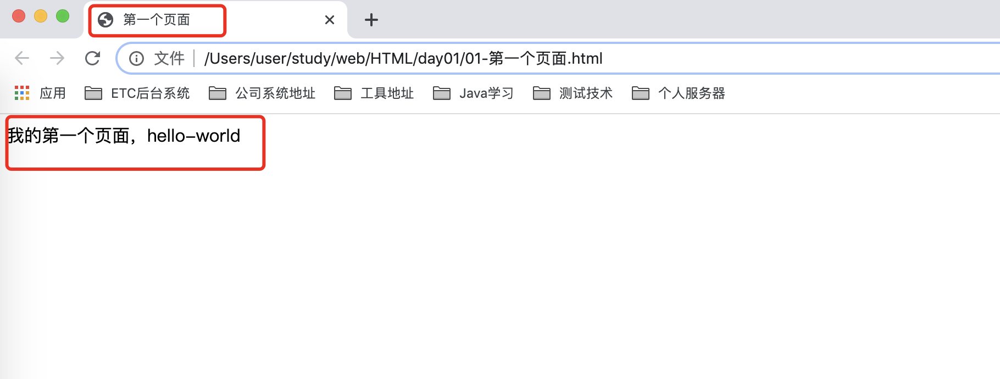
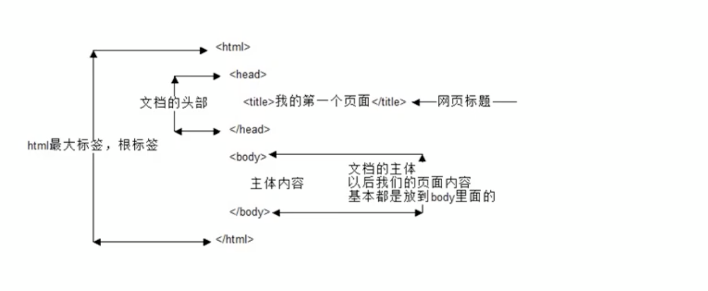
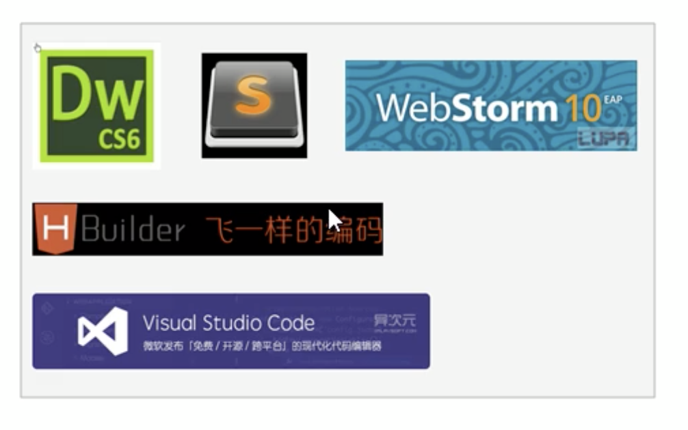
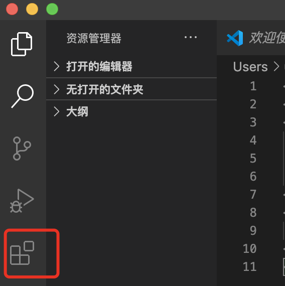
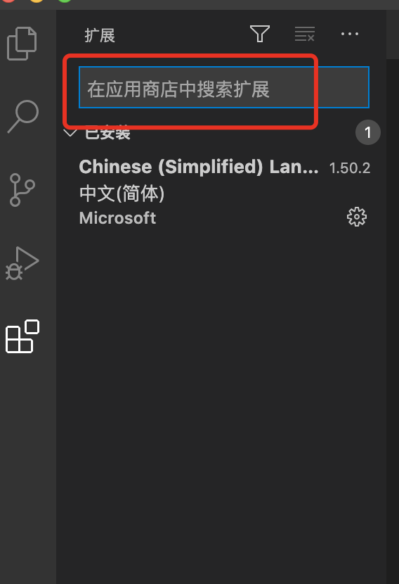
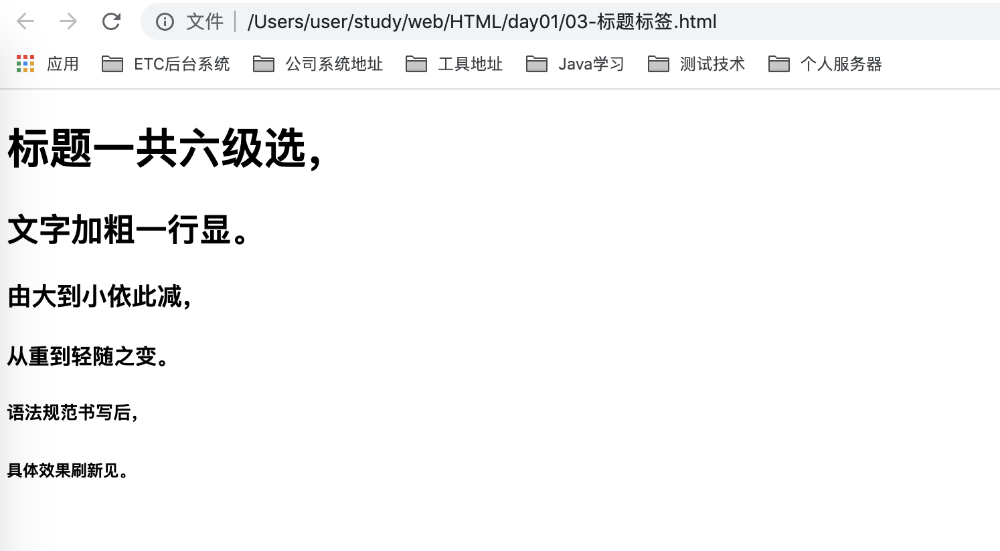

# 02-HTML(上)标签


## HTML语法规范

- HTML标签是由尖括号包围的关键词，例如\<html>。
- HTML标签通常都是成对出现的，例如\<html>和\</html>,我们称为双标签。标签对中对第一个标签是开始标签，第二个标签是结束标签。
- 有些特殊对标签必须是单个标签（极少情况），例如\<br /> ，我们通常称为单标签。


### 标签关系

双标签可以分为两类：包含关系和并列关系

**包含关系**（也称父子关系）：
```
<head>
    <title> </title>
</head>
```

**并列关系**(也称兄弟关系)：
```
<head>  </head>
<body>  </body>
```


## HTML基本结构标签

每个网页都会有一个基本的结构标签（也称为骨架标签），页面内容是在这些基本标签上书写。

HTML页面也称为HTML文档。

**基本结构标签如下：**
```
<html>
<head>
    <title>我的第一个页面</title>
</head>
<body>
    第一个HTML页面，hello world
</body>
</html>
```

| 标签名             | 定义      | 说明                                            |
| :---------------- | :-------- | :---------------------------------------------- |
| \<html>\</html>   | HTML标签  | 页面中最大的标签，我们称为根标签                    |
| \<head>\</head>   | 文档的头部 | 注意在head标签中我们必须要设置的标签是title          |
| \<title>\</title> | 文档的标题 | 让页面拥有一个属于自己的网页标题                    |
| \<body>\</body>   | 文档的主体 | 元素包含文档的所有内容，页面内容基本都是放到body里面的 |


HTML文档的后缀名必须是.html或.htm，浏览器的作用是读取HTML文档，并以网页的形式显示出它们。

此时，用浏览器打开这个网页，我们就可以预览我们写的第一个HTML文件了。

案例如下：

```
<html>
<head>
	<title>第一个页面</title>
</head>
<body>
	我的第一个页面，hello-world
</body>
</html>
```

打开浏览器显示如下：



**基本结构标签总结：**




## 开发工具

常用网页开发工具如下：



vs-code在前端开发人员使用的占比较多，我们就以vs-code这个工具开始学习练习。


### vs-code工具使用

- 1、双击打开软件
- 2、新建文件（Crtl+N）
- 3、保存（Crtl+S），注意要保存为.html文件
- 4、Crtl + 加号键，Crtl + 减号键 可以放大缩小视图
- 5、生成页面骨架架构。 输入！按下Tab键即可
- 6、利用插件在浏览器中预览页面：单击鼠标右键，在弹出出口点击“Open in Defalut Browser”


### vs code 插件安装

安装方法：（如下标红的按钮则是插件安装按钮）



接下来，在输入框内输入需要安装的插件名即可（不需要全部输入，自带联想功能）


安装完插件后，重启vs-code工具插件即可使用。


**推荐安装的插件：**

| 插件                                               | 作用                       |
| :------------------------------------------------- | :------------------------ |
| Chinese（Simplelified）Language  Pack for VS Code | 中午简体语言包              |
| Open in Browser                                   | 右击选择浏览器打开html文件   |
| Auto Rename Tag                                   | 自动重命名配对的HTML/XML标签 |
| CSS Peek                                          | 追踪至样式                  |


### vs code 工具生成骨架标签新增代码

- \<!DOCTYPE > 标签 ：文档类型申明，作用就是告诉浏览器使用哪种HTML版本来显示网页
```
<!DOCTYPE html>
```
这句代码的意思是：当前页面采用的是HTML5版本来显示网页

注意：
<!DOCTYPE >     声明位于文档中最前面的位置，处于\<html>标签之前。
<!DOCTYPE >    不是一个HTMKL标签，他就是文档类型申明标签。

- \<html lang="en"> ：lang语言种类

用来定义当前文档显示的语言。

1、en定义语言为英语
2、zh-CN定义语言为中文

简单来说，定义为en就是英文网页，定义为zh-CN就是中文网页。其实对于文档显示来说，定义成en的文档也可以显示中文，定义成zh-CN的文档也可以显示英文。

这个属性对浏览器和搜索引擎（谷歌、百度等）还是有作用的。


- 字符集

字符集（character set）是多个字符的集合。以便计算机能够识别和存储各种文字。
在\<head>标签内，可以通过\<meta>标签的charset属性来规定HTML文档应该使用哪种字符编码
```
 <meta charset="UTF-8">
```
charset 常用的值有：GB2312、BIG5、GBK、和UTF-8，其中UTF-8也被称为万国码，基本包含了全世界所有国家需要用到的字符。


**注意： 上面语法是必须要写的代码，否则可能引起乱码的情况。一般情况下，统一使用“UTF-8”编码，尽量统一写成标准的“UTF-8”,不要写成"utf-8'或"UTF8"**。


## HTML常用标签  


### 标签的语义

学习标签是有技巧的，重点是记住每个标签的语义。简单理解就是指标签的含义，即这个标签是用来干嘛的。

**根据标签的语义，在合适的地方给一个最为合理的标签，可以让页面结构更清晰。**


### 常用标签


#### 标题标签\<h1> - \<h6> (重要)

为了使网页更具有语义化，我们经常会在页面中用到标题标签。HTML提供了6个等级的网页标题，即\<h1> - \<h6>

```
<h1> 我是一级标题 </h1>
```
单词head的缩写，意为头部、标题。

标签语义：作为标题使用，并且依据重要性递减。

**特点：**

- 加了标题的文字会变的加粗，字号也会依此变大。
- 一个标题独占一行

```
    <h1>标题一共六级选，</h1>
    <h2>文字加粗一行显。</h2>
    <h3>由大到小依此减，</h3>
    <h4>从重到轻随之变。</h4>
    <h5>语法规范书写后，</h5>
    <h6>具体效果刷新见。</h6>
```
效果如下：




####  段落和换行标签

**段落标签：**

在网页中，要把文字有条理的显示出来，就需要将这些文字分段显示。在HTML标签中，\<p>标签用于定义段落，他可以将整个网页分为若干个段落。

```
<p> 我是一个段落标签 </p>
```

标签语义：可以把HTML文档分割为若干段落。


特点：

- 文本在一个段落中会根据浏览器窗口的大小自动换行。
- 段落和段落之间保有空隙。


**换行标签：**

在HTML中，一个段落中的文字会从左到右依此排列，直到浏览器窗口的右端，然后才自动换行。如果希望某段文本强制换行显示，就需要使用换行标签\<br />。


```
<br />  # 单词break的缩写，意为打断、换行
```

特点：

- \<br /> 是个单标签。
- \<br /> 标签只是简单的开始新一行，跟段落不一样，段落之间会插入一些垂直的间距。


#### 文本格式化标签

在网页中，有时需要为文字设置粗体、斜体、或下划线等效果，这是就需要用到HTML中的文本格式化标签，使文字以特殊的方式显示。

标签语义：突出重要性，比普通文字更重要

| 语义   | 标签                              | 说明                                |
| :---- | :------------------------------- | :---------------------------------- |
| 加粗   | \<strong>\</strong>或者\<b>\</b> | 更推荐使用\<strong>标签加粗，语义更强烈 |
| 倾斜   | \<em>\</em> 或者\<i>\</i>        | 更推荐使用\<em>标签倾斜，语义更强烈     |
| 删除线 | \<del>\</del>或者\<s>\</s>       | 更推荐使用\<del>标签删除线，语义更强烈  |
| 下划线 | \<ins>\</ins>或者\<u>\</u>       | 更推荐使用\<ins>标签下划线，语义更强烈   |


#### \<div>和\<span>标签

\<div>和\<span>是没有语义的，它们就是一个盒子，用来装内容的，也是用来布局的。

```
<div> 这是头部 </div>
<span> 今日价格 </sapn>
```
div是division的缩写，表示分割、分区。span意为跨度、跨距。

**特点：**

- \<div>标签用来布局，但是现在一行只能放一个\<div>. 大盒子
- \<span>标签用来布局，一行上可以多个\<span>. 小盒子


#### 图像标签

在HTML标签中，\标签用于定义HTML页面中的图像。

```
  # 单词image的缩写，意为图像。
```

src是\标签的必须属性，它用于指定图像文件的路径和文件名。

所谓属性：简单理解就是属于这个图像标签的特性。


**图像标签的其它属性：**

| 属性   | 属性值   | 说明                            |
| :----- | :------ | :------------------------------ |
| src    | 图片路径 | 必须属性                         |
| alt    | 文本    | 替换文本，图像不能显示时候展示的文字 |
| title  | 文本    | 提示文本，鼠标放到图像上展示的文字   |
| width  | 像素    | 设置图像的宽度                    |
| height | 像素    | 设置图像的高度                    |
| border | 像素    | 设置图像的边框粗细                |


**图像标签属性注意点：**

- 图像标签可以拥有多个属性，必须写在标签名的后面。
- 属性之间不分先后顺序，标签名与属性、属性与属性之间均以空格分开。
- 属性采取键值对的格式，即key=value的格式，属性 = 属性值


## HTML中的注释和特殊字符