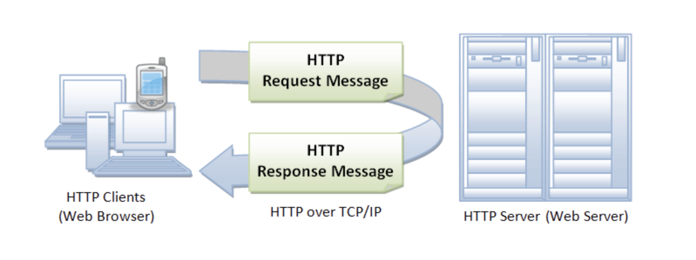
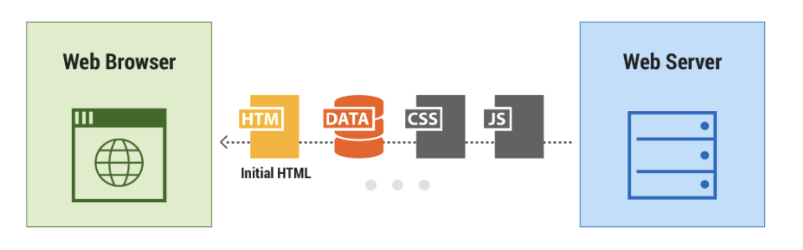
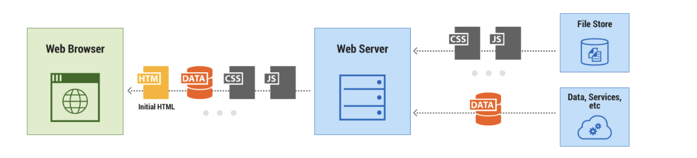

# 01-web开发简介

## web应用技术

当今的互联网时代，大家经常使用电脑上的浏览器或手机进行购物、刷新闻、娱乐，学习。这些丰富多彩的应用，背后的系统是基于web技术开发的。这些web系统通常可以分为：**客户端和服务端。**  比如，手机应用（微信）就是客户端，腾讯公司的微信服务程序（运行在腾讯的机房里面）就是服务端。再比如，电脑打开淘宝，浏览器里面运行的淘宝网页，就是客户端，而阿里巴巴的淘宝服务程序（运行在阿里的机房里面）就是服务端。

也有人喜欢把客户端称为前端，服务端称之为后端。
那么开发客户端（前端）的工程师就会被称之为客户端（前端）工程师！开发服务（后端）的工程师就会被称之为服务端（后端）工程师！

如果一个工程师，同时可以做前端和后端的开发，通常可以称之为web系统全栈工程师。

客户端和服务端之间是需要进行数据信息的交流的。想象一下，当你登录淘宝想查看自己的购买记录，你的购买记录存储在阿里的服务器上，所以浏览器就需要从阿里服务器上获取你的购买记录。那么作为客户端的浏览器或手机是怎样获取信息呢？

- 通常是根据使用http协议（Hypertext Transfer Protocol），客户端通过http协议发送请求信息给服务端，并从服务端接收响应信息。

下面我们就分别来看看前端开发和后端开发大体是做什么。这么我们先关注浏览器前端，也就是web前端。对于手机前端的开发暂不涉及。

## web前端开发

web前端开发的重点是：提供用户界面给用户进行观看和操作。

开发人员需要开发如下文件：

- html文件
  - 用来显示界面给用户看，我们看到的各种美观的web网页就是通过解释html实现的。当然，要显示出各种美观的界面，并且让用户方便的操作，光是html是不够的，还需要下面这些文档。
- CSS
  - css文档控制界面的显示样式和效果，比如字体、大小、颜色、背景、间距、动画等
- 资源文件 （包括显示在界面上的图片、视频等）
- javascript脚本
  - html文档里还包括一些，javascrpit脚本，简称js。
  - js和python一样是编程语言
  - python脚本通过python解释器执行，js脚本通过浏览器内置的js引擎执行。
  - 注意：html和css文档只是定义了一些静态的界面内容。前端的动态功能，就是通过浏览器执行这些js脚本产生的。

当我们浏览一个网站的时候，浏览器先通过http协议获取这些文档，然后读取解释它们的内容，生成对应的界面呈现给我们操作。前端工程师，不仅可以设计实现用户界面，还能使用js语言实现数据获取、分析处理和业务相关的逻辑。

## web后端开发

后端要开发服务进程，处理前端http请求，返回相应的数据。通常包括数据的查询、增加、删除、修改。这听起来似乎很简单，其实有的业务流程非常复杂（想想淘宝购物），有时一个购买操作，要涉及到很多逻辑处理。而且，如果设计用户量非常大，需要响应百万级以上的客户访问，就需要精心设计系统架构，做好多服务分布式、集群式的处理大量的用户请求。

通常，后端的开发涉及到：

- 静态文件服务方案
  - 就是前端开发出来的HTML、css、js文件存储在什么地方，使用什么的服务提供前端浏览器访问。通常一个比较大型的网站，静态文件往往会使用单独的服务器专门提供服务，甚至一部分特别消耗带宽的数据（比如视频、图片）会使用第三方的云服务厂商（比如阿里云的cdn和oss服务）。

- API接口设计，就是定义前端和后端交互接口规范
  - 目前流行的是REST API风格的接口，但是需要我们设计具体的API请求和响应消息的组成细节。

- 数据库存储方案，比如：选择什么样的数据库，包括关系型和非关系型的数据库。
- 数据库表结构设计，要能合理、高效的存储业务数据，这样才能高效查询、修改各种关联性的数据。
- 为了提高性能，需要决定使用怎样的缓存服务和异步任务服务
- 还有其他种种特殊的考虑，比如 要熟悉目前日益流行的云存储技术，将有的数据，如图片，视频等合理存储在云端
- 有的系统还需要有大数据分析的需求，要后端高效实现

## 使用Django开发后端服务

我们重点学习后端服务的实现，包括API接口设计和数据库设计和操作！

我们使用python web开发最流行的应用框架Django帮助我们高效的实现后端。Django是一个基于python语言的开源免费的web应用开发框架。它帮助我们解决了web应用开发的常见问题。使用它，我们可以把精力放在应用本身的逻辑处理上，而不用操心web服务的基本问题。这样可以大大提高我们的开发效率。

Django官方网站：https://www.djangoproject.com/

本教程将以一个实际的案例来学习如何使用Djano开发web应用，实现一个公司的销售管理系统。

