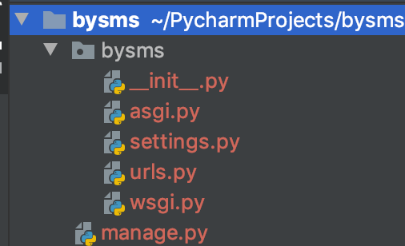
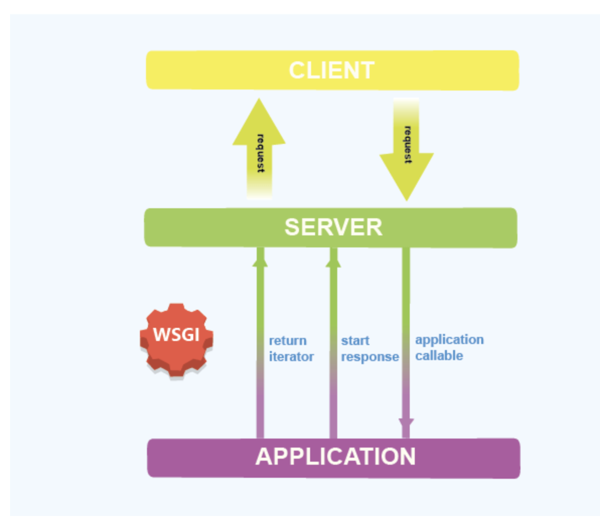
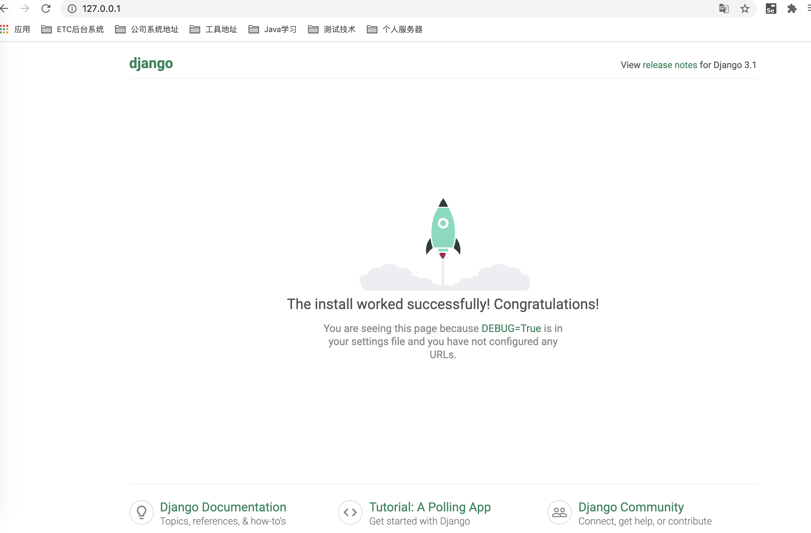
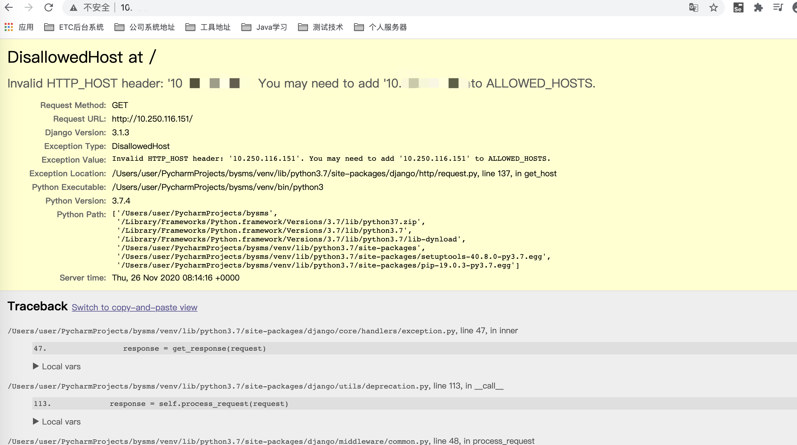

# 02-安装和运行


## 安装Django


Django框架是由python语言开发的，所以安装Django就像安装其它python库一样，执行如下命令即可：

```
pip install django
```

可以查看如下命令检查Django是否安装好，并且查看安装的Django版本

```
python -m django --version
```


## 创建项目


安装好Django后，我们需要创建我们的项目目录，项目目录里面保存了开发系统的所有文件。

我们以创建：/Users/user/PycharmProjects 作为我们项目的所在目录，这个大家可以随意选择自己的项目目录

然后从命令行窗口，进入到/Users/user/PycharmProjects目录，执行下面命令创建项目目录。


```
HCBdeMacBook-Pro:PycharmProjects user$  django-admin startproject bysms
```

注意最后的bysms就是项目的根目录名，执行上面命令后，就会创建如下的目录结构：





- 最外层/bysms 就是项目根目录/Users/user/PycharmProjects/bysms，项目文件都放在里面。

- manage.py 是一个工具脚本，用做项目管理的，以后我们会使用它执行管理操作。

- 里面的bysms/目录是python包。里面包含项目的重要配置文件。这个目录名字不能随便改，因为manage.py要用到它。

- bysms/settings.py 是Django项目的配置文件，包含了非常重要的配置项，后面边学习边讲解。我们会修改里面的一些配置项

- bysms/urls.py 里面存放了一张表，申明了前端发过来的各种http请求，分别由哪些函数来处理。后续重点学习

- bysms/wsgi.py 要了解这个文件的作用，我们必须明白wsgi是什么意思


python组织制定了web服务网关接口（Web Server Gateway Interface）规范，简称wsgi。 参考https://www.python.org/dev/peps/pep-3333/遵循wsgi规范的web后端系统，我们可以理解为由两个部分组成。 **wsgi web server** 和 **wsgi web application**  它们通常是运行在python进程中的两个模块，或者说两个子系统。

wsgi web server接受到前端的http请求后，会调用wsgi web application的接口（比如函数或者类方法），由wsgi web application 具体处理该请求。然后再把处理结果返回给wsgi web server ，wsgi web server 再返回给前端。




为什么需要两个子系统呢？

因为这两个子系统有各自负责的重点。wsgi web server 负责提供高效的http请求处理环境，可以使用多线程、多进程或者协程的机制。http请求发送到wsgi web server ，wsgi web server 分配线程或者进程或者轻量级线程，然后在这些线程、进程、或者协程里面，去调用执行wsgi web application 的入口代码。wsgi web application 被调用后，负责处理业务逻辑。业务逻辑处理可能非常复杂，wsgi web application 需要精心的设计来正确处理。


Django 是 wsgi web application 的框架，它只有一个简单的单线程 wsgi web server，供调试使用。产品正式上线运行的时候，通常我们需要高效的wsgi web server 产品，比如gunicorn，uwsgi，cherrypy等，结合Django，组成一个高效的后端服务。

所以这个wsgi.py就是提供给wsgi web server调用的接口文件，里面的变量application对应对象实现了wsgi入口，供wsgi web server调用。


## 运行Django Web服务


刚才我们说了，django虽然只是 wsgi web application的框架，但是它也有一个简单的wsgi web server。供调试使用。所以也构成了一个完整的后端web服务。本地调试代码的时候，完全可以运行起来。

运行web服务只需要在命令行窗口里面，首先进入到项目根目录，比如：/Users/user/PycharmProjects/bysms，然后执行如下命令：

```
python manage.py runserver 0.0.0.0:80
```

这样服务就会被启动，这样我们就可以在浏览器访问web服务了。其中0.0.0.0:80是指web服务绑定的IP地址和端口。

0.0.0.0表示绑定本机所有的IP地址，就是可以通过任何一个本机的IP（包括环回地址127.0.0.1）都可以访问我们的服务，80 表示服务启动在80端口上。

请打开浏览器，地址栏输入 ‘127.0.0.1’ ，就可以看到如下的界面，表示Django服务搭建成功，启动成功。




注意，启动web服务的命令行窗口不能关闭，如果关闭，web服务就停止了。


如果出现一下错误，可以在settings.py文件中ALLOWED_HOSTS = []列表中追加地址即可，然后重启服务，浏览器就可以使用这个地址进行访问。

