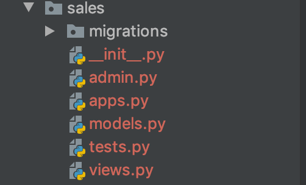

# 03-url路由


## 创建项目app


Django中的一个app就是项目里面的一个应用的意思。一个项目包含多个app。一个app通常就是一个相对独立的模块，实现相对独立 的功能。比如我们可以把销售管理系统的管理员管理的功能做在一个名字为mgr的app里面，把销售人员的操作，实现在另外一个名字为sales的app里面。


一个app本质上就是一个Python包，里面包含了一些应用相关的代码文件。 当然，一个项目分成多少个app这完全取决你的设计。你把所有的功能都放入一个大app内也可以实现功能，只是这样做，这个app特别的臃肿。


Django中创建app可以通过执行命令，创建一个app目录，并在里面自动创建app的常用文件。比如，现在我们需要一个app专门处理白月医药系统中销售员的添加、修改、查询、删除请求。我们就进入项目根目录，执行下面的命令：

```
python manage.py startapp sales
```

这样就会创建一个目录名为sales，对应一个名为sales的app，里面包含了如下自动生成的文件：




这个目录其实就是一个python package，里面有很多文件，后面我们会分别讲到它们的作用。


## 返回页面内容给浏览器

当浏览器地址栏中输入网址访问的时候，服务端是如何让浏览器呈现出网页内容的？

是这样的：当我们输入网址，比如百度网址，比较敲回车后，浏览器会发出http请求给百度的服务器，百度的服务器返回HTMl文档内容给浏览器，浏览器解析后，呈现出我们最终看到的网页内容。服务端返回的HTML文档内容其实就是符合HTML语法的一段字符串而已。


我们现在使用Django开发后端服务，就可以响应浏览器的HTTP请求，返回一段HTML字符串，浏览器就可以呈现在界面上了。

刚才我们创建的sales应用里面有个views.py文件。这个文件里面通常是处理http请求的代码的。


比如：我们设计凡是浏览器访问的http请求的url地址是/sales/orders，就由views.py里面的函数listorders来处理，返回一段字符串给浏览器。


接下来，我们在sales的views.py，在文件中加入以下内容：

```
from django.http import HttpResponse

def listorders(request):
    return HttpResponse("下面是系统中所有的订单的信息。。。")
```


注意：

- 这里面最终的返回结果是HttpResponse对象的参数字符串，也就是这句话：下面是系统中所有的订单的信息。。。

- listorders的参数request是Django中的HttpQuest对象，包含了请求中的信息。它的用法后面会学习，这里暂时用不到该参数。


光是定义了这样一个函数不行的，我们需要告诉Django：

当前端发送过来的HTTP请求，url地址是/sales/orders/ ，就由views.py里面的函数listorders来处理。怎么告诉Django呢？这就需要用到Django中的url路由设置。


## url路由


### 添加路由记录

在前面创建项目目录的时候，在项目的设置目录下，由如下的一个urls.py文件


这个文件是url路由设置的入口文件，打开该文件，在urlpatterns列表变量中添加一条路由信息，结果如下


```
from django.contrib import admin
from django.urls import path
from sales.views import listorders

urlpatterns = [
    path('admin/', admin.site.urls),
    # 添加新的路由记录, 将接口api对应内部的函数
    path('sales/orders', listorders)
]
```

urlpatterns列表就是Django的url路由的入口。里面是一条条路由的记录，我们添加的
```
 path('sales/orders', listorders)
```

就是告诉当前端过来的请求url地址是/sales/orders，就由views.py里面的函数listorders来处理。**所以所谓路由就是指：根据HTTP请求的url路径，设置由哪个函数来处理这个请求。**

通常我们项目代码的修改，Django的测试服务可以自动检测到，并且重新加载，不需要我们重启Django Web服务。如果大家想重新启动Django Web服务，大家可以在启动web服务的命令行窗口，按crtl+C按钮先停止服务，然后再次运行启动命令。

我们这时，就可以登录浏览器输入网址：http://127.0.0.1/sales/orders


这就是浏览器的请求经过Django路由后，选择执行我们定义的函数listorders，该函数返回的字符串，被作为http响应的消息提中的内容返回给浏览器了。所以最终浏览器显示的就是我们listorders函数返回的字符串。


注意：

只要修改了路由表配置，添加了我们自己的路由记录，再去浏览器访问 首页，这里就是 http://127.0.0.1 ，前面曾经出现的小火箭欢迎页就不见了！ 会出现一个 404 Not Found 的报错页面。

这是正常的，小火箭欢迎页面 是Django在调试模式下，发现路由记录没有添加的时候，缺省作为首页的。 真正的产品是不会使用这个首页的。一旦路由记录发生变动， 就会消失。


### 路由子表


url路由表就是可以像上面这样，一个请求对应一个处理函数。但是有的时候，我们的项目比较大的时候，请求的url会特别多，比如我们的系统提供给客户、销售商、管理员访问的url是不一样的，如下：

```
customer/
customer/orders/      

sales/
sales/orders/  

mgr/
mgr/customers/
mgr/medicines/
mgr/orders/
```

复杂的系统url条目多达几百甚至上千个，放在一个表中，查看时，要找一条路由记录就非常麻烦。这时，我们通常可以将不同的路由记录，按照功能分拆到不同的**url路由子表**文件中。


比如，这里我们可以把访问的url凡是以sales开头的全部都由sales app目录下面的子路由文件urls.py处理。

首先我们需要在sales目录下面创建一个新的文件：sales/urls.py。

然后在这个文件中输入如下内容：

```
from django.urls import path
from sales.views import listorders,listorders1

urlpatterns = [
    path('orders/', listorders),
    path('orders1/', listorders1)
]

```

然后再修改，主url路由文件bysms/urls.py,如下：

```
from django.contrib import admin
from django.urls import path, include  # 导入include函数


urlpatterns = [
    path('admin/', admin.site.urls),
    # 凡是url以sales/开头的，都根据sales.urls里面的子路由表进行路由
    path('sales/', include('sales.urls'))
]
```

当一个app请求过来时，Diango检查url，比如这里是slaes/orders/，先到主url路由文件bysms/urls.py,中查看是否有匹配的路由项。如果有匹配 ( 这里匹配了 sales/ )， 并且匹配的对象 不是 函数， 而是 一个子路由设置 , 比如这里是 include('sales.urls')。 就会去子路由文件中查看，这里就是 sales.urls 对应的文件 sales\urls.py 。

注意这时，会从请求url中去掉 前面主路由文件 已经匹配上的部分（这里是 sales/ ）, 将剩余的部分 （这里是 orders/ ）去子路由文件中查看是否有匹配的路由项。

这里就匹配了 orders/ ，匹配的对象，这里是 views.listorders ，它是一个处理函数，就调用该函数处理 这个http请求， 将该函数的返回对象 构建 HTTP响应消息，返回给客户端。


来看下我们配置的两个url接口请求对于的返回结果：

请求地址是：sales/orders的返回结果如下


请求地址是：sales/orders1的返回结果如下

