# 04-创建数据库和表


## 后端开发离不开数据库


前面，我们演示了一个获取订单信息的http请求到了服务端，请求的url地址是/sales/orders，那么服务端程序需要返回订单信息。前面只是简单的返回了一句话，演示以下url处理的流程。

真实的系统就应该返回真实的订单信息。那么服务从哪里获取真实的订单信息呢？ 像订单信息这些数据通常就是保存在数据库里面的。后端开发基本都需要操作数据，包括数据的存储、查询、修改、删除。 通常这些都是数据库来完成的，目前业界最广泛使用的数据库还是：**关系型数据库**。

关系型数据库系统，常用的开源数据库有mysql和postgresql。建议大家实际工作中使用的时候，使用上面这两种。

但上面这些数据库，都需要我们安装数据库服务系统和客户端库，比较麻烦，现在我们先使用另一种更简单但数据库：sqlite。

sqlite没有独立但数据库服务进程，数据操作被做成库直接提供应用程序调用。Django中可以直接使用，无须先搭建数据服务。后面大家要使用mysql等其它数据库，只需修改一些配置就可以了。


创建数据库，项目中数据库的配置在bysms/settings.py中，这里

```
# Database
# https://docs.djangoproject.com/en/3.1/ref/settings/#databases

DATABASES = {
    'default': {
        'ENGINE': 'django.db.backends.sqlite3',
        'NAME': BASE_DIR / 'db.sqlite3',
    }
}
```

大家可以发现，我们使用命令创建的项目，缺省就是使用sqlite。而且对于的数据文件，缺省的文件名是db.sqlite3，就在项目的根目录下面。


首先我们需要创建数据库，执行如下命令：

```
python manage.py migrate
```

执行结果如下：

```
Operations to perform:
  Apply all migrations: admin, auth, contenttypes, sessions
Running migrations:
  Applying contenttypes.0001_initial... OK
  Applying auth.0001_initial... OK
  Applying admin.0001_initial... OK
  Applying admin.0002_logentry_remove_auto_add... OK
  Applying admin.0003_logentry_add_action_flag_choices... OK
  Applying contenttypes.0002_remove_content_type_name... OK
  Applying auth.0002_alter_permission_name_max_length... OK
  Applying auth.0003_alter_user_email_max_length... OK
  Applying auth.0004_alter_user_username_opts... OK
  Applying auth.0005_alter_user_last_login_null... OK
  Applying auth.0006_require_contenttypes_0002... OK
  Applying auth.0007_alter_validators_add_error_messages... OK
  Applying auth.0008_alter_user_username_max_length... OK
  Applying auth.0009_alter_user_last_name_max_length... OK
  Applying auth.0010_alter_group_name_max_length... OK
  Applying auth.0011_update_proxy_permissions... OK
  Applying auth.0012_alter_user_first_name_max_length... OK
  Applying sessions.0001_initial... OK

```


就会在项目的根目录下面生成一个配置文件中指定的数据库文件db.sqllite3。并且会在其中创建一些表。

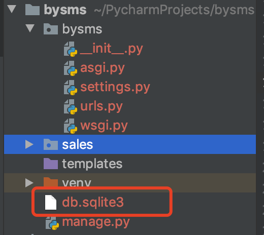


可以使用一些数据库连接软件，连接sql服务，我这里使用mac的 navicat premium

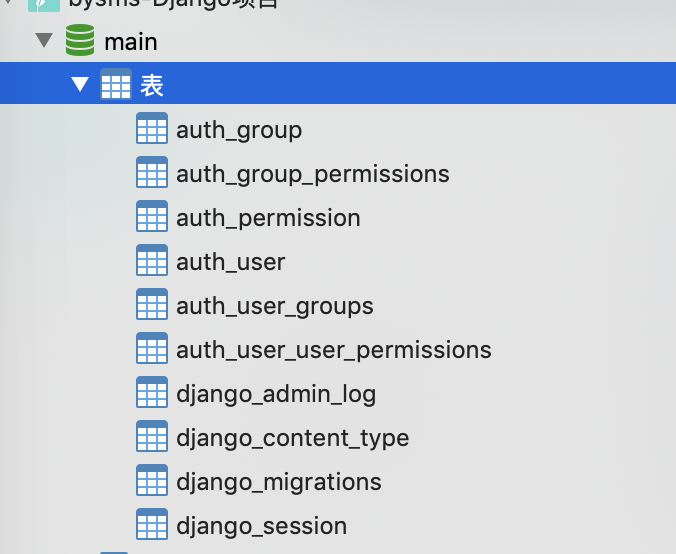


能看见这些表，就说明创建成功啦。这些表都是 Django缺省设置中， 需要的一些 基本表。包括: 用户表 auth_user， 登录会话表 django_session 等等。


## 什么是ORM


下面是某个数据库里面一张medicine表的格式定义。描述药品表的格式

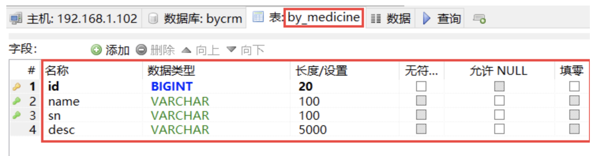


下面是这张表里面存储的一条条数据

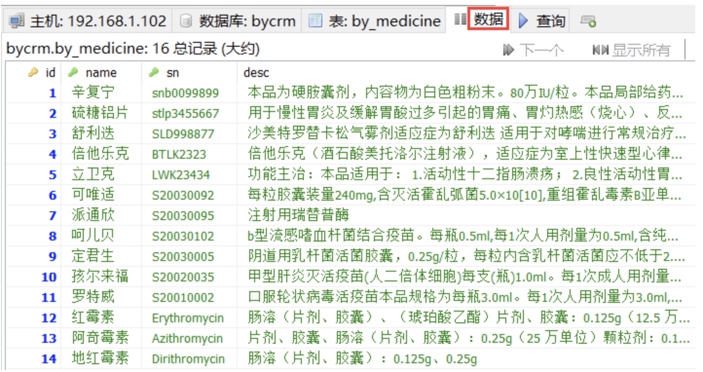


这个表的格式定义和表里面一条条数据，它们之间的关系就像什么？


是不是很像类定义和类的实例之间的关系。这个medicine表结构定义，就像定义了一恶搞medicine类，定义好了之后，这个mediceine表里面的一条条记录对应的就是一个个具体的药品。就是medicine类的实例。

既然数据库表定义和表记录之间的关系，就像类和实例之间的关系，Django就让开发者通过类和实例的操作来对应数据库表和记录的操作。Django里面，数据库的操作，包括表的定义、表中数据的增删改查，都可以通过Model类型的对象进行的。


通常，在Django中：

- 定义一张数据库的表就是定义一个继承自django.db.models.Model的类
- 定义该表中的字段（列），就是定义该类里面的一些属性
- 类的方法就是对改表中数据的处理方法，包括数据的增删改查


这样，开发者对数据的访问，从原来的使用底层的sql语句，变成面向对象的开发，通过一系列对象的类定义和方法调用就可以操作数据库。


这样做，

- 首先极大的简化了我们应用中的数据库开发，因为无需用使用sql语句操作数据库了，提高了开发的效率；
- 其次屏蔽了不同的数据库访问的底层细节，基本做到了开发好代码后，如果要换数据库，几乎不需要改代码，修改几个配置项就可以了；


这种通过对象操作数据库的方法被称之为ORM（object relational mapping）,下面我们就开看怎样使用。


## 定义数据库表


我们开发系统，需要定义我们需要的数据库表。首先，我们再创建一个名为common的应用目录，里面存放我们项目需要的一些公共的表的定义。

首先进入项目根目录，执行创建应用命令：

```
python manage.py startapp common 
```

就会创建一个目录为common，对应一个名为common的app，里面包含了如下自动生成的文件。

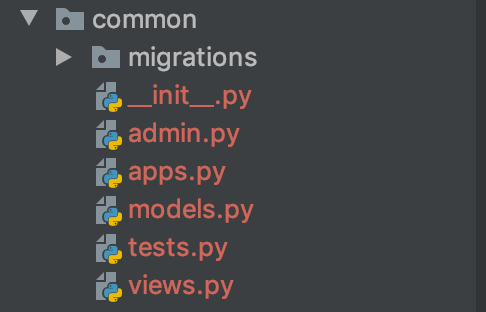


前面已经说过，Django是通过定义类来定义数据库表的。所以我们要定义数据库的表，无需执行sql语句，只需要在app目录下面定义特殊的类就可以了。

数据库表的定义，一般是放在app目录中的models.py里面的。打开common/models.py，发现里面是空的，因为我们还没有定义我们的业务所需要的表。

我们修改它，加入如下内容：

```
from django.db import models


# Create your models here.

class Customer(models.Model):
    # 客户名称
    name = models.CharField(max_length=200)
    # 联系电话
    phone_number = models.CharField(max_length=200)
    # 地址
    adderess = models.CharField(max_length=200)

```


这个customer类继承自djangod.db.models.Model，就是用来定义数据库表的。里面的name、phone_number、adderess是该表的三个字段。定义表中的字段就是一些静态属性，这些属性是django.db.models里面的各种Field对象，对应不同类型的字段。比如这里的3个字段都是CharField对象，对应varchar类型的数据库字段。后面的参数max_length指明了该varchar字段的最大长度。Djagno有很多字段对象类型，对应不同类型的数据库字段。

大家可以参考官方文档：https://docs.djangoproject.com/zh-hans/3.1/topics/db/models/


## 创建数据库表


定义好表后，我们怎么真正去创建数据库表呢？

首先我们需要告诉Django：我们的common应用中需要你关注，因为其中包含了数据库Model的定义。怎么告诉它？

在项目的配置文件settings.py中，INSTALLED_APPS配置项加入如下内容：

```
INSTALLED_APPS = [
    'django.contrib.admin',
    'django.contrib.auth',
    'django.contrib.contenttypes',
    'django.contrib.sessions',
    'django.contrib.messages',
    'django.contrib.staticfiles',
    # 加入下面这行
    'common.apps.CommonConfig',
]
```

'common.apps.CommonConfig' 告诉Django，CommonConfig 是 common/apps.py 文件中定义的一个应用配置的类。是这样的：

```
class CommonConfig(AppConfig):
    name = 'common'
```

CommonConfig是AppConfig的子类，就表示这个是应用的配置类。这里name=‘common' ，name是用来定义应用python模块路径的。这里就是说应用模块路径为common。

关于其它的配置参数，大家可以参考官方文档：

现在Django知道了我们的common应用，我们可以在项目根目录下执行命令：

```
python manage.py makemigrations common
```

得到如下结果：

Migrations for 'common':
  common/migrations/0001_initial.py
    - Create model Customer


这个命令，告诉Django，去看看common这个app里面的models.py，我们已经修改了数据定义，你现在去产生相应的更新脚本。执行一下，会发现在common\migrations目录下面出现了0001_initial.py，这个脚本就是相应要进行的数据库操作代码。

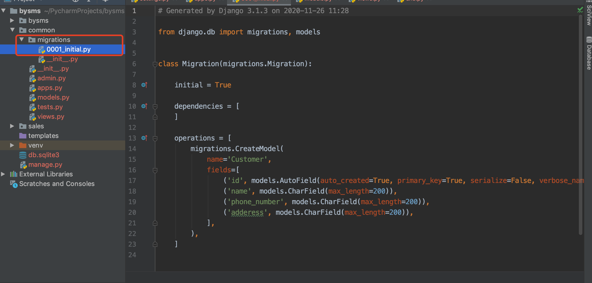


接下来，执行如下命令：

```
python manage.py migrate
```

得到如下结果：
Operations to perform:
  Apply all migrations: admin, auth, common, contenttypes, sessions
Running migrations:
  Applying common.0001_initial... OK


就真正去数据库创建表了。接下来可以去看看是否创建成功。发现创建了一张名为：common_cutstomer的表，如下：

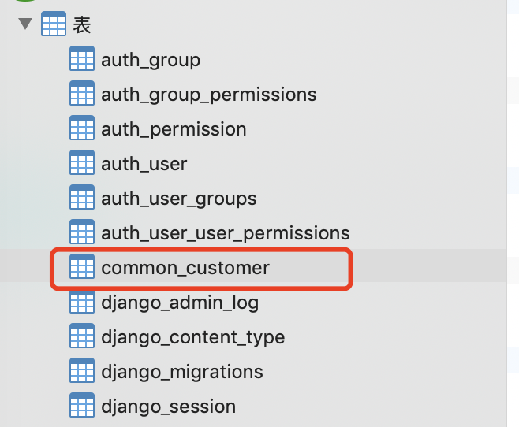


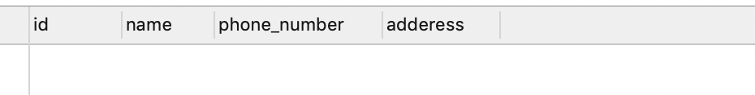


其中3个字段就是我们上面定义的Customer类里面的name、phone_number、adderess属性名。多出来的id字段就是改表的主键，是Django自动帮我们添加的。这个不需要我们在类中显示的定义。

**注意：**

如果以后我们修改了Models.py里面的库表的定义，都需要再次运行python manage.py makemigrations common 和 python manage.py migrate 命令，使数据库同步该修改结果。


## Django Admin 管理数据


Django提供了一个管理员操作界面可以方便的添加、修改、删除你定义的model表数据。首先，我们需要创建一个超级管理员账号。

进入到项目的跟目录，执行如下命令，依次输入你要创建的管理员的登录名、email、密码。

```
 python manage.py createsuperuser
```

Username (leave blank to use 'user'): longyu
Email address: larry616@sina.cn
Password: 
Password (again): 
This password is too common.
This password is entirely numeric.
Bypass password validation and create user anyway? [y/N]: y
Superuser created successfully.

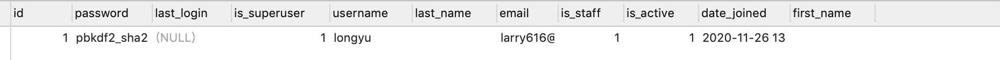

注意密码至少8个字符，这里我们设置密码为12345678，可以登录http://127.0.0.1/admin/login/进行后台查看：

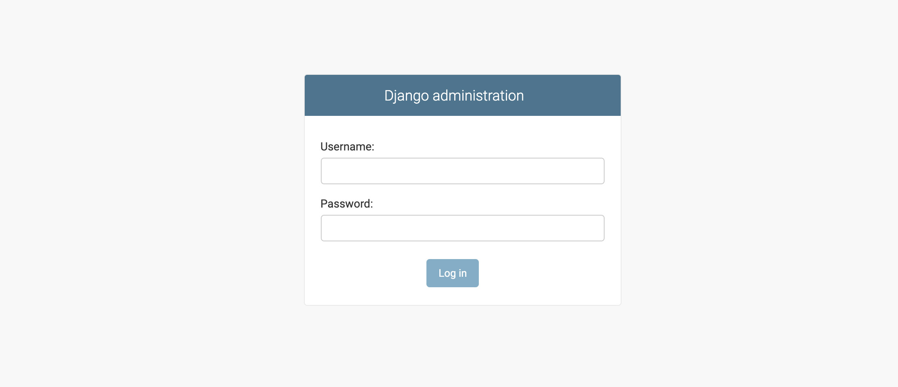


输入刚刚创建的用户名和密码即可进入：
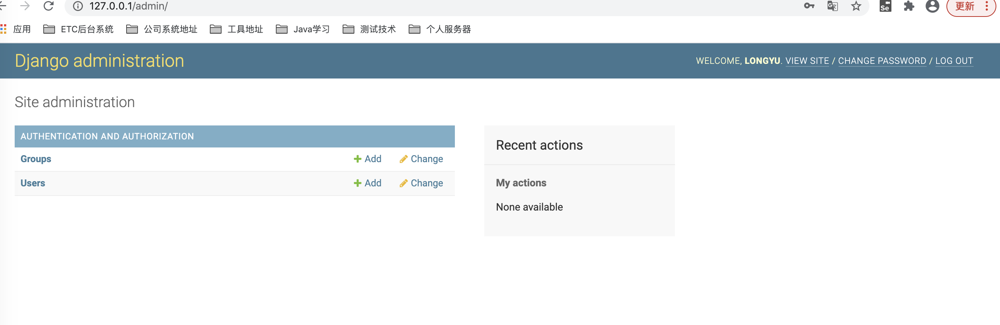


可以发现我们刚刚添加的表，并没有在里面，这时我们需要修改应用里面的管理员配置文件，common/admin.py，注册我们定义的model类。这样Django才会知道。

```
from django.contrib import admin

# Register your models here.
from .models import Customer

admin.site.register(Customer)
```

接下来刷新页面，就可以看见数据了。

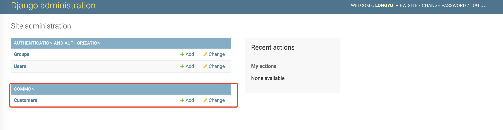


点击下面的 ADD CUSTOMER 按钮来添加一条客户记录：

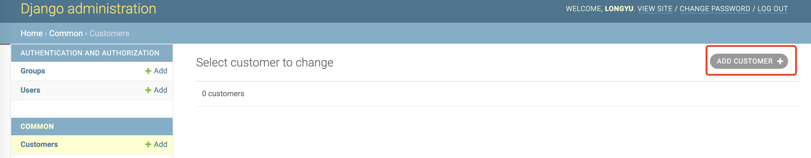


在跳出的界面中输入客户信息后，点击SAVE按钮：

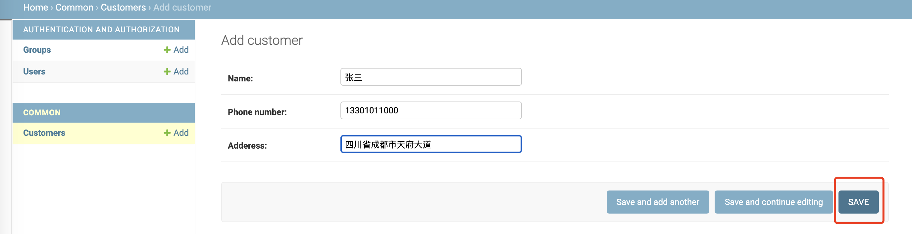


可以看见数据库的内容已经添加，如下：
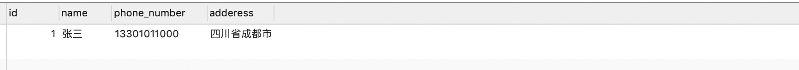


如果你是中文的操作系统，想使用中文的admin界面，应该在配置文件settings.py中MIDDLEWARE最后加入配置
```
MIDDLEWARE = [
    'django.middleware.security.SecurityMiddleware',
    'django.contrib.sessions.middleware.SessionMiddleware',
    'django.middleware.common.CommonMiddleware',
    'django.middleware.csrf.CsrfViewMiddleware',
    'django.contrib.auth.middleware.AuthenticationMiddleware',
    'django.contrib.messages.middleware.MessageMiddleware',
    'django.middleware.clickjacking.XFrameOptionsMiddleware',
    # admin界面语言本地化
    'django.middleware.locale.LocaleMiddleware',
]
```

刷新web管理页面，发现变成中文了。

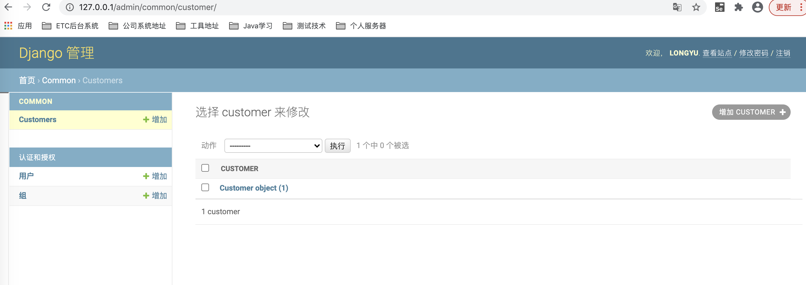


要注意上面的界面Django内置的给管理员使用的。只是实现了一些通用的功能，而且界面语言偏英语的。在实际的工作项目中，还是需要我们自己开发前端界面给他们使用。