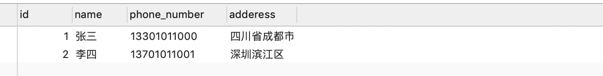

# 05-读取数据库数据


## 获取全部记录


前面我们已经创建了customer表，现在我们来实现一个功能：浏览器访问sales/customers，我们的服务端就返回系统中所有的客户记录给浏览器。

我们先实现一个函数，来处理浏览器发出的URL为sales/customers/的访问请求，我们需要返回数据库中的customer表所有记录。

Django中对数据库表的操作，应该都通过Model对象实现对数据的读写，而不是通过SQL语句。比如，这里我们要获取customer表所有记录，该表是和我们前面定义的Customer类管理的。


我们可以这样获取所有的表记录：

在文件sales/views.py文件中，定义一个listcustormers函数，内容如下：


```
def listcustomers(request):
    # 返回一个queryset对象，包含所有的表记录，每条记录都是一个dict对象，key是字段名，value是字段值
    qs = Customer.objects.values()

    # 定义返回字符串
    retStr = ""
    for customer in qs:
        for name, value in customer.items():
             retStr += f'{name} : {value} | '
        # <br> 表示换行
        retStr += ('<br>')
    return HttpResponse(retStr)
```

Customer.objects.values() 就会返回一个 QuerySet 对象，这个对象是Django 定义的，在这里它包含所有的Customer 表记录。QuerySet 对象 可以使用 for 循环遍历取出里面所有的元素。每个元素 对应 一条表记录。每条表记录元素都是一个dict对象，其中 每个元素的 key 是表字段名，value 是 该记录的字段值上面的代码就可以将 每条记录的信息存储到字符串中 返回给 前端浏览器。

我们还需要修改路由表，加上对sales/customers url请求的路由。前面主路由表已经加过以sales开头的都到子路由表进行路由，所以只需要修改sales/urls.py 即可，添加如下记录

```
path('customers/', listcustomers),
```

然后在浏览器输入如下网址：http://127.0.0.1/sales/customers/


和我们数据库读取的数据一致：




## 过滤条件

有的时候，我们需要根据过滤添加查询部分客户信息。比如，当用户在浏览器输入/sales/customers/?phonen_umber=13301011000 ，要求返回电话号码为 13301011000 客户记录。


我们可以通过**filter方法**加入过滤条件，修改view里面的代码，如下所示：

```
def listcustomers(request):
    # 返回一个queryset对象，包含所有的表记录，每条记录都是一个dict对象，key是字段名，value是字段值
    qs = Customer.objects.values()

    # 检查url中是否有参数phone_number, 如果没有则返回None
    ph = request.GET.get('phone_number', None)

    if ph:
        qs = qs.filter(phone_number=ph)

    # 定义返回字符串
    retStr = ""
    for customer in qs:
        for name, value in customer.items():
             retStr += f'{name} : {value} | '
        # <br> 表示换行
        retStr += ('<br>')
    return HttpResponse(retStr)
```


看到函数定义的参数request了吗？

Django框架在url路由匹配到函数后，调用函数时，会传入一个HttpRequest对象参数给变量request，该对象里面包含了请求的数据信息。

HTTP 的Get请求url里面的参数（术语叫querystring里面的参数），可以通过HttpRequest对象的GET属性获取。这是一个类似dict的对象。

比如要获取querystring里面的phone_number参数，就可以像这样

```
 ph = request.GET.get('phone_number', None)
```

第二个参数传入None表示，如果没有phone_number参数在querystring中，就会返回None。

然后通过调用QuerySet对象的filter方法，就可以把查询过滤条件加上去
```
qs = qs.filter(phone_number=ph)
```

有了这个过滤条件，Django会在底层执行数据库查询的SQL语句加上相应的where从句，进行过滤查询。注意，参数名phone_number是和定义的表model的属性名phone_number一致的。filter的过滤条件可以又怒多个，只要继续在后面的参数添加过滤添加即可。

比如：
```
qs = qs.filter(phonenumber=ph,address='四川省成都市天府大道')
```
这样就除了根据电话号码字段过滤，还有根据地址字段过滤。


现在浏览器输入如下url：
http://127.0.0.1/sales/customers/?phone_number=13301011000


访问结果如下：


可以发现过滤条件生效了。