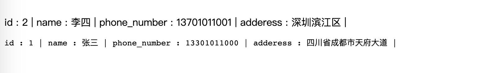
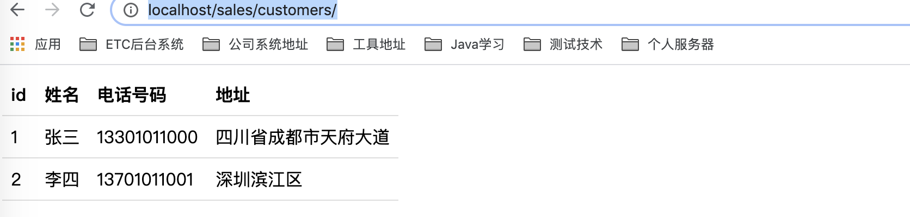
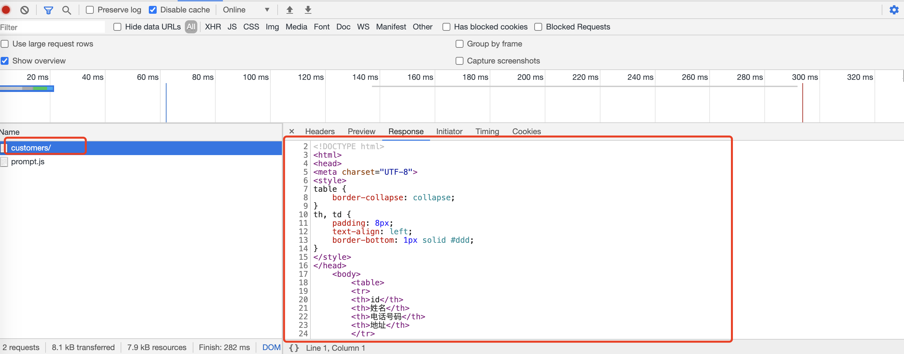

# 06-前后端分离架构

前面，我们的数据展示在界面上是这样的




很不好看，因为我们返回的其实就是字符串，并不是HTML。要好看一些，我们可以使用HTML来展示数据。


## 代码直接生成HTML


HTML本身其实也是字符串，只是这个字符串里面的内容是符合HTML语言规范的。既然他也是字符串，我们可以使用Python直接构建出HTML字符串内容。修改如下：

```
def listcustomers(request):
    # 返回一个queryset对象，包含所有的表记录，每条记录都是一个dict对象，key是字段名，value是字段值
    qs = Customer.objects.values()

    # 检查url中是否有参数phone_number, 如果没有则返回None
    ph = request.GET.get('phone_number', None)

    if ph:
        qs = qs.filter(phone_number=ph)


    # 生成html模版中要插入的内容
    table_content = ''
    for customer in qs:
        table_content += '<tr>'
        for name, value in customer.items():
            table_content += f'<td>{value}</td>'
        table_content += '</tr>'

    return HttpResponse(html_template % table_content)
```


我们用一个变量html_template存储html模板，然后代码中生成html里面需要插入的表格记录的内容，这个内容是html片段，也就是html表格的每行。最后填入到html_template模板里面。就产生了完整的HTML字符串。最后返回该html文档字符串即可。


然后再浏览器访问：http://localhost/sales/customers/




然后可以浏览器F12查看接口返回信息：




## 使用模版


上面我们使用python代码直接拼接出html内容，但是这种方式，我们代码处理比较麻烦。特别是，如果html里面有很多内容需要填入，使用python代码直接拼接就显得很繁杂，不好维护。

很多后端框架都提供了一种模板技术，可以在html中嵌入编程语言代码片段，用模板引擎（就是一个专门处理HTML模板的库）来动态化的生成HTML代码。


比如，JavaEE里面 的JSP，Pyhton中有很多这样的模板引擎，比如：jinjia2、Mako、Django也内置了一个这样的模板引擎。我们接下来修改一下代码，使用Django的模板引擎：

```
from django.shortcuts import render
from django.http import HttpResponse
from common.models import Customer
from django.template import engines

# 先定义好HTML模板
html_template = '''
<!DOCTYPE html>
<html>
<head>
<meta charset="UTF-8">
<style>
table {
    border-collapse: collapse;
}
th, td {
    padding: 8px;
    text-align: left;
    border-bottom: 1px solid #ddd;
}
</style>
</head>
    <body>
        <table>
        <tr>
        <th>id</th>
        <th>姓名</th>
        <th>电话号码</th>
        <th>地址</th>
        </tr>

        

        
            <tr>

                        
                <td>{{ value }}</td>            
            

            </tr>
        

        

        </table>
    </body>
</html>
'''


def listorders(request):
    return HttpResponse("下面是系统中所有的订单的信息。。。")


django_engine = engines['django']
template = django_engine.from_string(html_template)


def listcustomers(request):
    # 返回一个queryset对象，包含所有的表记录，每条记录都是一个dict对象，key是字段名，value是字段值
    qs = Customer.objects.values()

    # 检查url中是否有参数phone_number, 如果没有则返回None
    ph = request.GET.get('phone_number', None)

    if ph:
        qs = qs.filter(phone_number=ph)

    # 传入模版需要的参数
    rendered = template.render({'customers': qs})

    return HttpResponse(rendered)

```

这个是比较老的模板技术了，最新Django3.0已经不支持。

通过上面的模板引擎，在浏览器访问，可以得到一样的结果。对比python直接生成HTMl，大家可以发现，使用模板引擎的好处，就是产生HTML的代码更简单方便了。因为我们可以直接把要生成的HTML片段写在HTML模板里面。然后只需要传入渲染模板所需要的参数就可以了，模板引擎会自动化的帮我们生成HTML。上面只是一种简单颜色，具体的模板用法，可以参考官方文档。https://docs.djangoproject.com/zh-hans/3.1/topics/templates/#the-django-template-language


## 前后端分离架构


有了模板引擎，对我们后端开发来说，简化了程序员后端生成HTML的任务，提高了开发效率。但是通常后端开发人员的核心任务不是开发前端界面，而且大部分后端开发人员对前端界面开发还是不熟悉对，前端界面对开发还是前端去做，如果动态对界面内容都是后端模版生成，就意味着前端开发人员要接触后端的模板。

这样存在一些问题：

- 不利于前后端开发任务的分离，前后端开发人员要做额外的沟通
- 如果除了web浏览器，还有手机app的话，app不需要服务端返回HTML，就得再开发一套数据接口
- 渲染任务在后端执行，大大增加了后端的性能压力，尤其是HTML页面很大，当有大量的用户并发访问的时候，后端渲染工作量很大，很耗费CPU资源


现在随着浏览器中javascript解释器性能的突飞猛进，以及一些前端模板库和框架的流行。很多架构师将页面的html内容的任务放到前端。这样服务端只负责**提供数据**，界面构成全部在前端（浏览器前端或者手机前端）进行，称之为前端渲染。


只是这个工作在前端执行， 使用前端的 框架库去完成，比如angular，react，vue。这样 界面完全交给前端开发人员去做， 后端开发只需要提供前端界面所需要的数据就行了。前端 和 后端 之间的交互就完全是 业务数据了。这样就需要定义好前端和后端交互数据的接口。

目前通常这样的接口设计最普遍的就是使用REST风格的API接口。前端通过API接口从后端获取数据展示在界面上。前端通过API接口告诉后端需要更新的数据是什么。所以接下来我们就聚焦在后端，我们的系统前端由另外的团队开发，我们只负责后端业务数据的维护。


接下来我们就围绕着定义好的接口，来实现后端服务。实现数据交互。

注意：
需要Django返回的信息，通常都是所谓的动态数据信息。比如：用户信息、药品信息，订单信息，等等。这些信息通常都是存储在数据库中，这些信息是会随着系统的使用发生变化的。

而静态信息，比如：页面HTML文档、css文档、图片、视频等、是不应该由Django负责返回数据的。

这些数据通常都是由其它的静态资源服务软件，比如niginx、varnish等等，返回给前端。这些软件都会有效的对静态数据进行缓存，大大提高服务效率。在实际的项目中，往往还会直接使用静态文件云服务（OSS+CDN）提高静态数据的访问服务。

总之，Django处理并返回的应该是动态业务数据信息。

