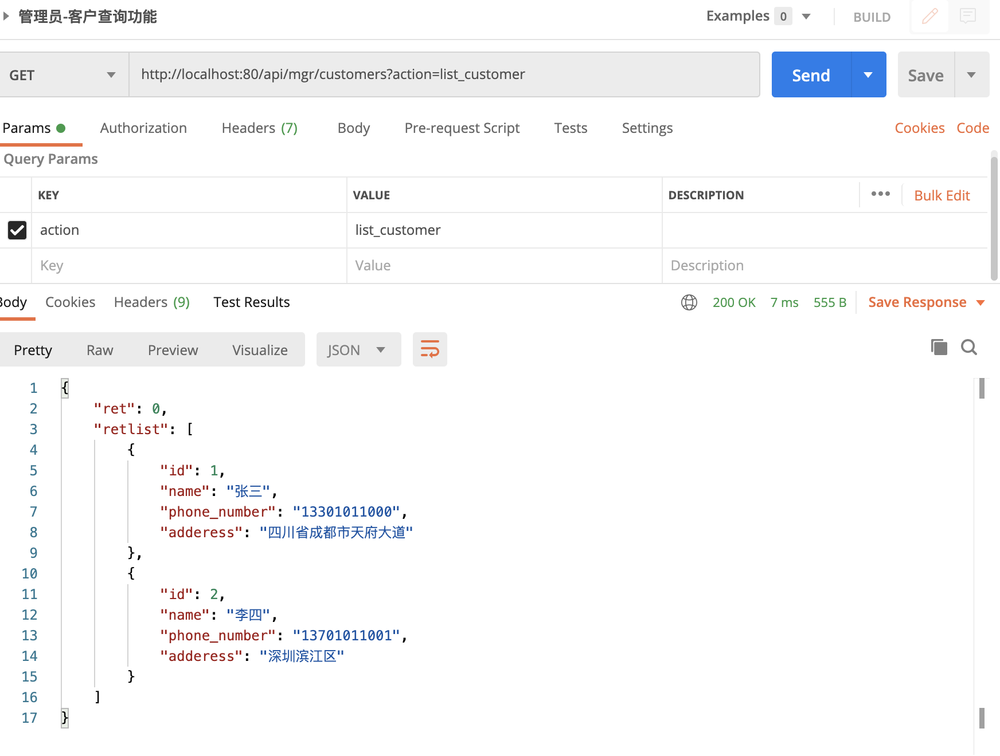

# 07-对资源对增删改查处理


前面我们已经说过，如果采用前后端分离的架构开发，后端几乎不负责任何展现界面的工作，只负责对数据进行管理。数据的管理，主要就是：相应前端的请求，对数据资源的增加、修改、删除、列出。

下面我们以BYSMS系统中customer数据为例，学习如何进行数据的增删改查操作。


现在要实现的系统，API接口已经由架构师定义好了，[点击这里查看](http://www.python3.vip/tut/webdev/django/doc_api_v1_0/)。

其中包括了客户数据的增删改查接口。现在我们就根据这个接口文档，来实现后端API。


## 创建mgr应用目录


接口文档明确说明了，这是针对管理员用户的请求。前面我们已经为销售员工用户专门创建了一个应用sales来处理相关请求。所以，我们可以再为管理员用户专门创建一个应用mgr来处理相关的请求。

```
python manage.py startapp mgr

```

## 添加处理请求模块和url路由


前面，我们都是在views.py里面定义函数，处理http请求的。但是可以想象，以后，这个mgr应用要处理很多类型的http请求。都用这个views.py就会让这个文件非常的庞大，不好维护。所以我们可以用不同的py文件处理不同类型的http请求。

比如，这里我们可以新增一个文件customer.py，专门处理客户端customer数据的操作。将来如果客户端有对其它类型数据的操作，比如order数据，我们就可以添加orders.py来处理。  


接下来，从接口文档，我们可以发现对资源对增删该查操作，都是同一个URL，都是/api/mgr/medicine。而且我们发现，不同的操作请求，使用不同的HTTP请求方法，比如：添加是POST，查询是GET、修改是PUT、删除是DELETE。而且请求的参数中都有action参数表明这次请求的具体是什么。 

注意：Django的url路由功能不支持根据HTTP请求的方法和请求体里面的参数进行路由。就是不能像下面这样，来根据请求是post还是get来路由：
```
path('customers/', 'app.views.list_customer', method='get'),
path('customers/', 'app.views.add_customer',  method='post'),
```

那么应该怎么办呢？

一种方式是：自己编写一个函数，来根据http请求的类型和请求体里面的参数分发（或者说路由）给不同的函数进行处理。我们可以在customer.py中定义dispatcher函数：

```
import json

from django.http import JsonResponse


def dispatcher(request):
    # 将请求参数统一放入request的params属性中，方便后续处理

    # GET请求参数在url中，通过request对象GET属性获取
    if request.method == 'GET':
        request.params = request.GET

    # POST、PUT、DELETE请求参数从request对象的body属性中获取
    elif request.method in ['POST', 'PUT', 'DELETE']:
        # 根据接口，POST/PUT/DELETE请求的消息体都是json格式
        request.params = json.loads(request.body)

    # 根据不同的action分派给不同的函数进行处理

    action = request.params['action']
    if action == 'list_customer':
        return listcustomers(request)
    elif action == 'add_customer':
        return addcustomer(request)
    elif action == 'modify_customer':
        return modifycustomer(request)
    elif action == 'del_customer':
        return deletecustomer(request)

    else:
        return JsonResponse({'ret': 1, 'msg': '不支持该类型http请求'})
```

该函数把请求消息中的参数统一放入到request请求对象的params属性中。params属性被做成一个dict类型，方便后面的处理函数来获取消息中的参数。然后dispathcer函数再根据请求的类型和action参数的值决定由哪个函数具体处理该请求消息。比如action参数为‘add_customer’的请求就由addcustomer函数进行处理。
当然在文件的开头，我们需要先导入JsonReponse和Json的定义，像下面这样：

```
import json
from django.http import JsonResponse
```

接下来，根据API接口，我们发现凡是API请求为/api/mgr/customers的，都属于客户相关的api，都应该交由我们上面定义的dispatcher函数进行分派处理。那么我们需要在Django的url路由文件中加入对应的路由：

第一步：我们应该在总路由文件bysms/urls.py中定义如下部分：

```
 # 凡是url以api/mgr开头的，都根据mgr.urls里面的子路由表进行路由
 path('api/mgr/', include('mgr.urls')),
```

第二步：在mgr目录下面添加urls.py路由文件，并加入如下申明即可，如下所示：

```
from django.urls import path
from mgr import customer

urlpatterns = [
    path('customers/', customer.dispatcher),
]

```
这样，就表示凡是API请求url为/api/mgr/customers的，都交由我们上面定义的 dispathcer函数进行分派处理


## 列出客户


通常数据资源的增删改查，查就是查看，对应的就是列出数据资源。

根据接口文档，列出客户数据接口，后端返回的数据格式如下：
```
{
    "ret": 0,
    "retlist": [
        {
            "address": "江苏省常州武进市白云街44号",
            "id": 1,
            "name": "武进市 袁腾飞",
            "phonenumber": "13886666666"
        },
        
        {
            "address": "北京海淀区",
            "id": 4,
            "name": "北京海淀区代理 蔡国庆",
            "phonenumber": "13990123456"
        }
    ]              
}
```

如上，这里我们无需将数据库中获取的数据转化为供浏览器展示的HTML。在前后端分离的开发架构中，如何展示数据，那是前端的事情。在后端只需要根据接口文档，返回原始数据就行。

我们可以使用如下的函数来返回数据库所有的客户数据信息。

```
def listcustomers(request):
    # 返回一个QuerySet对象，包含所有的表记录
    qs = Customer.objects.values()

    # 将QuerySet对象转化为list类型，否则不能被转换为JSON字符串
    retlist = list(qs)
    return JsonResponse({'ret': 0, 'retlist': retlist})
```

当然在文件的开头，我们需要导入Customer定义，像下面这样
```
导入Customer
from common.models import Customer
```
可以发现，无需转化数据为HTML，后端的代码任务也大大减轻。


可以对接口进行测试，使用postman发起http请求如下：




## 添加客户

通常数据资源对增删改查，增就是添加，对应对就是添加数据资源。根据接口文档，添加客户数据接口，前端提供的客户格式如下：

```
{
    "action":"add_customer",
    "data":{
        "name":"武汉市桥西医院",
        "phone_number":"13345679934",
        "address":"武汉市桥西医院北路"
    }
}
```

我们可以使用如下的函数来处理：

```
def addcustomer(request):
    info = request.params['data']

    # 从请求消息中获取要添加客户的信息，并且插入到数据库中，返回值就是对应插入记录的对象
    record = Customer.objects.create(name=info['name'], phone_number=info['phone_number'],
                                     adderess=info['address'])
    return JsonResponse({'ret': 0, 'id': record.id})
```


运行结果如下：
```
RuntimeError: You called this URL via POST, but the URL doesn't end in a slash and you have APPEND_SLASH set. Django can't redirect to the slash URL while maintaining POST data. Change your form to point to localhost:80/api/mgr/customers/ (note the trailing slash), or set APPEND_SLASH=False in your Django settings.
```

需要按照下面取消CSRF校验机制。

**Customer.objects.create方法可以添加一条Customer表里面的记录**


## 临时取消CSRF校验


根据接口文档，添加客户请求是个POST请求
```
POST  /api/mgr/customers  HTTP/1.1
Content-Type:   application/json
```
注意，缺省创建的项目，Django会启用一个CSRF（跨战请求伪造）安全防护机制。

在这种情况下，所有的POST、PUT类型的请求都必须在HTTP请求头中携带用于校验的数据。为了简单起见，我们先临时取消掉CSRF的校验机制，等以后有需要再打开。

要临时取消掉CSRF的校验机制，非常简单，只需要在项目的配置文件bysms/settings.py中MIDDLEWARE配置李注释掉django.middleware.csrf.CsrfViewMiddleware即可。

```
MIDDLEWARE = [
    'django.middleware.security.SecurityMiddleware',
    'django.contrib.sessions.middleware.SessionMiddleware',
    'django.middleware.common.CommonMiddleware',
    # 'django.middleware.csrf.CsrfViewMiddleware',  CSRF安全校验
    'django.contrib.auth.middleware.AuthenticationMiddleware',
    'django.contrib.messages.middleware.MessageMiddleware',
    'django.middleware.clickjacking.XFrameOptionsMiddleware',
    # admin界面语言本地化
    'django.middleware.locale.LocaleMiddleware',
]
```

取消后再发起添加客户请求如下：


## 修改客户信息


数据资源的增删改查，里面的改就是改动，对应的就是修改数据资源。

根据接口文档，修改客户数据接口，前端提供的数据格式如下：

{
    "action":"modify_customer",
    "id": 6,
    "newdata":{
        "name":"武汉市桥北医院",
        "phone_number":"13345678888",
        "address":"武汉市桥北医院北路"
    }
}


我们可以使用如下的函数来处理：

```
def modifycustomer(request):
    customer_id = request.params['id']
    newdata = request.params['newdata']
    try:
        # 根据id从数据库中找到相应的客户记录
        customer = Customer.objects.get(id=customer_id)
    except Customer.DoesNotExist:
        return {
            'ret': 1,
            'msg': f'id为`{customer_id}`的客户不存在'
        }
    if 'name' in newdata:
        customer.name = newdata['name']
    if 'phone_number' in newdata:
        customer.phone_number = newdata['phone_number']
    if 'address' in newdata:
        customer.adderess = newdata['address']

    # 注意，一定要执行save才能将修改信息保存到数据库
    customer.save()

    return JsonResponse({'ret': 0})
```


发起修改请求，结果如下：


## 删除客户


数据资源的增删改查，删就是删除，对应的就是删除资源数据。根据接口文档，删除客户数据接口，前端只需要提供要删除的客户的ID。

根据接口文档，删除客户数据接口，前端只需要提供要删除客户的ID，数据格式如下：

```
{
    "action":"del_customer",
    "id": 6
}
```

我们可以使用如下的函数来处理：

```
def deletecustomer(request):
    customer_id = request.params['id']
    try:
        # 根据id从数据库中查找对应的记录
        customer = Customer.objects.get(id=customer_id)
    except Customer.DoesNotExist:
        return JsonResponse({
            'ret': 1,
            'msg': f'id为{customer_id}的客户不存在'
        })
    customer.delete()
    return JsonResponse({'ret': 0})
```

运行结果如下：


## 测试后端代码


后端对客户数据的增删改查已经实现了，我们应该怎样测试代码呢。测试自己的代码可以开发测试程序，模拟前端，发出HTTP请求对后端进行测试。这就是Web API接口测试了，Python做接口测试，最合适的就是使用requests这个库。


这里，我们只需要使用requests库构建各种接口规定的http请求消息，并且检查响应。比如，要检查列出客户的接口

```
import requests, pprint


def test_list_customers():
    data = {'action': 'list_customer'}
    response = requests.get('http://localhost/api/mgr/customers', params=data)
    pprint.pprint((response.json()))
```

运行一下，得到如下的返回结果：

```
{'ret': 0,
 'retlist': [{'adderess': '四川省成都市天府大道',
              'id': 1,
              'name': '张三',
              'phone_number': '13301011000'},
             {'adderess': '深圳滨江区',
              'id': 2,
              'name': '李四',
              'phone_number': '13701011001'},
             {'adderess': '武汉市桥北医院北路',
              'id': 3,
              'name': '武汉市桥北医院',
              'phone_number': '13345678888'}]}
```

根据接口文档，ret值为0，表示接口调用成功。如果retlist里面格式符合接口规定，并且其中的数据和数据库内容一致，则测试通过


要检查添加客户的接口，如下：

```
import requests, pprint
def test_add_customer():
    # 构建添加客户信息的消息体，是json格式
    payload = {
        'action': 'add_customer',
        'data': {
            'name': '测试1',
            'phone_number': '13000909999',
            'address': '四川省高新区天府软件园'
        }
    }
    response = requests.post('http://localhost:80/api/mgr/customers/', json=payload)
    pprint.pprint(response.json())

if __name__ == '__main__':
    test_add_customer()
```

运行结果如下：

{'id': 4, 'ret': 0}


## 和前端集成


最终我们的产品，前端和后端系统会集成在一起成为一个完整的系统。 部署到生成环境（生成环境就是正式的线上运营环境）运行的架构往往比较复杂。我们后面具体学习一个比较完整的线上环境，如何搭建。


这里我们讲述开发环境下，前后端分离 的架构如何简单集成。

前端环境其实就是一些前端的代码和资源文件，包括js文件、html文件、css文件还有图片视频文件等。我们模拟前端开发的前端系统打包在这里，[点击下载](http://cdn1.python3.vip/files/django/z_dist.zip)。下载好以后，可以解压该z_dist.zip文件到项目根目录下面，形成一个目录z_dist.

该目录下面就是前端的代码资源文件。Django的开发环境也可以从浏览器访问这些前端的资源文件。但是前端文件都是静态文件，需要我们配置一下Django的配置文件，指定http请求如果访问静态文件，Django在哪个目录下查找。


注意：接下来我们配置Django静态文件服务，是开发时使用的一种临时方案。性能很低，这是方便我们程序调试用的。前面讲过正式部署web服务的时候，不应该这样干，应该采用其它方法，比如Nginx等。后面将学习如何使用Nginx和Django组合使用。


现在，请打开bysms/urls.py文件，在末尾添加一个：

```
+ static('/mgr/', document_root="./z_dist/mgr")
```
并添加如下申明：
```
from django.conf.urls.static import static
```
最终内容如下：

```
from django.conf.urls.static import static
from django.contrib import admin
from django.urls import path, include  # 导入include函数


urlpatterns = [
    path('admin/', admin.site.urls),
    # 凡是url以sales/开头的，都根据sales.urls里面的子路由表进行路由
    path('sales/', include('sales.urls')),
    # 凡是url以api/mgr开头的，都根据mgr.urls里面的子路由表进行路由
    path('api/mgr/', include('mgr.urls')),
] + static('/mgr/', document_root="./z_dist/mgr")
```

最后的就是url路由中加入前端静态文件的查找路径。这样如果http请求的url不是以admin/sales/api/mgr/开头，Django就会认为z_dist目录下面的静态文件。

好了，现在我们运行如下命令：
```
python manage.py runserver 0.0.0.0:80
```

然后，我们打开浏览器，输入如下网址：

http://localhost/mgr/index.html#/customers

就会出现 管理员操作界面，如下


这就是前端开发的客户管理界面，可以在界面上进行客户的增删该查操作，这些操作会触发API请求发送给我们的后端服务。

