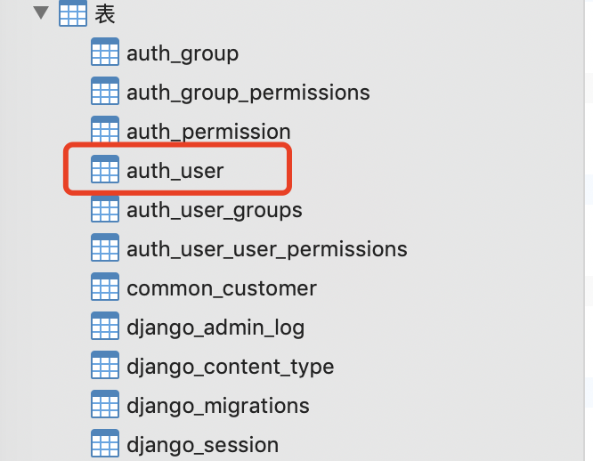
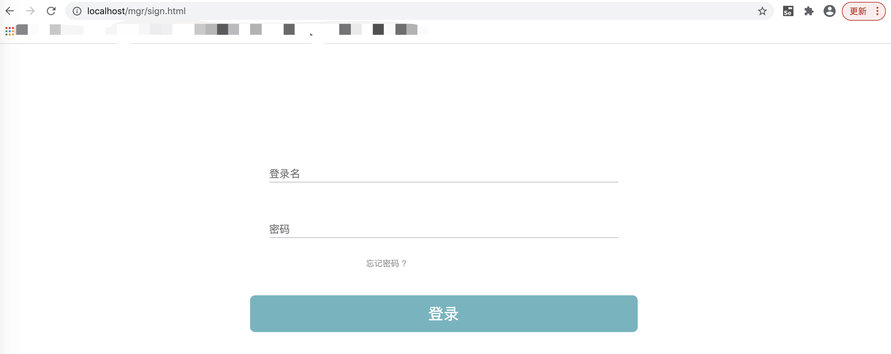

# 08-实现登录

前面我们实现了服务端管理员端一些增删改查操作，但是，我们还没有实现管理员端登录功能。

现在我们来根据，API接口文档，[点击这里查看](http://www.python3.vip/tut/webdev/django/doc_api_v1_0/) 实现管理员登录功能。


## 处理登录、登出请求


我们可以在mgr目录里面创建一个代码文件：sign_in_out.py，这个代码文件就是用来处理管理员登录和登出的API请求的。

大家可以思考一下，我们的代码该如何处理登录请求呢？

无非就把请求参数里面的用户名、密码取出来，和数据库中记录的用户名密码进行比对。如果和数据库中记录的一致就认为是认证通过，否则就是不通过。

Django中创建一个项目，自动为我们创建了一张用户表，名为auth_user。如下所示：




并且已经为我们做好了登录名、密码验证的库。我们只需要使用库里面的方法就可以了。Django的文档就给出了登录和登出代码范例，我们稍微修改一下。

我们在mgr目录下面，创建一个sign_in_out.py文件。

```
from django.contrib.auth import authenticate, login, logout
from django.http import JsonResponse


# 登录处理
def signin(request):
    # 从HTTP POST请求中获取用户名、密码参数
    userName = request.POST.get('username')
    passWord = request.POST.get('password')

    # 使用Django auth库里面的方法校验用户名、密码
    user = authenticate(username=userName, password=passWord)
    # 如果能找到用户，并且密码正确
    if user is not None:
        if user.is_active:
            if user.is_superuser:
                login(request, user)
                request.session['usertype'] = 'mgr'
                return JsonResponse({'ret': 0})
            else:
                return JsonResponse({'ret': 1, 'msg': '请使用管理员账户登录'})
        else:
            return JsonResponse({'ret': 0, 'msg': '用户已经被禁用'})
    else:
        return JsonResponse({'ret': 0, 'msg': '用户已经被禁用'})


# 登出处理
def signout(request):
    # 使用登出方法
    logout(request)
    return JsonResponse({'ret': 0})

```


## 创建url路由


bysms系统，浏览器登录页面的url是：http://localhost/mgr/sign.html，但是这不是登录API接口的url路径。根据接口，管理员登录的API路径是：/api/mgr/signin, 前面，我们已经在总路由文件bysms/urls.py中添加了如下路由记录。

```
 # 凡是url以api/mgr开头的，都根据mgr.urls里面的子路由表进行路由
 path('api/mgr/', include('mgr.urls')),
```

现在，我们只需要在mgr目录下面的子路由文件urls.py里添加如下内容

```
from django.urls import path
from mgr import customer, sign_in_out

urlpatterns = [
    path('customers/', customer.dispatcher),
    path('signin/', sign_in_out.signin),
    path('signout/', sign_in_out.signout),
]
```

这样就表示：

如果有HTTP请求 url是 /api/mgr/signin 就由 sign_in_out.py 里面的signin 函数处理，

如果有HTTP请求 url是 /api/mgr/signout 就由 sign_in_out.py 里面的signout 函数处理。


##   测试我们的代码


这样我们后端的登录请求处理的代码已经完成了。

那么，怎么测试是否正确呢？

还是可以 使用 requests库构建 登录请求http消息， 并且检查响应，看看是否能登录成功。

非常简单，如下代码即可

```

def test_signin():
    payload = {
        'username': 'longyu',
        'password': '12345678'
    }
    response = requests.post('http://localhost/api/mgr/signin/', data=payload)
    pprint.pprint(response.json())


if __name__ == '__main__':
    test_signin()

```

运行结果如下：

{'ret': 0}

根据接口文档，ret 值为0，表示登录接口调用成功。



