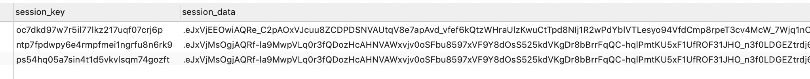
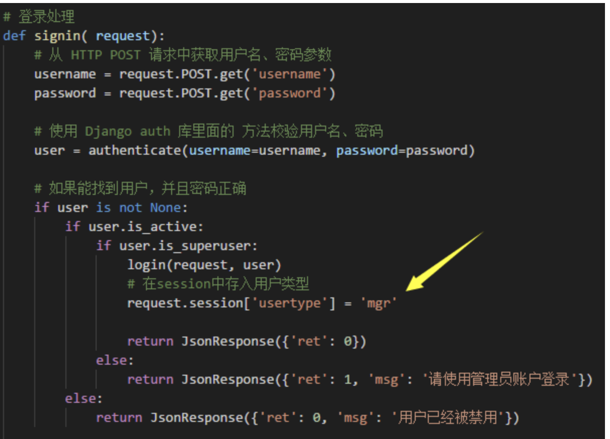
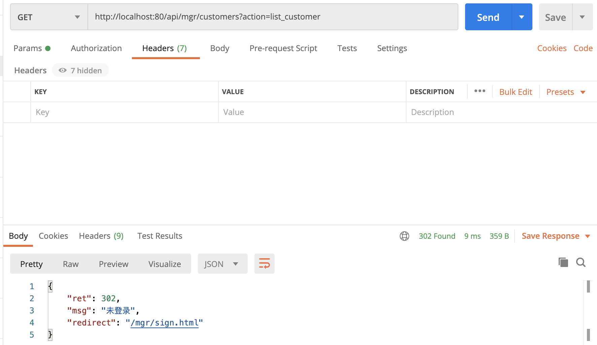
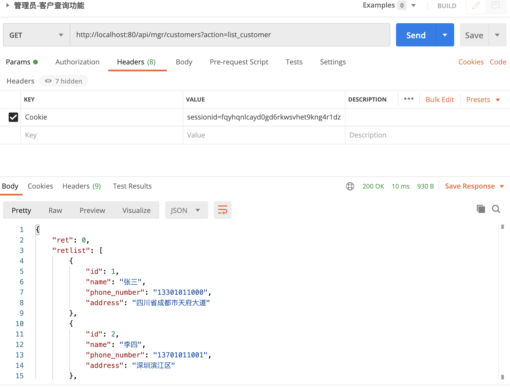

# 09-session和token


前面我们已经根据接口文档，编写代码，对前端发来对Customer API请求进行处理了。并且我们也编写了用户登录处理的代码。不知道大家有没有发现一个问题？

前端发来的Customer API请求，我们后端代码就直接处理了，并没有验证这个请求是不是已经登录的管理员发出的。如果是这样，客户端可以不需要登录，直接访问登录后的主页，我们编写的登录处理代码又有什么用呢？ 这就需要我们在处理Customer API请求前，判断发出该请求的用户是否已经登录了。


对于请求消息的合法性验证，通常用两种方案：session和token。


## session 方案


session就是会话的意思。

session方案的原理如下：

- 服务端在数据库中保存一张session表，这张表记录了一次用户登录的相关信息。具体记录什么信息，不同的系统各有差异，通常会记录该用户的ID、姓名、登录名之类的。Django中该表名字就叫django_session，如下所示。




大家可以发现sessionid通常就是一串字符串，用来标记一个session的。而session对应的数据在这里是加密的。通过这张表，服务端可以根据session号（通常叫session ID）查到session的信息数据。


- 在用户登录成功后，服务端就在数据库session表中创建一条记录，记录这次会话。 也就是创建一个新的sessionid插入到该表中。同时也放入一些该session对应的数据到记录的数据字段中，比如登录用户的信息。然后在该登录请求的HTTP响应消息中的头字段 Set-Cookie里填入sessionid数据。类似这样

```
Set-Cookie: sessionid=6qu1cuk8cxvtf4w9rjxeppexh2izy0hh
```

根据HTTP协议，这个Set-Cookie字段的意思就是要求前端将其中的数据存入cookie中。并且随后访问该服务的时候，在HTTP请求消息中必须带上这些cookie数据。


cookie通常就是存储在客户端浏览器的一些数据。服务端可以通过http响应消息，要求浏览器存储一些数据。以后每次访问同一个网站服务，必须在HTTP请求中再带上这些cookie里面的数据。

cookie数据由多个键值对组成，比如：

```
sessionid=6qu1cuk8cxvtf4w9rjxeppexh2izy0hh
username=byhy
favorite=phone_laptop_watch
```

- 该用户的后续操作，触发的HTTP请求，都会在请求头的Cookie字段带上前面说的sessionid。如下所示：

```
Cookie: sessionid=6qu1cuk8cxvtf4w9rjxeppexh2izy0hh
```

服务端接受到该请求后，只需要到session表中查看是否有该sessionid对应的记录，这样就可以判断这个请求是否是前面已经登录的用户发出的。如果不是，就可以拒绝服务，重定向http请求到登录页面让用户登录。


## token机制


使用session机制验证用户请求的合法性的主要缺点有两个

- 性能问题

因为，验证请求是更加sessionid到数据库中查找session表的，而数据库操作是服务端常见的性能瓶颈，尤其是当用户量比较大的时候。

- 扩展性问题

当系统用户特别多的时候，后端处理请求的服务端通常有多个，部署在多个节点上。但是多个节点都要访问session表，这样就要求数据库服务能被多个节点访问，不方便切分数据库以提高性能。


近些年，比较流行的一种token机制可以比较好的解决这些问题。

token简单来说，就是包含类数据信息和校验信息的数据包。

- session机制是把数据信息（比如session表）放到服务端，服务端数据是客户无法篡改的，从而保证验证的可靠性。
- token机制数据信息直接传给客户端，客户每次请求再携带过来给服务端。服务端无需查找数据库，直接根据token里面的数据信息进行校验。

那么问题来了：客户端数据直接发送给客户端，如果客户端篡改了数据，比如把自己改为vip用户怎么办？服务端怎么验证数据有没有被客户端篡改（术语叫完整性验证）呢？


token机制的原理如下：

- 服务端配置一个密钥（secret key），该密钥是服务端私密保存的，不能外泄。
- 在用户登录成功后，服务端将用户信息+密钥一起进行一个哈希计算，得到一个哈希值。
注意：哈希算法保证了，哈希值只能根据同样的源数据得到。如果谁修改了用户信息，除非他知道密钥，再次使用哈希算法才能得到正确的哈希值。所以这个哈希值，就是用来校验数据是否被修改的，然后将用户信息和哈希值一起做成一个字节串，这个字节串就称为token。大家可以发现token里面包含了用户数据信息和用于校验完整性的哈希值。

然后，服务端返回给客户端的HTTP响应中返回了这个Token。通常token放在HTTP响应的头部中的，具体哪个头部字段没有规定，开发者可以自行定义。


- 该用户的后续操作，触发的HTTP API请求，会在请求消息里面带上token。

具体在请求消息的什么地方存放token，开发者自己定义，通常也放在HTTP请求的头部只中。服务端接收到请求后，会根据数据信息和密钥使用哈希算法再次生成哈希值。如果客户修改了数据信息，因为他不知道密钥，没法得到正确的哈希值，那么服务端根据篡改后的数据+密钥得到的新哈希值一定和保存在token中的老哈希值不同。就知道数据被修改了。

如果客户没有修改数据，服务端根据原来的数据+密钥得到的哈希值和保存在token中原来的哈希值一致，就校验通过。校验通过后，就确信来数据没有被修改，可以放下的使用token里面的数据，进行后续的业务逻辑处理了。

上述处理中，由于不需要服务端访问查找数据库，从而大大提高了处理性能。


## 使用session验证客户端请求


Django对session的支持是缺省就有的，下面我们来看看如何加入对API请求的合法性验证。大家是否注意到，前面我们处理登录的函数中，有如下箭头所指的一行代码




这行代码的作用就是登录认证后，将用户类型保存到session数据中，也就是存入前面数据库的那张图的会话记录中。

Django 框架会自动在HTTP响应消息头中加入类似下面的的 sessionid cookie

```
   Set-Cookie: sessionid=????????
```
后续的HTTP请求会携带这个sessionid.我们处理URL以/api/mgr开头的api请求代码里面，需要加上一个验证逻辑。验证请求的cookie里面是否有sessionid，并且检查session 表，看看是否存在session_key为该sessionid的一条记录，该记录的数据字典里面是否包含了usertype为mgr的数据。

前面实现的代码中，这些请求都是在dispatcher入口函数处理的，我们就只需在该dispatcher中进行验证。修改mgr/customer.py的dispathcer函数，在前面加上如下代码：

```
# 根据session判断用户是否登录的管理员用户
    if 'usertype' not in request.sessiion:
        return JsonResponse({
            'ret': 302,
            'msg': '未登录',
            'redirect': '/mgr/sign.html'
        }, status=302)
    if request.sessiion['usertype'] != 'mgr':
        return JsonResponse({
            'ret': 302,
            'msg': '用户非mgr类型',
            'redirect': '/mgr/sign.html'
        }, status=302)
```


注意request对象里面的session属性对应的就是session记录里面的数据。该数据对象类似字典，所以检查是否有usertype类型为mgr的信息，就是这样写：

```
if request.session['usertype'] != 'mgr' 
```


接下来我们验证下：

未携带cookie数据请求如下，直接返回未登录：



加上cookie后，再次http请求，返回成功：



