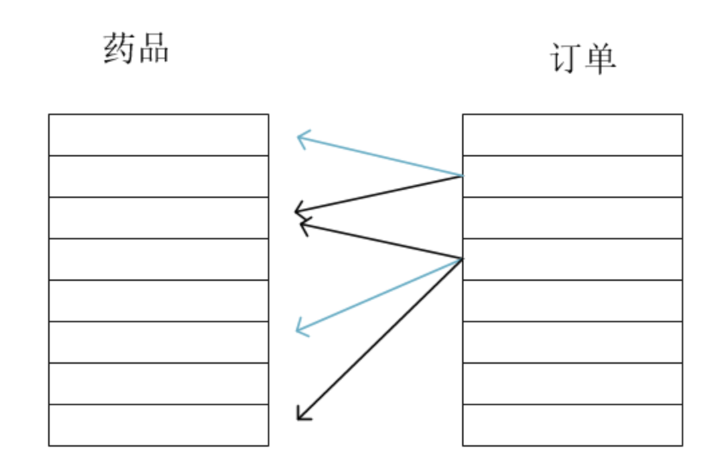

# 10-数据库表的关联


后端系统中，数据库设计是重中之重。特别是前后端分离的系统，后端的职责基本就是数据关联，开发的代码几乎都是围绕数据操作的。目前，使用的数据库系统主要还是关系型数据库。

什么是关系型数据库？就是建立在关系模型基础上的数据库。大家耳熟能详的mysql、oracle、sqlserver、SQLite都是，而mongodb、Cassandra不是。而关系型数据库，设计的一个难点就是各种表之间的关联关系。

常见的3种关联关系就是：一对多、一对一、多对多。


## 一对多


表之间一对多的关系，就是外键关联关系，比如，我们BYSMS系统中，已经定义了客户Customer这张表，如下所示：

```
from django.db import models


class Customer(models.Model):
    # 客户名称
    name = models.CharField(max_length=200)
    # 联系电话
    phone_number = models.CharField(max_length=200)
    # 地址
    address = models.CharField(max_length=200)
```

现在我们还需要定义药品（Medicine）这张表，包括药品名称、编号、和描述这些信息。这个也简单，添加如下的类定义：

```
class Medicine(models.Model):
    # 药品名
    name = models.CharField(max_length=200)
    # 药品编号
    sn = models.CharField(max_length=200)
    # 描述
    decs = models.CharField(max_length=200)
```

接下来我们要定义订单（Order）这张表，这个order表包括创建日期、客户、药品、数量。其中，客户字段对应的客户只能是Customer中的某个客户记录，可以说Order表里面一条订单记录的客户对应Customer表里面的一条客户记录，而多条Order记录里面的客户是可以对应Customer表里面同一个客户记录的。反过来说，就是一个客户记录可以对应多条订单记录，这就是一对多的关系，可以用如下图片表示：


像这种一对多的关系，数据库中是用外键来表示的。如果一个表中的某个字段是外键，那就意味着这个外键字段的记录取值，只能是它关联表的某个记录的主键的值。

当我们定义表的Modle类的时候，如果没有指定主键字段，migrate的时候Django会为该Model对应的数据库自动生成一个id字段，作为主键。

比如，我们这里，Customer、Medicine表均没有主键，但是在migrate之后，查看数据库记录就可以发现有一个id字段，且该字段是主键（primary key）。

现在我们要定义订单表Order，其中客户字段就应该是一个外键，对应customer的主键，也就是id字段。Django中定义外键的方法就是Model类的该属性字段值为Foreignkey对象，如下所示：


```
class Order(models.Model):
    # 订单名
    name = models.CharField(max_length=200, null=True, blank=True)
    # 创建日期
    create_date = models.DateTimeField(default=datetime.datetime.now)
    # 客户
    customer = models.ForeignKey(Customer,on_delete=models.PROTECT)
```

大家可以发现，customer字段是外键，指向Customer类。意思就是告诉Django：Order表的customer字段指向Customer表的主键的一个外键。另外一个参数on_delete指定了当我们想删除外键指向的主键记录时，系统的行为。比如，我们要删除客户记录，那么Order表中对应这个客户的订单记录该如何处理？

on_delete不同取值对应不同的做法，常见的做法如下：

- CASCADE 
  删除主键记录和相应的外键记录。比如，我们要删除客户张三，在删除了客户表中张三记录同时，也删除Order表中所有这个张三的订单记录。

- PROTECT
    禁止删除记录。比如，我们要删除客户张三，如果Order表中有张三的订单记录，Django系统就会抛出ProtectedError类型的异常，当然也就禁止删除客户记录和相关的订单记录了。除非我们将Order表中所有张三的订单记录都先删除掉，才能删除该客户表中的张三记录。

- SET_NULL
    删除主键记录，并且将外键记录中外键字段的值设置为null.当然前提是外键字段要设置为值允许是null。比如，我们要删除客户张三时，在删除了客户张三记录同时，会将Order表里面所有的张三记录里面的customer字段设置为null。但是上面我们并没有设置customer字段有null=True的参数设置，所以，是不能取值为SET_NULL的。


## 一对一


外键是一对多的关系，也可以说是多对一的关系。有时候表之间是一对一对关系，比如某个学校的学生和学生的地址表，就形成一对一的关系，即一条主键记录所在表的记录只能对应一条外键所在表的记录。Django中用OneToOneField对象实现一对一的关系。如下：

```
class Student(models.Model):
    # 姓名
    name = models.CharField(max_length=200)
    # 班级
    classname = models.CharField(max_length=200)
    # 描述
    desc = models.CharField(max_length=200)


class ContactAddress(models.Model):
    # 一对一 对应学生 
    student = models.OneToOneField(Student, on_delete=models.PROTECT)
    # 家庭
    homeaddress = models.CharField(max_length=200)
    # 电话号码
    phone = models.CharField(max_length=200)
```


Django发现这样一对一定义，他会在migrate的时候，在数据库中定义该字段为外键的同时，加上unique=True约束，表示在此表中，所有记录的该字段取值必须唯一，不能重复。


## 多对多


数据库表还有一种多对多的关系。在我们的BYSMS系统中，一个订单可以采购多种药品，就对应Medicine表里面的多种药品；而一种药品也可以被多个订单采购，那么Order表和Medicine表之间就形成了多对多关系。

其实对应关系可以用以下图来表示：




Django是通过ManyToManyField对象表示多对多的关系的。如下所示：

```
class Order(models.Model):
    # 订单名
    name = models.CharField(max_length=200, null=True, blank=True)
    # 创建日期
    create_date = models.DateTimeField(default=datetime.datetime.now)
    # 客户
    customer = models.ForeignKey(Customer, on_delete=models.PROTECT)
    # 订单购买的药品，和Medicine表是多对多关系
    medicines = models.ManyToManyField(Medicine, through='OrderMedicine')
    

class OrderMedicine(models.Model):
    order = models.ForeignKey(Order, on_delete=models.PROTECT)
    medicine = models.ForeignKey(Medicine, on_delete=models.PROTECT)
    # 订单中药品数量
    amount = models.PositiveIntegerField()
```

像这样

```
medicines = models.ManyToManyField(Medicine, through='OrderMedicine')
```

指定Order表和Medicine表的多对多关系，其实Order表中并不会产生一个叫medicines对字段。Order表和Medicine表的多对多关系是通过另外一张表，也就是through参数指定的OrderMedicine表来确定的。


migrate的时候，Django会自动产生一张新表（这里就是common_ordermedicine）来实现order表和medicine表之间的多对多关系。


可以执行如下命令进行验证：

```
python manage.py makemigrations common
python manage.py migrate
```
就会发现产生如下的一张新表common_ordermedicine


可以发现这张表中有 order_id 和 medicine_id 两个字段。

比如一个order表的订单id 为 1， 如果该订单中对应的药品有3种，它们的id分别 为 3，4，5。 那么就会有类似这样的这样3条记录在 common_order_medicine 表中。


## 实现代码


现在我们开始实现药品管理和订单管理的服务端代码了。


### 药品管理


其中药品管理部分比较简单，和前面的customer.py的代码基本类似。我们在mgr目录下面创建medicine.py，处理客户端发过来的列出药品、添加药品、修改药品、删除药品的请求。

如下所示：

```
from django.http import JsonResponse

# 导入Medicine对象定义
from common.models import Medicine
import json


def dispatcher(request):
    # 根据session判断用户是否是登录的管理员用户
    if 'usertype' not in request.session:
        return JsonResponse({
            'ret': 302,
            'msg': '未登录',
            'redirect': '/mgr/sign.html'
        }, status=302)
    if request.session['usertype'] != 'mgr':
        return JsonResponse({
            'ret': 302,
            'msg': '用户不是管理员',
            'redirect': '/mgr/sign.html'
        }, status=302)

    # 将请求参数统一放入request的params属性中，方便后续处理
    # GET请求参数在request对象的GET属性中
    if request.method == 'GET':
        request.params = request.GET

    # POST/PUT/DELETE 请求 参数 从 request 对象的 body 属性中获取
    elif request.method in ['POST', 'PUT', 'DELETE']:
        # 根据接口，POST、PUT、DELETE、请求的消息都是json格式
        request.params = json.loads(request.body)

    # 根据不同的action分派给不同的函数进行处理
    action = request.params['action']
    if action == 'list_medicine':
        return listmedicine(request)
    elif action == 'add_medicine':
        return addmedicine(request)
    elif action == 'modify_medicine':
        return modifymedicine(request)
    elif action == 'del_medicine':
        return deletemedicine(request)

    else:
        return JsonResponse({'ret': 1, 'msg': '不支持该类型http请求'})


def listmedicine(request):
    # 返回一个QuerySet对象，包含所有的表记录
    qs = Medicine.objects.values()
    # 将QuerySet对象转化为list类型，否则不能转化为JSON字符串
    retlist = list(qs)
    return JsonResponse({'ret': 0, 'retlist': retlist})


def addmedicine(request):
    info = request.params['data']
    # 从请求消息中 获取要添加客户的信息,并且插入到数据库中
    medicine = Medicine.objects.create(name=info['name'], sn=info['sn'], desc=info['desc'])
    return JsonResponse({'ret': 0, 'id': medicine.id})


def modifymedicine(request):
    # 从请求消息中 获取修改客户的信息, 找到该客户，并且进行修改操作
    medicine_id = request.params['id']
    new_data = request.params['newdata']
    try:
        # 根据Id从数据库中查找到相应的药品记录
        medicine = Medicine.objects.get(id=medicine_id)
    except Medicine.DoesNotExist:
        return JsonResponse({
            'ret': 1,
            'msg': f'id为{medicine_id}的药品不存在'
        })
    if 'name' in new_data:
        medicine.name = new_data['name']
    if 'sn' in new_data:
        medicine.sn = new_data['sn']
    if 'desc' in new_data:
        medicine.desc = new_data['desc']

    # 注意一定要执行save才能将修改信息保存到数据库
    medicine.save()
    return JsonResponse({'ret': 0, 'msg': '药品添加成功'})


def deletemedicine(request):
    medicine_id = request.params['id']

    try:
        medicine = Medicine.objects.get(id=medicine_id)
    except Medicine.DoesNotExist:
        return JsonResponse({
            'ret': 1,
            'msg': f'id为{medicine_id}的药品不存在'
        })
    # 执行delete方法将该记录从数据库中删除
    medicine.delete()
    return JsonResponse({'ret': 0, 'msg': '药品删除成功'})
```

实现了请求处理的模块后，我们可以在mgr/urls.py里面加上对medicine对请求处理路由设置


```
path('medicines', medicine.dispatcher), # 加上这行
```

接下来就可以对这些功能进行测试了。

