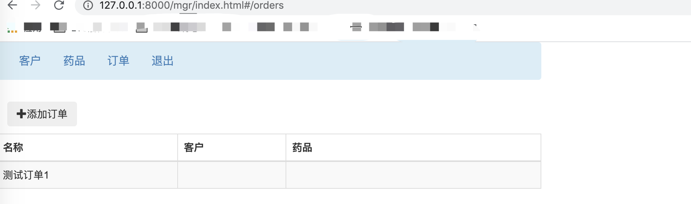
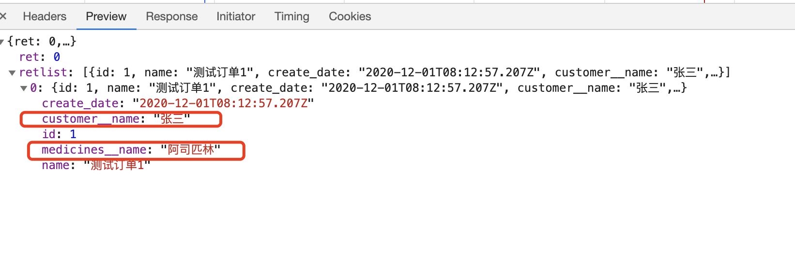
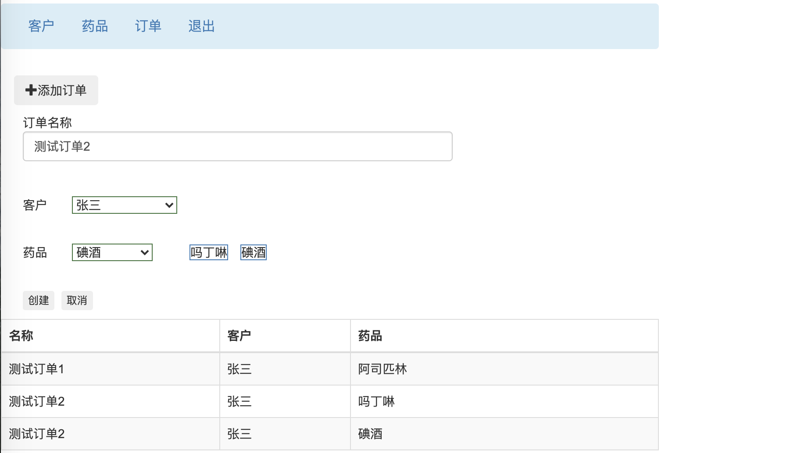
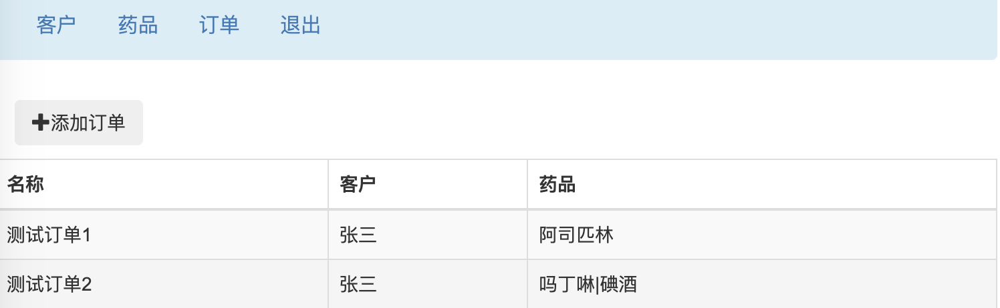

# 11-ORM关联表、事务


## ORM对关联表的操作

前面我们学过一对多，一对一，多对多，都是通过外键来实现。接下来我们通过一个实例颜色，Django如何操作外键关联关系，可以在models.py中定义如下两个Model，对应两张表，进行测试：

```
# 国家表
class Country(models.Model):
    name = models.CharField(max_length=100)

# 学生表， country 字段是国家表的外键，形成一对多的关系
class Student(models.Model):
    name    = models.CharField(max_length=100)
    grade   = models.PositiveSmallIntegerField()
    country = models.ForeignKey(Country,
                                on_delete=models.PROTECT)
```


然后，执行：

```
python manage.py makemigrations common
python manage.py migrate
```
是定义生效到数据库中

然后，命令中执行python manage.py shell , 直接启动Django命令行，输入代码。 先输入如下代码，创建一些数据


```
from common.models import *
c1 = Country.objects.create(name='中国')
c2 = Country.objects.create(name='美国')
c3 = Country.objects.create(name='法国')
Student.objects.create(name='白月', grade=1, country=c1)
Student.objects.create(name='黑羽', grade=2, country=c1)
Student.objects.create(name='大罗', grade=1, country=c1)
Student.objects.create(name='真佛', grade=2, country=c1)
Student.objects.create(name='Mike', grade=1, country=c2)
Student.objects.create(name='Gus',  grade=1, country=c2)
Student.objects.create(name='White', grade=2, country=c2)
Student.objects.create(name='White', grade=2, country=c2)
Student.objects.create(name='Napolen', grade=2, country=c3)
```


## 通过对象访问外键表

如果你已经获取了一个student对象，要得到它对国家名称只需这样

```
>>> s1 = Student.objects.get(name='白月')
>>> s1.country.name

```


## 根据外键表数据过滤

如果，我们要查找Student表中所有一年级学生，很简单

```
Student.objects.filter(grade=1).values()

```

如果现在，我们要查找Student表中所有一年级中国学生，该怎么写呢？

不能这么写：
```
Student.objects.filter(grade=1,country='中国')
```
因为student表中country字段并不是国家的名称，而是外键，其实就是对应Country记录的id。可能有的朋友已经想，我们先获取中国的国家id，然后再通过id去找，像这样：

```
cn = Country.objects.get(name='中国')
Student.objects.filter(grade=1,country_id=cn.id).values()
```

注意外键字段的id是通过后缀_id获取的。或者这样，也是可以的

```
cn = Country.objects.get(name='中国')
Student.objects.filter(grade=1,country=cn).values()
```

上面的方法，写起来麻烦一些，有两部操作。而且需要发送两次数据请求，性能不高。其实Django ORM中，对外键关联，有更方便的语法。可以这样写：

```
Student.objects.filter(grade=1,country__name='中国').values()
```
写起来简单，一步到位，而且只需要发送一个数据库请求，性能更好。

如果返回结果只需要学生姓名和国家名两个字符，可以指定values内容：

```
Student.objects.filter(grade=1,country__name='中国')\
     .values('name','country__name')
```

但是这样写有个问题：选择出来的记录中，国家名是country__name。两个下划线比较奇怪。有时候，前后端的接口的设计者，定义好了接口格式，如果要求一定是countryname这样怎么办？
可以使用annotate方法将获取的字段值进行重命名，像下面这样：

```
from django.db.models import F

# annotate 可以将表字段进行别名处理
Student.objects.annotate(
    countryname=F('country__name'),
    studentname=F('name')
    )\
    .filter(grade=1,countryname='中国').values('studentname','countryname')
```


## 反向访问

如果你已经获取了一个Conutry对象，如何访问到所有属于这个国家的学生呢？

```
cn = Country.objects.get(name='中国')
cn.student_set.all()
```

通过Model名转化为小写，后面加上一个_set来获取所有的反向外键关联对象，Django还给出了一个方法，可以更直观的反映关联关系。

在定义Model的时候，外键字段使用related_name参数，像这样
```
# 国家表
class Country(models.Model):
    name = models.CharField(max_length=100)

# country 字段是国家表的外键，形成一对多的关系
class Student(models.Model):
    name    = models.CharField(max_length=100)
    grade   = models.PositiveSmallIntegerField()
    country = models.ForeignKey(Country,
                on_delete = models.PROTECT,
                # 指定反向访问的名字
                related_name='students')
```

就可以使用更直观的属性名，像这样。

```
cn = Country.objects.get(name='中国')
cn.students.all()
```


## 反向过滤

如果我们要获取所有具有一年级学生的国家名，该怎么写？

当然可以这样：

```
# 先获取所有的一年级学生id列表
country_ids = Student.objects.filter(grade=1).values_list('country', flat=True)

# 再通过id列表使用  id__in  过滤
Country.objects.filter(id__in=country_ids).values()
```

但是这样同样存在麻烦和性能的问题，Django ORM可以这样写：

```
Country.objects.filter(students__grade=1).values()
```

注意， 因为，我们定义表的时候，用 related_name='students' 指定了反向关联名称 students ，所以这里是 students__grade 。 使用了反向关联名字。如果没有指定方向关联名，则应该使用表名转化为小写，就是这样：

```
Country.objects.filter(student__grade=1).values()
```

但是，我们发现，这种方式，会有重复的记录产生，如下：

```
<QuerySet [{'id': 1, 'name': '中国'}, {'id': 1, 'name': '中国'}, {'id': 2, 'name': '美国'}, {'id': 2, 'name': '美国'}]>

```

可以使用 .distinct()去重

```
Country.objects.filter(student__grade=1).values().distinct()

```

注意：据说 .distinct()对MySQL数据库无效，我没有来得及验证。实测 SQLite，Postgresql有效。


## 实现项目代码


### url路由更新

现在，我们在mgr目录下面新建order.py处理客户端发过来的列出订单、添加订单的请求。同样，写写dispatcher函数，代码如下：

```
from django.db import IntegrityError, transaction

# 导入order对象定义
from common.models import Order, OrderMedicine
import json


def dispatcher(request):
    # 根据session判断用户是否是登录的管理员用户
    if 'usertype' not in request.session:
        return JsonResponse({
            'ret': 302,
            'msg': '未登录',
            'redirect': '/mgr/sign.html'},
            status=302)

    if request.session['usertype'] != 'mgr':
        return JsonResponse({
            'ret': 302,
            'msg': '用户非mgr类型',
            'redirect': '/mgr/sign.html'},
            status=302)

        # 将请求参数统一放入request 的 params 属性中，方便后续处理

        # GET请求 参数 在 request 对象的 GET属性中
    if request.method == 'GET':
        request.params = request.GET

        # POST/PUT/DELETE 请求 参数 从 request 对象的 body 属性中获取
    elif request.method in ['POST', 'PUT', 'DELETE']:
        # 根据接口，POST/PUT/DELETE 请求的消息体都是 json格式
        request.params = json.loads(request.body)

        # 根据不同的action分派给不同的函数进行处理
    action = request.params['action']
    if action == 'list_order':
        return listorder(request)
    elif action == 'add_order':
        return addorder(request)

    # 订单 暂 不支持修改 和删除

    else:
        return JsonResponse({'ret': 1, 'msg': '不支持该类型http请求'})
```

和以前差不多，没有什么好说的。

然后，我们在 mgr\urls.py 里面加上 对 orders 请求处理的路由

```
 path('orders', order.dispatcher), # 加上这行
```


### 事务


接下来，我们添加函数addorder，来处理添加订单请求。我们添加一条订单记录，需要在2张表（Order和OrderMedicine）中添加记录。

这里有个需要特别注意的地方，有两张表的插入，意味着我们要有两次数据库的操作。如果第一次插入成功，而第二次插入失败，就会出现Order表中把订单信息写了一部分，而OrderMedicine表中该订单的信息却没有写成功。

这是个大问题：就会造成这个处理做了一半，那么数据库中就会出现数据的不一致。术语叫做，脏数据。熟悉数据库的同学就会知道，我们应该用数据库的事务机制来解决这个问题。把一批数据库操作放在事务中，该事务的任何一次数据库操作失败了，数据库系统就会让整个事务就发生回滚，撤销前面的操作，数据库回滚到这事务操作之前的状态。

Django怎么实现事务操作呢？ 这里我们可以使用Django的 with transaction.atomic()

代码如下：

```
def listorder(request):
    info = request.params['data']
    # 从请求消息中 获取要添加订单的信息,并且插入到数据库中
    with transaction.atomic():
        new_order = Order.objects.create(name=info['name'],
                                         customer_id=info['customerid'])
        batch = [OrderMedicine(order_id=new_order.id, medicine_id=mid, amount=1) for mid in info['medicineids']]
        OrderMedicine.objects.bulk_create(batch)
    return JsonResponse({'ret': 0, 'id': new_order.id})
```

 with transaction.atomic(): 下面缩进部分的代码，对数据库对操作，就都是在一个事务中进行了。如果其中有任何一步数据操作失败了，前面的操作都会回滚。这可以防止出现，前面的Order表记录插入成功，而后面的订单药品记录插入失败而导致的数据不一致现象。

大家可以发现 插入 OrderMedicine 表中的数据 可能有很多条， 如果我们循环用 ``` OrderMedicine.objects.create(order_id=new_order.id,medicine_id=mid,amount=1) ``` 插入的话， 循环几次， 就会执行 几次SQL语句 插入的 数据库操作 这样性能不高。我们可以把多条数据的插入，放在一个SQL语句中完成， 这样会大大提高性能。

方法就是使用 bulk_create， 参数是一个包含所有 该表的 Model 对象的 列表

现在可以运行服务，用做好的前端系统添加几条订单记录，然后看一下数据库里面的数据是否正确。


### ORM外键关联


接下来我们编写listorder函数用来处理列出订单请求。

根据接口文档，我们应该返回订单记录格式，如下：

```
[
    {
        id: 1, 
        name: "华山医院订单001", 
        create_date: "2018-12-26T14:10:15.419Z",
        customer_name: "华山医院",
        medicines_name: "青霉素"
    },
    {
        id: 2, 
        name: "华山医院订单002", 
        create_date: "2018-12-27T14:10:37.208Z",
        customer_name: "华山医院",
        medicines_name: "青霉素 | 红霉素 "
    }
] 
```

其中 ‘id’,‘name’,‘create_date’ 这些字段的内容获取很简单，order表中就有这些字段，

只需要这样写就可以了。

```
def listorder(request):
    # 返回一个 QuerySet 对象 ，包含所有的表记录
    qs = Order.objects.values('id','name','create_date')
    return JsonResponse({'ret': 0, 'retlist': newlist})
```

问题是：‘customer_name’ 和 ‘medicines_name’ 这两个字段的值怎么获取呢？ 因为 订单对应的客户名字 和 药品的名字 都不在 Order 表中啊。

Order 这个Model 中 有 ‘customer’ 字段 ， 它外键关联了 Customer 表中的一个 记录，这个记录里面 的 name字段 就是我们要取的字段。

取 外键关联的表记录的字段值，在Django中很简单，可以直接通过 外键字段 后面加 两个下划线 加 关联字段名的方式 来获取。

比如 这里我们就可以用 下面的代码来实现

```
 qs = Order.objects.values('id', 'name', 'create_date', 'customer__name')  # 两个下划线表示外键关联的表中的name字段的值
    # 将queryset对象转化为list类型
    retlist = list(qs)
    return JsonResponse({'ret': 0, 'retlist': retlist})
```
我们可以 浏览器访问一下 订单管理界面， F12 查看 浏览器抓包。

同样的道理 ， 订单对应 的药品 名字段，是 多对多 关联， 也同样可以用 两个下划线 获取 关联字段的值， 如下所示:

```

def listorder(request):
    qs = Order.objects.values('id', 'name', 'create_date', 'customer__name',
                              'medicines__name')  # 两个下划线表示外键关联的表中的name字段的值
    # 将queryset对象转化为list类型
    retlist = list(qs)
    return JsonResponse({'ret': 0, 'retlist': retlist})
```

我们可以浏览器访问一下订单管理界面，F12查看浏览器抓包。




首先，第一个问题， 接口文档需要的名字是 ‘customer_name’ 和 ‘medicines_name’。 里面只有一个下划线， 而我们这里却产生了 两个下划线。



应该怎样解决这个问题呢，可以使用 annotate 方法将获取的字段值进行重命名，像下面这样：

```
def listorder(request):
    qs = Order.objects.annotate(
        customer_name=F('customer__name'),
        medicines_name=F('medicines__name')
    ).values('id', 'name', 'create_date', 'customer_name',
             'medicines_name')  # 两个下划线表示外键关联的表中的name字段的值
    # 将queryset对象转化为list类型
    retlist = list(qs)
    return JsonResponse({'ret': 0, 'retlist': retlist})
```

再次再浏览器运行，结果如下：




可以发现存在第二个问题，如果一个订单有多个药品，就会产生多条记录，这不是我们想要的。根据接口，一个订单里面的多个药品，用竖线隔开。怎么办？我们可以用python代码来处理，像下面这样。

```
def listorder(request):
    qs = Order.objects.annotate(
        customer_name=F('customer__name'),
        medicines_name=F('medicines__name')
    ).values('id', 'name', 'create_date', 'customer_name',
             'medicines_name')  # 两个下划线表示外键关联的表中的name字段的值
    # 将queryset对象转化为list类型
    retlist = list(qs)
    # 可能有ID相同，药品不同的订单记录，需要合并
    newlist = []
    id2order = {}
    for i in retlist:
        orderid = i['id']
        if orderid not in id2order:
            newlist.append(i)
            id2order[orderid] = i
        else:
            id2order[orderid]['medicines_name'] += '|' + i['medicines_name']
    return JsonResponse({'ret': 0, 'retlist': newlist})
```





可以发现问题已经解决了。