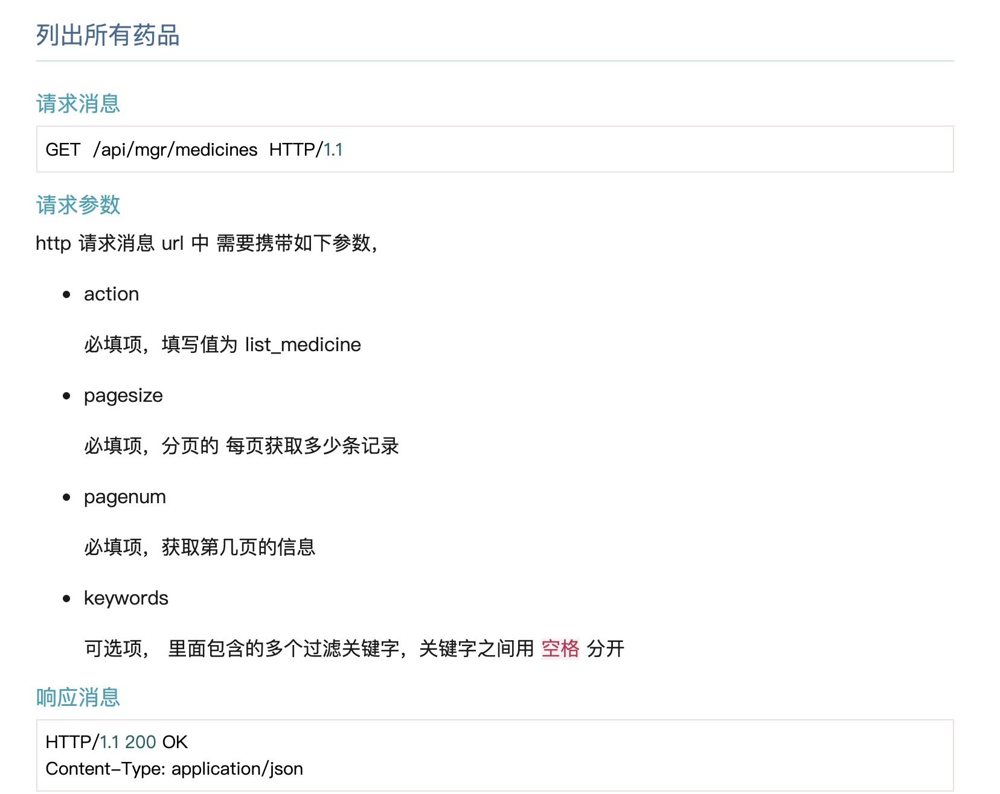
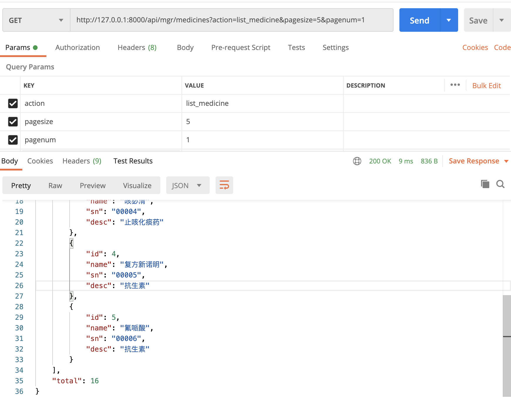
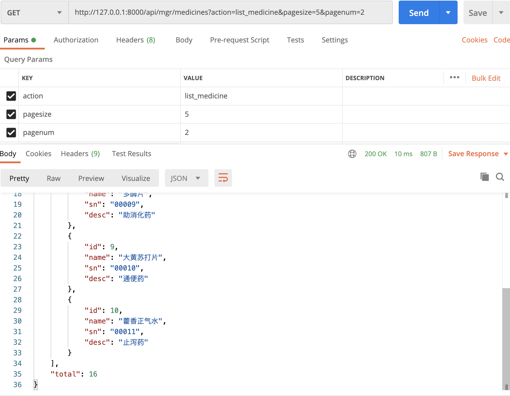

# 13-分页和过滤

如果我们有大量的数据， 比如系统中存储10万种药品，这个表将会非常的长，需要后端程序从数据库中读取大量的数据，并且传递给前端。而用户通常只需要看其中的一点点数据。这是非常大的性能浪费。怎么解决这个问题？大家只要看看淘宝、京东这些购物网站就知道了，

方案是 分页 和 过滤 。

- 分页就是每次只读取一页的信息，返回给前端。

- 过滤就是根据用户的提供的筛选条件，只读取符合条件的部分信息。


## 分页

先看分页的实现，既然要分页，那么前端发送的请求中需要携带两个信息：每页包含多少条记录和需要获取第几页。我们定义列出数据请求中的2个url参数：pagesize 和pagenum 分别对应这两个信息。

为了实现分页 和 过滤 ，接口也做了相应的修改，修改后的接口文档如下：




Django提供了对分页的支持，具体的信息，大家可以查看其官方文档：

以列出药品的代码为例， 我们可以修改 listmedicine 函数，如下

```
def listmedicine(request):
    try:
        # 返回一个QuerySet对象，包含所有的表记录
        qs = Medicine.objects.values()
        # 要获取第几页
        pagenum = request.params['pagenum']
        # 每页显示多少条记录
        pagesize = request.params['pagesize']
        # 使用分页对象，设定每页多少条记录
        pgnt = Paginator(qs, pagesize)
        # 从数据库中读取数据，指定读取其中第几页
        page = pgnt.page(pagenum)
        # 将Queryset对象转化为list类型
        retlist = list(page)
        # total指定了一共有多少条数据
        return JsonResponse({'ret': 0, 'retlist': retlist, 'total': pgnt.count})
    except EmptyPage:
        return JsonResponse({'ret': 0, 'retlist': [], 'total': 0})
```


接下来我们测试一下：



然后调整参数，获取第二页数据：




注意，我们返回的信息，包括一页的数据， 还需要告诉前端， 符合条件的 总共有多少条记录 。为什么？因为这样，前端可以计算出， 总共有多少页，从而正确的显示出分页界面。如下所示：


这行代码创建了分页对象，在初始化参数里面设定每页多少条记录
```
pgnt = Paginator(qs, pagesize)
```
返回的分页对象，赋值给变量pgnt。

然后，一页的数据就可以通过pgnt.page(pagenum)获取。而总共有多少页可以使用：pgnt.num_pages得到，总共有多少数据可以使用pgnt.count得到。


## 过滤

我们在看过滤如何实现。过滤就是根据用户提供的筛选条件，只读取符合条件的部分信息。

比如，列出药品，需要根据 药品描述 中包含的关键字来 查询 。而且用户可能会输入多个关键字， 比如 乳酸 和 注射液 。这就有一个问题， 多个关键字查询 是 且 的关系 还是 或 的关系。 前者要求 药品描述 同时包含 多个关键字， 后者只需 包含其中任意一个关键字即可。

我们这里先以且的关系为例。

首先，我们需要在 列出药品的请求消息里面 添加一个参数 保存关键字信息。我们这里使用 keywords 参数。里面包含的多个关键字之间用 空格 分开。查询过滤条件，前面我们学过，可以通过 QuerySet 对象的 filter方法， 比如

```
qs.filter(name__contains='乳酸')
```
注意，上面的 name__contains='乳酸' 表示 name 字段包含乳酸这个关键字。Django执行该代码是，会转换为下面的SQL条件从句到数据库进行查询

```
WHERE name LIKE '%乳酸%'
```

如果有多个过滤条件，可以继续在后面调用filter方法，比如：
```
qs.filter(name__contains='乳酸').filter(name__contains='注射液')
```

就等价于下面的 SQL条件从句

```
WHERE name LIKE '%乳酸%' AND name LIKE '%注射液%'
```
大家注意没有， 多次调用 filter 方法，是一种 AND 关系， 也就是要同时满足这些条件。如果我们想表示的是or的关系该怎么办呢？

这时候，可以使用 Django 里面提供 的 Q 对象 。参考官方文档

Q对象的初始化参数里面携带和filter一致的条件，比如：
```
from django.db.models import Q
qs.filter(Q(name__contains='乳酸'))
```

如果我们查询的多个过滤条件是 或 的关系，就用 竖线 | 符号 连接多个Q对象，比如
```
qs.filter( Q(name__contains='乳酸') | Q(name__contains='注射液'))
```

等价于 下面的 SQL条件从句
```
WHERE name LIKE '%乳酸%' OR name LIKE '%注射液%'
```
如果我们查询的多个过滤条件是 且 的关系，就用 & 符号 连接多个Q对象，比如

```
qs.filter( Q(name__contains='乳酸') & Q(name__contains='注射液'))
```
等价于 下面的 SQL条件从句

```
WHERE name LIKE '%乳酸%' and name LIKE '%注射液%'
```

了解了上面的方法，我们继续修改listmedicine函数，如下所示：

```
def listmedicine(request):
    try:
        # order_by('-id')表示按照id字段的值倒序排列，这样可以保证最新的记录显示在最前面
        qs = Medicine.objects.values().order_by('-id')

        # 查看是否有关键字搜索参数
        keywords = request.params.get('keywords', None)
        if keywords:
            conditions = [Q(name__contains=one) for one in keywords.split('') if one]
            query = Q()
            for condition in conditions:
                query &= condition
            qs = qs.filter(query)

        # 要获取第几页
        pagenum = request.params['pagenum']
        # 每页显示多少条记录
        pagesize = request.params['pagesize']
        # 使用分页对象，设定每页多少条记录
        pgnt = Paginator(qs, pagesize)
        # 从数据库中读取数据，指定读取其中第几页
        page = pgnt.page(pagenum)
        # 将Queryset对象转化为list类型
        retlist = list(page)
        # total指定了一共有多少条数据，num_pages返回总共多少页，count返回总记录条数
        return JsonResponse({'ret': 0, 'retlist': retlist, 'total': pgnt.count, 'total_page_num': pgnt.num_pages})
    except EmptyPage:
        return JsonResponse({'ret': 0, 'retlist': [], 'total': 0})
    except:
        return JsonResponse({'ret': 2, 'msg': f'未知错误\n{traceback.format_exc()}'})
```