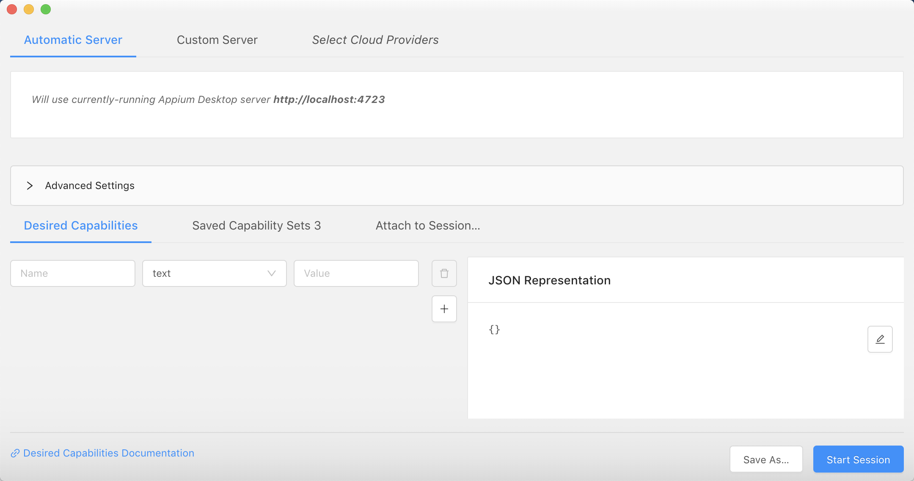

# 02-APPIUM环境搭建

## 一、APPIUM生态工具

- adb：Android的控制工具，用于获取android的各种数据和控制（可以单独安装，也可以安装安卓SDK）
- Appium Desktop：内嵌了appium server和inspector的综合工具
- Appium Server：appium的核心工具，命令行工具
- Appium client：各种语言的客户端封装库，用于连接appium server
  - python
  - java
  - ruby
  - robotframework-appium
- AppCrawler自动遍历工具


### Appium Dsektop工具包

下载地址：https://github.com/appium/appium-desktop


安装成功，如下图：


### 安装SDK
下载安装Aandroid_studio,下载地址：https://developer.android.com/studio#downloads

安装完毕之后配置相关环境变量：
```
# 修改配置文件
 
vim ~/.bash_profile
 
#设置ANDROID_HOME环境变量：
export ANDROID_HOME=/Users/user/Library/Android/sdk
export PATH=$PATH:$ANDROID_HOME/tools
export PATH=$PATH:$ANDROID_HOME/platform-tools
 
# 刷新配置生效
source ~/.bash_profile
```

**安装完成的几个关键：**

- adb放在了PATH变量下
- ANDROID_HOME环境变量设置为SDK路径
- java在PATH变量下，可直接执行

**真机或模拟器：**

- 模拟器使用Android Studio或者sdk中的sdkmanager进行创建
- 真机自备
- 网易mumu模拟器 https://mumu.163.com/


使用命令创建模拟器
```

avdmanager list
avdmanager create avd -n test -k "system-images;android-27;google_apis_playstore;x86"
emulator -list-avds
```

### 安装APPIUM Server

安装appium

使用npm命令，必须要先安装NodeJS，NPM的全称是Node Package Manager ，是一个NodeJS包管理和分发工具。

mac推荐使用brew安装，前提是mac安装了Homebrew。
```
brew install node #安装node
```

官方安装
```
npm install -g appium
npm install -g appium@1.18.1 #更新至指定版本
```

淘宝cnpm安装（最稳定的方法）
```
npm install -g cnpm
npm install -g cnpm --registry=https://registry.npm.taobao.org
cnpm install -g appium
```
安装成功标识
```
appium
[Appium] Welcome to Appium v1.17.1
[Appium] Appium REST http interface listener started on 0.0.0.0:4723
```

## 二、录制case

### 创建模拟器(也可以使用真机)

使用android_studio,avdmanager进行创建, avd(android viturial devices)
点击avdmanager，进入下图：


点击创建虚拟设备，create virtual devices，进入下图


选择对应的屏幕尺寸，点击next


选择对应的安卓版本镜像，需要下载。然后点击next。（注意：x86 和 arm是两个不同厂家的指令级，微信在x86的指令集可能安装不上）


最后进入虚拟设备的一些配置确认调整，finish即可完成虚拟设备创建。


创建成功的虚拟设备，可以选择设备进行启动运行。


使用命令进行创建
```
# 查看Android命令下的辅助命令
HCBdeMacBook-Pro:~ user$ android
*************************************************************************
The "android" command is deprecated.
For manual SDK, AVD, and project management, please use Android Studio.
For command-line tools, use tools/bin/sdkmanager and tools/bin/avdmanager
*************************************************************************
Invalid or unsupported command ""
 
Supported commands are:
android list target
android list avd
android list device
android create avd
android move avd
android delete avd
android list sdk
android update sdk
HCBdeMacBook-Pro:~ user$
# 查看虚拟设备
HCBdeMacBook-Pro:~ user$ emulator -list-avds
Pixel_2_XL_API_29
test_phone
 
# 使用命令创建模拟器
android create avd -n test_android_phone -k 'system-images;android-26;google_apis_playstore;x86' #-k后面的镜像要在本地
```

### 打开appium 启动虚拟设备录制case


点击start server


进入appium控制台页面，appium-server控制台，会打印log信息，监听本机4723端口收到的请求。

点击放大镜：



在desired capabilities 输入一些参数选项，用于启动app


输入参数，点击start session即可启动app。通过adb logcat |grep -i displayed 可以获取应用包名，以及应用主入口。


接着点击录制：start recoreding


选中点击区域，点击Tap


选择对应的语言，生产详细的示例，然后copy到IDEA即可执行，生成的代码如下：
```
# This sample code uses the Appium python client
# pip install Appium-Python-Client
# Then you can paste this into a file and simply run with Python
 
from appium import webdriver
 
caps = {}
caps["platformName"] = "android"
caps["deviceName"] = "emulator-5554"
caps["appPackage"] = "com.xueqiu.android"
caps["appActivity"] = ".view.WelcomeActivityAlias"
 
driver = webdriver.Remote("http://localhost:4723/wd/hub", caps)
 
el1 = driver.find_element_by_id("com.xueqiu.android:id/tv_agree")
el1.click()
 
driver.quit()
```