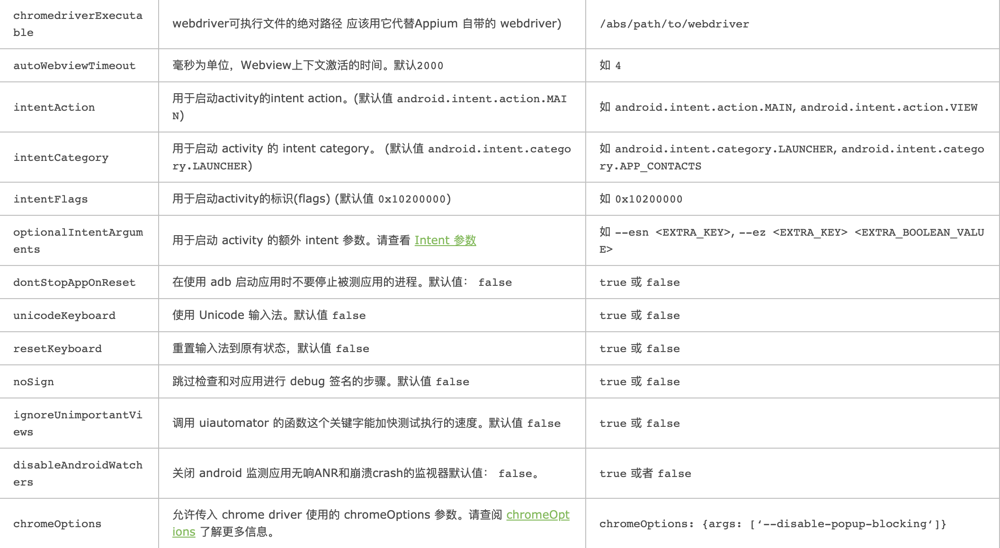
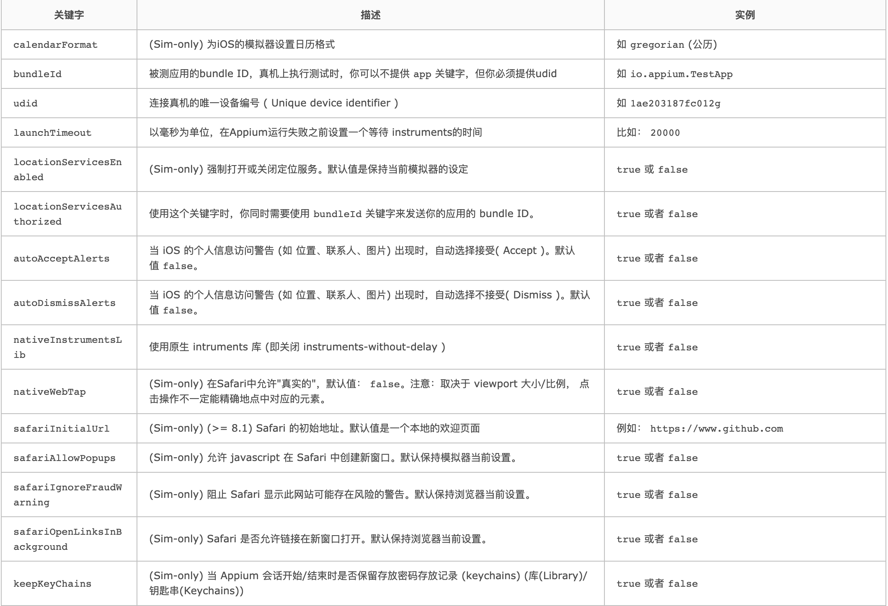

# 03-APPIUM定位技术

## 一、appium自动化用例编写

- 导入依赖
  - python from import
  - java import
- capabilities 设置
  - python dict
  - java class
- 初始化driver
  - python webdriver.remote
  - java new AppiumDriver
- 元素定位与操作 find + action
- 断言 assert

将普通录制动案例代码改成测试框架：

普通录制的代码样式：
```
from appium import webdriver


caps = {}
caps["platformName"] = "android"
caps["deviceName"] = "test1"
caps["appPackage"] = "com.xueqiu.android"
caps["appActivity"] = ".view.WelcomeActivityAlias"
driver = webdriver.Remote("http://localhost:4723/wd/hub", caps)
driver.implicitly_wait(10)
self.driver.find_element_by_id("com.xueqiu.android:id/tv_agree")
el1.click()
el2 = self.driver.find_element_by_id("com.xueqiu.android:id/all_stock_tv")
el2.click()
self.driver.quit()
```

优化成pytest框架样本：
用一个class进行管理，使用setup和teardown进行共性代码拆分

```
# This sample code uses the Appium python client
# pip install Appium-Python-Client
# Then you can paste this into a file and simply run with Python
from time import sleep
from appium import webdriver
from appium.webdriver.common.mobileby import MobileBy


class TestXueQiu:

    def setup(self):
        caps = {}
        caps["platformName"] = "android"
        caps["deviceName"] = "test1"
        caps["appPackage"] = "com.xueqiu.android"
        caps["appActivity"] = ".view.WelcomeActivityAlias"
        self.driver = webdriver.Remote("http://localhost:4723/wd/hub", caps)
        self.driver.implicitly_wait(10)

    def test_search(self):
        el1 = self.driver.find_element_by_id("com.xueqiu.android:id/tv_agree")
        el1.click()
        el2 = self.driver.find_element_by_id("com.xueqiu.android:id/all_stock_tv")
        el2.click()
        # el3 = self.driver.find_element(MobileBy.ID,)
      

    def teardown(self):
        sleep(20) #加slepp目的是用例运行结束后，不直接关闭可以看看当前执行完的界面内容
        self.driver.quit()
```

## 二、capabilities设置


### 什么是capabilitiy和session
Capability的功能是配置Appium会话。他们告诉Appium服务器您想要自动化的平台和应用程序。
DesiredCapabilities是一组设置的键值对的集合，其中键对应设置的名称，而值对应设置的值。主要用于通知Appium服务器建立需要的Session。

会话Session：Appium的客户端和服务端之间进行通信都必须在一个Session的上下文中进行。客户端在发起通信的时候首先会发送一个叫作“Desired Capabilities”的JSON对象给服务器。服务器收到该数据后，会创建一个session并将session的ID返回到客户端，之后客户端可以用该session的ID发送后续的命令。


### 常用capabilitiy配置

官方文档：https://github.com/appium/appium/blob/master/docs/en/writing-running-appium/caps.md

Capability的配置主要分成了三部分：公共部分、安卓部分、iOS部分。不同的平台需要使用对应的配置！

- appium初始化基础参数


- Android 特有配置参数




- iOS特有配置参数




- 常用参数
  - app： apk地址
  - appPackage： 包名
  - appActivity： Activity名字
  - automationName： 默认使用uiautomator
  - noReset fullReset： 是否在测试前后重置相关环境
  - unicodeKeyBoard resetKeyBoard： 是否需要输入非英文 之外的语言并在测试完成后重置输入法


app信息：

```
获取当前界面元素：adb shell dumpsys activity top
获取任务列表：adb shell dumpsys activity activities
```

app入口：
```
adb logcat |grep -i displayed
或 aapt dump badging mobike.apk | grep launchable-activity
```

启动应用：

```
adb shell am start -W -n com.xueqiu.android/.view.WelcomeActivityAlias -S
```


## 三、控件定位与交互

### 控件基础知识

DOM：Document Object Model 文档对象模型。DOM 定义了访问 HTML 和 XML 文档的标准：

W3C 文档对象模型 （DOM） 是中立于平台和语言的接口，它允许程序和脚本动态地访问和更新文档的内容、结构和样式。
W3C DOM 标准被分为 3 个不同的部分：

 - 核心 DOM - 针对任何结构化文档的标准模型
 - XML DOM - 针对 XML 文档的标准模型
 - HTML DOM - 针对 HTML 文档的标准模型


HTML DOM  Tree 实例


XML DOM 


dom应用:最早应用于html和js 的交互。界面的结构化描述， 常见的格式为html、xml。核心 元素为节点和属性

xpath:xml路径语言，用于xml 中的节点定位


### APP控件知识

一个Android App是由一个或多个Activity组成，每一个Activity都是一个UI容器，也就是一个屏幕界面，一个界面的组成则是由一组Android UI控件组成。

Android UI控件根据其作用，大致可以分为两种：视图控件和布局控件。

一个视图控件在屏幕上占据一定的区域空间，通过Android提供的api，我们可以管理和空间这片区域的显示，以及处理这片区域发生的事件。比如Button（按钮）、TextView（文字框）、EditText（编辑框）、List（列表）、CheckBox（复选框）、RadioButton（单选框）等，这些视图控件都是继承自View类，它们都属于Android应用程序组成中的Widget。

View可以放在ViewGroup中，由ViewGroup进行布局的管理，实现ViewGroup的类即为布局控件，在Android中布局通常有以下几种不同的情况：
 
 - FrameLayout（框架布局）：系统默认的在屏幕上就有空白区显示它；
 - LinearLayout（线性布局）：让所有的子视图都成为单一的方向，即垂直的或者水平的； 
 - AbsoluteLayout（绝对布局）：让子视图使用x/y坐标确定在屏幕上的位置；
 - RelativeLayout（相对布局）：让子视图的位置和其他的视图相关； 
 - TableLayout（表格布局）：位置是它的子视图的行或列。

Android中控件类的扩展结构：


- APP DOM 结构解析


在APP里面叫Source，其实和DOM是一个意思。


## 四、元素定位

案例：(启动APP至主页)
```
from appium import webdriver
from appium.webdriver.common.mobileby import MobileBy


caps = {}
caps["platformName"] = "android"
caps["deviceName"] = "xiaomi5"
caps["appPackage"] = "com.xiwei.logistics"
caps["appActivity"] = "com.xiwei.logistics.carrier.ui.CarrierMainActivity"

driver = webdriver.Remote("http://localhost:4723/wd/hub", caps)

# 同意协议
el1 = driver.find_element_by_id("com.xiwei.logistics:id/dialog_btn_right")
el1.click()

# 同意NFC授权，需要等待20s
driver.implicitly_wait(25)
el2 = driver.find_element(MobileBy.ID, "android:id/button1")
el2.click()

# 点击知道了弹框
el3 = driver.find_element(MobileBy.ID, "com.xiwei.logistics:id/buttons_layout")
el3.click()

# 关闭广告弹窗x按钮
el4 = driver.find_element(MobileBy.ID, "com.xiwei.logistics:id/iv_close")
el4.click()
```

加入norest配置，不清除用户数据，进入主页：（直接到主页，前面的同意协议及NFC授权以及知道了直接跳过）
```
from appium import webdriver
from appium.webdriver.common.mobileby import MobileBy


caps = {}
caps["platformName"] = "android"
caps["deviceName"] = "xiaomi5"
caps["appPackage"] = "com.xiwei.logistics"
caps["appActivity"] = "com.xiwei.logistics.carrier.ui.CarrierMainActivity"
caps["noReset"] = True

driver = webdriver.Remote("http://localhost:4723/wd/hub", caps)

# 关闭广告弹窗x按钮
driver.implicitly_wait(15) # 直接启动进入此页面，需要加入等待
el4 = driver.find_element(MobileBy.ID, "com.xiwei.logistics:id/iv_close")
el4.click()
```

测试步骤3要素：

 - 定位
 - 交互
 - 断言
 
 常见定位方法：

 - id（重要）
 - xpath（重要）
 - accessibityId（content-desc）
 - 不推荐:class -ios -android


adb如何连接mumu模拟器：
windows：
```
adb connect 127.0.0.1:7555
adb shell
```
mac版本：
```
adb kill-server && adb server && adb shell
```

### 常用api

- 控件定位：find_element()方法
- 点击：click()方法
- 文本输入：send_keys()方法


### xml定位

xml语法：https://www.w3schools.com/xml/xpath_syntax.asp

- contains ：模糊匹配
- / ：绝对路径
-  //：相对路径
- @：可以用来寻找属性
- and：多个表达式同时满足
-  .. :父节点
- *：所有

定位案例：
```
from appium import webdriver
from appium.webdriver.common.mobileby import MobileBy


class TestYmmAPP:

    def setup(self):
        caps = {}
        caps["platformName"] = "android"
        caps["deviceName"] = "xiaomi5"
        caps["appPackage"] = "com.xiwei.logistics"
        caps["appActivity"] = "com.xiwei.logistics.carrier.ui.CarrierMainActivity"
        # caps["noReset"] = True
        self.driver = webdriver.Remote("http://localhost:4723/wd/hub", caps)
        # 同意协议
        self.driver.find_element_by_id("com.xiwei.logistics:id/dialog_btn_right").click()
        # 同意NFC授权，需要等待20s
        self.driver.implicitly_wait(25)
        self.driver.find_element(MobileBy.ID, "android:id/button1").click()
        # 点击知道了弹框
        self.driver.find_element(MobileBy.ID, "com.xiwei.logistics:id/buttons_layout").click()
        # 关闭广告弹窗x按钮
        self.driver.implicitly_wait(15)
        self.driver.find_element(MobileBy.ID, "com.xiwei.logistics:id/iv_close").click()

    def test_etchome(self):
        # page_source方法返回页面xml结构
        # print(self.driver.page_source)
        tab = "//*[@text='服务']/../../.."  # 父节点
        tab1 = "//*[contains(@resource-id,'ll_tab_container')]"  # 模糊匹配：使用contains
        tab2 = "//*[contains(@resource-id,'tv_tab') and @text='服务']"  # 使用多表达式组合 and
        # 点击服务，进入满帮服务首页
        self.driver.find_element(MobileBy.XPATH, "//*[contains(@resource-id,'tv_tab') and @text='服务']").click()
        etc_tab = "//*[@text='ETC']"
        self.driver.find_element(MobileBy.XPATH, etc_tab).click()
        # 点击NFC授权
        self.driver.find_element(MobileBy.ID, "android:id/button1").click()
        quick_appaly_image = "//*[contains(@resource-id,'ll_online_open_card')]"
        # 断言，get_attribute获取元素属性进行对比
        assert (self.driver.find_element(MobileBy.XPATH, quick_appaly_image).get_attribute(
            "resourceId")) == "com.wlqq.phantom.plugin.etc:id/ll_online_open_card"

    def test_etc_services(self):
        etc_service_more = "//*[@text='ETC服务']//*[@text='查看更多']"
        etc_service_apply_credit_card = "//*[@text='ETC服务']//*[contains(@text,'全国记账卡')]//*[@text='去办卡']"
        etc_service_apply_stored_card = "//*[@text='ETC服务']//*[contains(@text,'全国储值卡')]//*[@text='去办卡']"

    def teardown(self):
        self.driver.quit()
```

UI属性：
```
public enum Attribute {
    CHECKABLE(new String[]{"checkable"}),
    CHECKED(new String[]{"checked"}),
    CLASS(new String[]{"class", "className"}),
    CLICKABLE(new String[]{"clickable"}),
    CONTENT_DESC(new String[]{"content-desc", "contentDescription"}),
    ENABLED(new String[]{"enabled"}),
    FOCUSABLE(new String[]{"focusable"}),
    FOCUSED(new String[]{"focused"}),
    LONG_CLICKABLE(new String[]{"long-clickable", "longClickable"}),
    PACKAGE(new String[]{"package"}),
    PASSWORD(new String[]{"password"}),
    RESOURCE_ID(new String[]{"resource-id", "resourceId"}),
    SCROLLABLE(new String[]{"scrollable"}),
    SELECTION_START(new String[]{"selection-start"}),
    SELECTION_END(new String[]{"selection-end"}),
    SELECTED(new String[]{"selected"}),
    TEXT(new String[]{"text", "name"}),
    // The main difference of this attribute from the preceding one is that
    // it does not replace null values with empty strings
    ORIGINAL_TEXT(new String[]{"original-text"}, false, false),
    BOUNDS(new String[]{"bounds"}),
    INDEX(new String[]{"index"}, false, true),
    DISPLAYED(new String[]{"displayed"}),
    CONTENT_SIZE(new String[]{"contentSize"}, true, false);
```

## 五、手势操作

在APP自动化中，我们常常需要进行手势操作比如：滑动、长按等 ，在APPIUM中提供此功能的对象：TouchAction

- TouchAction对象
  - press ：长按
  - move_to：移动坐标位置
  - release：释放坐标点
  - perform：执行一系列action动作
  
如果需要使用这些方法，需要先创建TouchAction对象，由该对象来执行相应的方法。
```
# 引入依赖
from appium.webdriver.common.touch_action import TouchAction
# 创建TouchAction对象
action = TouchAction(self.driver)
```
滑动案例：
```
        # 滑动屏幕
        action = TouchAction(self.driver)
        window_rect = self.driver.get_window_rect()
        print(window_rect)
        width = window_rect['width']
        height = window_rect['height']
        for i in range(3):
            action.press(x=width * 1 / 2, y=height * 5 / 6).wait(2000).move_to(x=width * 1 / 2,

                                                                       y=height * 1 / 6).release().perform()
        # 再滑动回至原位置
        for i in range(3):
            action.press(x=width * 1 / 2, y=height * 1 / 6).wait(2000).move_to(x=width * 1 / 2,
                                                                               y=height * 5 / 6).release().perform()
```


## 六、等待机制

在app自动化用例运行过程中，我们常常会遇到某个页面还未出现就去执行相关操作，导致case报错运行不稳定。这时我们常用的解决方案就是加入各种等待机制。

- 显式等待
- 隐式等待
- 强制等待

### 三种模式的特点：

- 强制等待：是sleep，强烈不推荐，设置的时间太固定。如果一个等待，模拟器可能是3s，真机可能是2s，甚至不同的机型性能不一样，所等待的时间也是不一致的。
- 隐式等待：driver.implicitly.wat(timeout)，贯穿全部元素的等待，只需要设定一次即可，通常是在创建driver的时候代码运行，是dom建立之后的等待。
- 显示等待：是在客户端的等待，也是最常用的，客户端等待某个元素出现，通常使用这种机制。引包和对应方法如下：
  - from selenium.webdriver.support.wait import WebDriverWait
  - from selenium.webdriver.support import expected_conditions
  - WebDriverWait(self.driver,10).until(expected_conditions.element_to_be_clickable(locator))

### 显示等待的简介：

- 显示等待与隐式等待相对，显示等待必须在每一个需要等待的元素前面进行声明
- 是针对某个特定的元素设置等待时间，在设置时间内，默认每隔一段时间检测一次，当前某个元素是否存在
- 如果在规定的时间内找到元素，则直接执行，即找到元素就执行相关操作
- 如果超过设置时间检测不到就抛出异常，默认检测频率为0.5s,默认抛出的异常时NoSuchElementException
- 常用的2个类：
  - WebDriverWait
  - expected_condition


### 为什么要用显示等待，为什么隐式等待无法代替显示等待？

- 显示等待可以等待动态加载的ajax元素，需要配合expected_condition来检查条件
- presence-visibility-clickabe，元素出现-可见-可点击，是元素的三个性质，当DOM树出现时，定位元素可能已经显示出来了，但是可见和可点击的属性可能还没加载出来，这时候元素的一些方法是不可用的，比如element.click()，要等到js渲染出来以后，元素的click属性才可以用
- 一般页面上元素的呈现顺序：
  - 首先出现title
  - 然后是dom树的出现，presence还不完整，dom树出现就是隐式等待了，但此时的元素可能还没有是可点击的状态，所以只用隐式等待，使用click方法，肯定会报错的
  - css出现：可见visbility
  - js的出现，js特效执行：可点击clickable
- html文档是自上而下加载的
- js文件加载会阻塞html内容的加载，有些js异步加载的方式来完成js的加载


js的同步和异步加载

 - 同步加载：同步模式，又称阻塞模式，会阻止浏览器的后续处理，停止了后续的解析，因此停止了后续的文件加载（如图像）、渲染、代码执行。
 - 异步加载：异步加载又叫非阻塞，浏览器在下载执行 js 同时，还会继续进行后续页面的处理。


### WebDriverWait用法

- WebDriverWait(self, driver, timeout, poll_frequency=POLL_FREQUENCY, ignored_exceptions=None)
  - driver：浏览器驱动
  - timeout:超时时间，单位秒
  - poll_frequency:检查的间隔步长，默认是0.5s
  - ignored_exceptions：超时最后的抛出的异常，默认是NoSuchElementException
  - 通常我们只会用到driver和timeout
  - WebDriverWait().unti(self, method, message=’’) or until_not()的方法：
    - method:在等待期间，每个一段时间（__init__中的poll_frequency）调用这个传入的方法，直到返回值不是False
    - message：如果超时，抛出TimeoutException，将message传入异常
    - until not是当某个元素消失
    - 或什么条件则继续执行，参数也相同


### expected_conditions类

- appium直接帮我们封装好了类，只需要传参数即可，比如我们使用的是click()，只需要判断这个元素是否可点击属性才继续点击
- 用法：expected_conditions.element_to_be_clickable(locator)，其中locator就是：(By.ID, “com.xiwei.logistics:id/buttons_layouth”)
- 常用的几个功能如下：
  - expected_conditions.element_to_be_clickable：元素是否可点击
  - expected_conditions.presence_of_element_located：元素是否被加到dom树里面
  - expected_conditions.visibility_of_element_located：元素是否可见


案例：
```
from appium import webdriver
from appium.webdriver.common.mobileby import MobileBy
from appium.webdriver.common.touch_action import TouchAction
from selenium.webdriver.support import expected_conditions
from selenium.webdriver.support.wait import WebDriverWait


class TestYmmAPP:

    def setup(self):
        caps = {}
        caps["platformName"] = "android"
        caps["deviceName"] = "xiaomi5"
        caps["appPackage"] = "com.xiwei.logistics"
        caps["appActivity"] = "com.xiwei.logistics.carrier.ui.CarrierMainActivity"
        # caps["noReset"] = True
        self.driver = webdriver.Remote("http://localhost:4723/wd/hub", caps)
        self.driver.implicitly_wait(15)  # 全局隐式等待
        # 同意协议
        self.driver.find_element_by_id("com.xiwei.logistics:id/dialog_btn_right").click()
        # 加入显示等待机制，因为此处页面元素呈现较慢,需要等待20s
        WebDriverWait(self.driver, 20).until(expected_conditions.element_to_be_clickable((MobileBy.ID, "android:id/button1")))
        # 同意NFC授权
        self.driver.find_element(MobileBy.ID, "android:id/button1").click()
        # 点击知道了弹框
        self.driver.find_element(MobileBy.ID, "com.xiwei.logistics:id/buttons_layout").click()
        # 关闭广告弹窗x按钮
        WebDriverWait(self.driver, 10).until(
            expected_conditions.element_to_be_clickable((MobileBy.ID, "com.xiwei.logistics:id/iv_close")))
        self.driver.find_element(MobileBy.ID, "com.xiwei.logistics:id/iv_close").click()

    def test_etchome(self):
        # page_source方法返回页面xml结构
        # print(self.driver.page_source)
        tab = "// *[@text='服务']/../../.."  # 父节点
        tab1 = "//*[contains(@resource-id,'ll_tab_container')]"  # 模糊匹配：使用contains
        tab2 = "//*[contains(@resource-id,'tv_tab') and @text='服务']"  # 使用多表达式组合 and
        # 点击服务，进入满帮服务首页
        self.driver.find_element(MobileBy.XPATH, "//*[contains(@resource-id,'tv_tab') and @text='服务']").click()
        # 滑动屏幕
        action = TouchAction(self.driver)
        window_rect = self.driver.get_window_rect()
        print(window_rect)
        width = window_rect['width']
        height = window_rect['height']
        for i in range(3):
            action.press(x=width * 1 / 2, y=height * 5 / 6).wait(2000).move_to(x=width * 1 / 2,

                                                                       y=height * 1 / 6).release().perform()
        # 再滑动回至原位置
        for i in range(3):
            action.press(x=width * 1 / 2, y=height * 1 / 6).wait(2000).move_to(x=width * 1 / 2,
                                                                               y=height * 5 / 6).release().perform()

        etc_tab = "//*[@text='ETC']"
        self.driver.find_element(MobileBy.XPATH, etc_tab).click()
        WebDriverWait(self.driver, 15).until(
            expected_conditions.element_to_be_clickable((MobileBy.ID, "android:id/button1")))
        # 点击NFC授权
        self.driver.find_element(MobileBy.ID, "android:id/button1").click()
        quick_appaly_image = "//*[contains(@resource-id,'ll_online_open_card')]"
        assert (self.driver.find_element(MobileBy.XPATH, quick_appaly_image).get_attribute(
            "resourceId")) == "com.wlqq.phantom.plugin.etc:id/ll_online_open_card"~~~~

    def teardown(self):
        # self.driver.quit()
        pass

```


### 滑动查找元素

有一些页面有持续滑动的能力，比如微博，没有分页，可以一直滑动，uiautomator提供了滑动查找元素的方法。

- driver.find_element_by_android_uiautomator(‘new UiScrollable(new UiSelector().’
‘scrollable(true).instance(0)).’
‘scrollIntoView(new UiSelector().textContains(“去卖车”).’
‘instance(0));’).click()

案例：
```
 self.driver.find_element(MobileBy.XPATH, "//*[contains(@resource-id,'tv_tab') and @text='服务']").click()
 # 利用ui_selector滑动查找元素进行定位
 self.driver.find_element_by_android_uiautomator('new UiScrollable(new UiSelector().'
                                                 'scrollable(true).instance(0)).'
                                                 'scrollIntoView(new UiSelector().textContains("去卖车").'
                                                 'instance(0));').click()

# 加入显示等待,新调转的页面是webview，后面需要修改断言代码
WebDriverWait(self.driver, 10).until(expected_conditions.visibility_of_element_located(MobileBy.ID,
                                                  "com.xiwei.logistics:id/tv_title"))
assert self.driver.find_element(MobileBy.XPATH, "//*[contains(@resource-id,'tv_title')]").\
                                                  get_attribute('text') == '我要卖车'
```


## 七、Android Toast识别

Toast：

- 为了给当前视图显示一个浮动的显示块，与dialog不同它永远不会获得焦点
- 显示时间有限，根据用户设置的显示时间后自动消失
- 本身是个系统级别的控件，它归属系统settings，当一个app发送消息的时候，不是自己造出来的这个弹框，它是发给系统，由系统统一进行弹框，这类的控件不在app内、需要特殊的控件识别方法


如何定位：

- appium使用uiautomator底层的机制来分析抓取toast，并且把toast放到控件树里面，但本身并不属于控件
- automationName:uiautomator2 这个是appium本身的设置就自带的，不需要额外添加，默认就是uiautomator2
- getPageSource是无法找到toast的
- 必须使用xpath去查找
  - //*[@class=“android.widget.Toast”]
  - //*[contains(@text,“xxxxx”)]


案例：
演练apk：https://github.com/appium/sample-code/raw/master/sample-code/apps/ApiDemos/bin/ApiDemos-debug.apk

```
from appium import webdriver
from appium.webdriver.common.mobileby import MobileBy


class TestApiDemo:

    def setup(self):

        caps = {}
        caps['platformName'] = "android"
        caps['deviceName'] = "小米5"
        caps['appPackage'] = "io.appium.android.apis"
        caps['appActivity'] = ".ApiDemos"
        self.driver = webdriver.Remote("http://localhost:4723/wd/hub", caps)
        self.driver.implicitly_wait(10)

    def test_toast(self):
        self.driver.find_element(MobileBy.XPATH, "//*[@text='Views' and contains(@resource-id,'text1')]").click()
        self.driver.find_element(MobileBy.ANDROID_UIAUTOMATOR, 'new UiScrollable(new UiSelector().'
                                                        'scrollable(true).instance(0)).'
                                                        'scrollIntoView(new UiSelector().textContains("Popup Menu").'
                                                        'instance(0));').click()
        self.driver.find_element(MobileBy.ACCESSIBILITY_ID, 'Make a Popup!').click()
        self.driver.find_element(MobileBy.XPATH, "//*[@text='Search']").click()
        # toast定位，由于toast短暂最好用变量存下来
        toast = self.driver.find_element(MobileBy.XPATH, "//*[@class='android.widget.Toast']").text
        print(toast)
        assert 'Clicked' in toast
        assert 'popup menu' in toast
        assert 'API Demos：Clicked popup menu item Search' == toast
        
    def teardown(self):
        pass

```


## 八、补充知识

分析APPIUM输出的log

如何查找appium相关命令：
```
appium -h
# 查找与log相关的命令
appium -h |grep 'log'
```
将appium日志输出至文件保存
```
appium -g /Users/user/desktop/Log/appium.txt
```
提取adb命令：
```
Log user$ less appium.txt |grep 'adb'
adb -P 5037 start-server'
adb -P 5037 -s 28d6f388 shell getprop ro.build.version.sdk'
adb -P 5037 -s 28d6f388 wait-for-device'
adb -P 5037 -s 28d6f388 shell echo ping'
adb -P 5037 -s 28d6f388 shell dumpsys package io.appium.settings'
adb -P 5037 -s 28d6f388 shell dumpsys package io.appium.settings'
adb -P 5037 -s 28d6f388 shell 'pgrep --help; echo $?''
adb -P 5037 -s 28d6f388 shell 'pgrep ^appium\\.settings$ || pgrep ^io\\.appium\\.setti$''
adb -P 5037 -s 28d6f388 shell appops set io.appium.settings android\:mock_location allow'
adb -P 5037 -s 28d6f388 logcat -v threadtime
adb -P 5037 -s 28d6f388 forward tcp\:8202 tcp\:6790'
adb -P 5037 -s 28d6f388 shell dumpsys package io.appium.uiautomator2.server'
adb -P 5037 -s 28d6f388 shell dumpsys package io.appium.uiautomator2.server'
adb -P 5037 -s 28d6f388 shell dumpsys package io.appium.uiautomator2.server.test'
adb -P 5037 -s 28d6f388 shell pm list instrumentation'
adb -P 5037 -s 28d6f388 shell dumpsys package com.xiwei.logistics'
adb -P 5037 -s 28d6f388 shell am force-stop com.xiwei.logistics'
adb -P 5037 -s 28d6f388 shell pm clear com.xiwei.logistics'
adb -P 5037 -s 28d6f388 shell am force-stop io.appium.uiautomator2.server.test'
adb -P 5037 -s 28d6f388 shell dumpsys window'
adb -P 5037 -s 28d6f388 shell am start -W -n com.xiwei.logistics/com.xiwei.logistics.carrier.ui.CarrierMainActivity -S -a android.intent.action.MAIN -c android.intent.category.LAUNCHER -f 0x10200000'
adb -P 5037 -s 28d6f388 shell am force-stop com.xiwei.logistics'
adb -P 5037 -s 28d6f388 forward --remove tcp\:8202'
```
