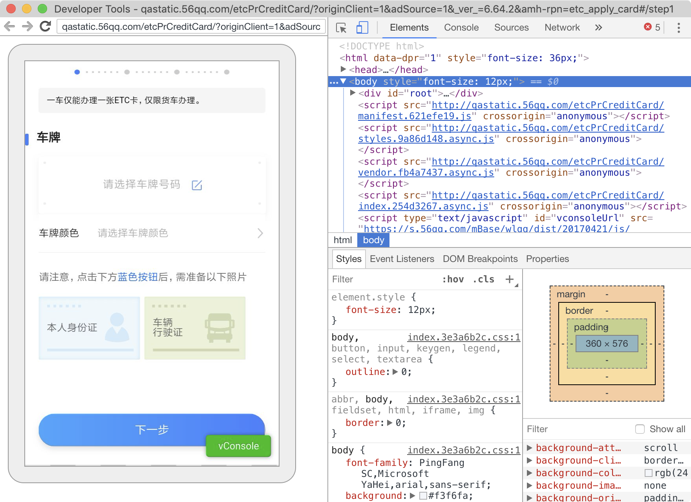

# APPIUM定位进阶


## 一、webview控件

### 如何查看页面是否是webview？

- 可以利用uiautomatorviewer 分析页面元素，如果类名是Android.webkit.webview，则代表页面是webview控件
- 看顶部是否有关闭按钮，一般是x的都是webview


注意：

- 分析元素时，uiautomator2 会自动将webview控件转换成android原生控件，同时转换需要一定的时间。所以会出现第一次和第二次刷新页面布局时，webview内部控件发生变化。
- 不同版本系统，页面元素分析会映射成不同的属性，极其不稳定。
- webview控件元素可以转换成原生，代表着可以使用android原生定位，但是极其不稳定，所以不推荐，一般采用app包打开webview调试开关，切换容器，使用selenium定位方式


### webview开关

- webview调试：https://developers.google.com/web/tools/chrome-devtools/remote-debugging/webviews?hl=zh-cn
- 模拟器6.0系统默认打开，系统bug导致
- 物理机需要打开app内开关
- 必须从您的应用中启用 WebView 调试。要启用 WebView 调试，请在 WebView 类上调用静态方法 setWebContentsDebuggingEnabled。
```
if (Build.VERSION.SDK_INT >= Build.VERSION_CODES.KITKAT) {
    WebView.setWebContentsDebuggingEnabled(true);
}
```


### 测试机oppo r9m 安卓5.1刷机成6.0系统：

- 1.https://bbs.coloros.net/graphic?id=364383
- 2.https://www.coloros.com/index/newsDetail?id=68


### 查看webview版本

```
# 查看包名
adb shell pm list package
# 查看app浏览器包名
adb shell pm list package |grep browser
# 查看app 浏览器包名
adb shell pm list package |grep webview
# 查看浏览器版本号
adb shell pm dump com.android.browser |grep version
# 查看webview版本号
adb shell pm dump com.android.webview |grep version
```
在Android4.4之后chrome内核包名可能变成webview，以前的版本是browser


### chrome-inspect功能

chrome-inspect功能是一个google提供webview的调试工具，详细说明：https://developers.google.com/web/tools/chrome-devtools/remote-debugging?hl=zh-cn

- chrome-inspect需要访问国外资源，需要翻墙，因此国内基本访问不了。可以淘宝购买离线inspect资源包进行本地调试 
- chrome-inspect可以获取当前系统webview版本号
- chrome-inspect用来分析页面元素，使用selenium元素定位方式进行定位
- 在浏览器输入：chrome://inspect，chrome自动监听webview的请求，进行页面呈现

注意：x5内核的h5是调试是不能识别的


捕获到H5请求：


点击inspect后页面呈现：（用于元素定位分析）



## 二、webview定位


- 环境准备
  - 手机端
      - app打开webview调试开关
  - PC
      - 能访问google-chrome中inspect功能，或者使用离线调试包
      - 安装手机webview对应chromedriver版本（版本对照表可以google搜索，参考链接：https://blog.csdn.net/huilan_same/article/details/51896672 5）
      - 淘宝镜像源：https://npm.taobao.org/mirrors/chromedriver?spm=a2c6h.14029880.0.0.735975d7VASy8e
  - 代码
      - 代码中要添加chromedriverExecutable，指定chromedriver版本
      - 使用switch_to.context(self.driver.contexts[-1])方法切换上下文
  - 有一些webview可以被uiautomatorview查找到，但都不推荐，可能会出现兼容性的问题，比如text的显示字符串会不一样，建议切换至webview使用selenium定位方式

如何查看当前页面的webview网页：
```
adb shell logcat|grep http
```


PC未配置对应到chromedriver版本报错如下：


### 编码注意

- 需要等待多个上下文出现，才能切换，因此需要加入显示等待机制
- 使用switch_to.context方法进行切换
- 切换完成后打印当前页面的page_source是html结构，未切换之前是xml结构
- 代码指定chromedriver版本：caps["chromedriverExecutable"] 有多个配置chromerdriver参数，可以官方文档查询使用

```
    def test_webview(self):
        self.driver.find_element(MobileBy.XPATH, "//*[@text='ETC']").click()
        WebDriverWait(self.driver, 20).until(expected_conditions.element_to_be_clickable((MobileBy.ID,
                                                                                          "android:id/button1")))
        self.driver.find_element(MobileBy.ID, "android:id/button1").click()
        WebDriverWait(self.driver, 15).until(expected_conditions.element_to_be_clickable((MobileBy.ID, 'com.wlqq.phantom.plugin.etc:id/tv_online_open_card')))
        self.driver.find_element(MobileBy.ID, "com.wlqq.phantom.plugin.etc:id/tv_online_open_card").click()
        print(self.driver.contexts)
        print(self.driver.page_source)
        self.driver.find_element(MobileBy.ID, "com.wlqq:id/btn_back").click()
        # 打印当前页面结构page_source，当前xml结构
        print(self.driver.page_source)
        # 等待上下文出现，webview出现
        WebDriverWait(self.driver, 20).until(lambda x: (len(self.driver.contexts) > 1))
        # 切换至webview容器
        self.driver.switch_to.context(self.driver.contexts[-1])
        # 打印当前页面结构page_source，当前html结构
        print(self.driver.page_source)
```
chromedriver参数配置：
```
caps["chromedriverExecutable"] = "/Users/user/tool/chromedriver/2.35/chromedriver"
```

多个上下文出现：
使用print(self.driver.contexts)进行查看，可以看见native以及webview多个，列表的形式，因此可以使用索引进行获取


chromedrive使用r官方文档：https://github.com/appium/appium/blob/master/docs/en/writing-running-appium/web/chromedriver.md


### 雪球测试案例
```
rom time import sleep
from appium import webdriver
from appium.webdriver.common.mobileby import MobileBy
from selenium.webdriver.support import expected_conditions
from selenium.webdriver.support.wait import WebDriverWait


class TestXueQiu:

    def setup(self):
        caps = {}
        caps["platformName"] = "android"
        caps["deviceName"] = "test1"
        caps["appPackage"] = "com.xueqiu.android"
        caps["appActivity"] = ".view.WelcomeActivityAlias"
        caps["chromedriverExecutable"] = "/Users/user/tool/chromedriver/2.20/chromedriver"
        self.driver = webdriver.Remote("http://localhost:4723/wd/hub", caps)
        WebDriverWait(self.driver, 10).until(expected_conditions.element_to_be_clickable((MobileBy.ID, 'com.xueqiu.android:id/tv_agree')))
        self.driver.find_element(MobileBy.ID, 'com.xueqiu.android:id/tv_agree').click()
        self.driver.implicitly_wait(10)

    def test_webview_context(self):
        self.driver.find_element(MobileBy.XPATH, "//*[@text='交易' and contains(@resource-id,'tab_name')]").click()
        # WebDriverWait(self.driver, 15).until(lambda x: len(self.driver.contexts) > 1)
        for i in range(5):
            print(self.driver.contexts)
            sleep(1)
        print(self.driver.page_source)
        self.driver.switch_to.context(self.driver.contexts[-1])
        print(self.driver.contexts)
        print(self.driver.page_source)


    def teardown(self):
        sleep(20)
        self.driver.quit()
```

webview中toast定位案例：
```
    def test_webview(self):
        self.driver.find_element(MobileBy.XPATH, "//*[@text='ETC']").click()
        WebDriverWait(self.driver, 20).until(expected_conditions.element_to_be_clickable((MobileBy.ID,
                                                                                          "android:id/button1")))
        self.driver.find_element(MobileBy.ID, "android:id/button1").click()
        WebDriverWait(self.driver, 15).until(expected_conditions.element_to_be_clickable((MobileBy.ID, 'com.wlqq.phantom.plugin.etc:id/tv_online_open_card')))
        self.driver.find_element(MobileBy.ID, "com.wlqq.phantom.plugin.etc:id/tv_online_open_card").click()
        print(self.driver.contexts)
        self.driver.find_element(MobileBy.ID, "com.wlqq:id/btn_back").click()
        # 打印当前页面结构page_source，当前xml结构
        # print(self.driver.page_source)
        # 等待上下文出现，webview出现
        WebDriverWait(self.driver, 20).until(lambda x: (len(self.driver.contexts) > 1))
        # 切换至webview容器
        self.driver.switch_to.context(self.driver.contexts[-1])
        # 打印当前页面结构page_source，当前html结构
        # print(self.driver.page_source)
        self.driver.find_element(By.XPATH, "//*[@id='root']/div/div/div[4]/a").click()
        # webview中toast定位获取到div中的id属性
        toast = self.driver.find_element(By.CSS_SELECTOR, "#goblin-toast").text
        print(toast)
        assert "未选择车牌" in toast
```