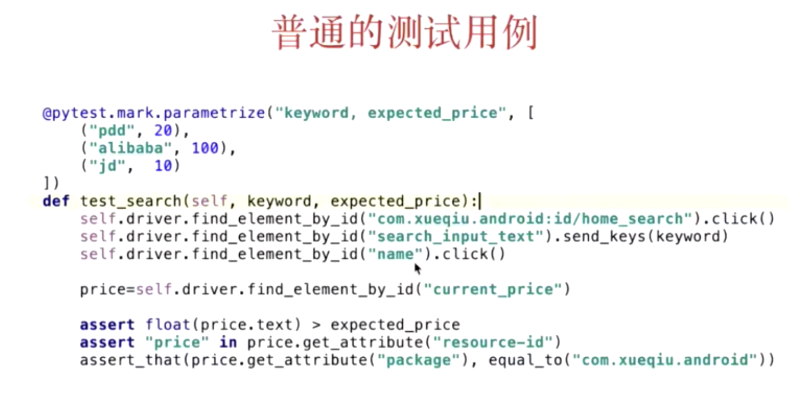
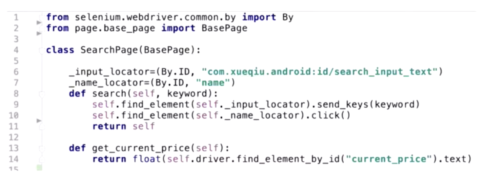
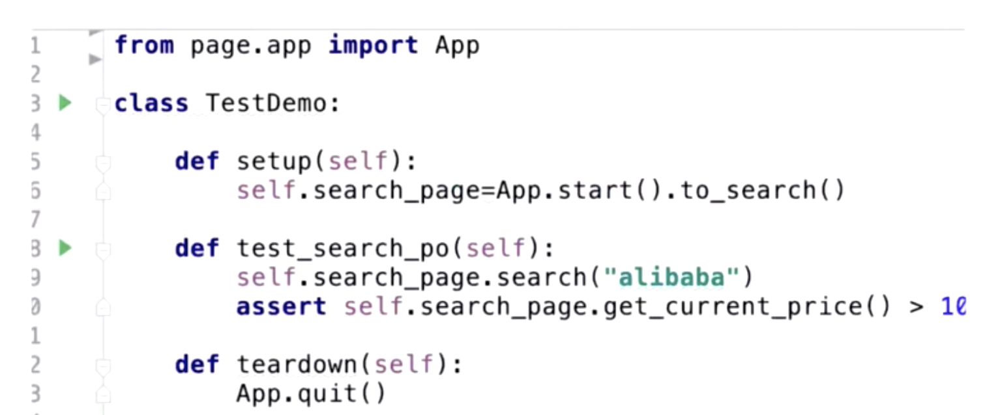
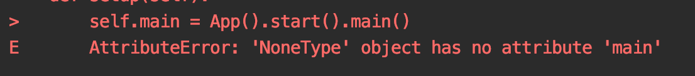
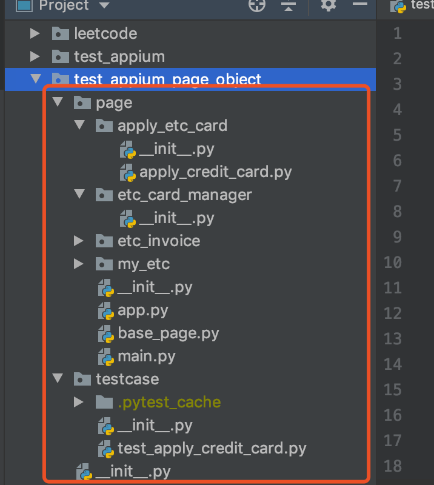

# APPIUM自动化PO模式及实战


## 一、PO概念

### 普通的测试用例


一旦app 页面发生变法改动的地方太多，这样设计的测试用例注定app自动化会走向失败的道路。因为后期的维护成本相当高！


### PageObject模式

- 用Page Object表示UI
- 减少重复样板代码
- 让变更范围控制在Object内
- 本质是面向抽象编程

### PageObject模式的原文总结

原文地址：https://autopilot-docs-mirror.readthedocs.io/en/latest/guides/page_object.html

- The public methods represent the sevices that the page offers          使用公共的方法代表页面所提供的功能
- Try not to expose the internals of the page                                        不要暴露内部的细节(不要把页面内部大量的定位符暴露出来)
- Methods return other PageObjects                                                    方法返回的是其它pageobject
- Assertions should exist only in tests                                                   不要在方法内加断言，而是在用例内创建断言
- Need not represent an entire page                                                     不用把页面内部所有的元素写出来，使用到什么定义什么
- Actions which produce multiple results should have a test for each result   相同的行为不同的结果建模成不同的方法，比如登录成功和登录失败建模成2个方法

### PageObject 模式原则

- 方法意义
  - 用公共方法代表UI所提供的服务
  - 方法应该返回其它的Object或者返回用于断言的数据
  - 同样的行为不同的结果，可以建模为不同的方法
  - 不要在方法内加断言
- 字段意义
  - 不要暴露页面内部的元素给外部
  - 不需要建模UI内的所有元素


## 二、PO实战

### Page Object例子



基于PO的测试用例：



### PO模式封装的主要组成元素

- Page对象：完成对页面的封装
- Driver对象：完成对web、android、iOS对接口驱动
- 测试用例：调用page对象实现业务并断言
- 数据封装：配置文件和数据驱动
- Utils：其它功能封装，改进原生框架不足

### PO改造顺序

- PO接口设计
- 测试用例编写
- PO实现
- 用例联调

### 演练例子


```
    def start(self):
        pass
```
原因是start方法没有返回，所以IEDA链式调用也没有相应的提醒


base_page
```
from appium.webdriver.common.mobileby import MobileBy
from test_appium_page_object.page.base_page import BasePage


class ApplyCreditCard(BasePage):

    _name_apply_card_element = (MobileBy.ID, "com.wlqq.phantom.plugin.etc:id/tv_online_open_card")
    _name_nfc_element = (MobileBy.ID, "com.wlqq:id/btn_back")

    def apply_credit_card(self):
        self.find(self._name_apply_card_element).click()
        self.find(self._name_nfc_element).click()
        return self

    def goto_faq(self):
        pass

    def goto_bind_card(self):
        pass

    def goto_obu(self):
        pass

```
main page
```
from appium.webdriver.common.mobileby import MobileBy
from selenium.webdriver.support import expected_conditions
from selenium.webdriver.support.wait import WebDriverWait

from test_appium_page_object.page.apply_etc_card.apply_credit_card import ApplyCreditCard
from test_appium_page_object.page.base_page import BasePage


class Main(BasePage):
    def goto_etc_home(self):
        self.find(MobileBy.XPATH, "//*[@text='ETC']").click()
        WebDriverWait(self._driver, 20).until(expected_conditions.element_to_be_clickable((MobileBy.ID,
                                                                                          "android:id/button1")))
        self.find(MobileBy.ID, "android:id/button1").click()
        return ApplyCreditCard(self._driver)

    def goto_etc_services_more(self):
        pass

    def goto_profile(self):
        pass

    def goto_message(self):
        pass

```
app page
```
from appium import webdriver
from appium.webdriver.common.mobileby import MobileBy
from selenium.webdriver.support import expected_conditions
from selenium.webdriver.support.wait import WebDriverWait
from test_appium_page_object.page.base_page import BasePage
from test_appium_page_object.page.main import Main


class App(BasePage):
    _appPackage = "com.wlqq"
    _appActivity = ".activity.HomeActivity"

    def start(self):

        if self._driver is None:
            caps = {}
            caps['platformName'] = 'android'
            caps['deviceName'] = '28d6f388'
            caps["appPackage"] = self._appPackage
            caps["appActivity"] = self._appActivity
            caps["automationname"] = "uiautomator2"
            caps["chromedriverExecutable"] = "/Users/user/tool/chromedriver/2.35/chromedriver"
            self._driver = webdriver.Remote("http://localhost:4723/wd/hub", caps)
            self._driver.implicitly_wait(10)
            self.find(MobileBy.ID, "com.wlqq:id/dialog_btn_right").click()
            return self
        else:
            self._driver.start_activity(self._appPackage, self._appActivity)

    def restart(self):
        pass

    def stop(self):
        pass

    # 类型提示 ->
    def main(self) -> Main:
        # todo: wait main page
        WebDriverWait(self._driver, 30).until(expected_conditions.element_to_be_clickable((MobileBy.ID,
                                                                                          "android:id/button1")))
        self.find(MobileBy.ID, "android:id/button1").click()
        self.find(MobileBy.XPATH, "//*[@text='知道了']").click()
        WebDriverWait(self._driver, 30).until(expected_conditions.element_to_be_clickable((MobileBy.XPATH,
                                                                                          "//*[contains(@resource-id,'content')]\
                                                                                          //*[@class ='android.widget.FrameLayout']//*[@class='android.widget.ImageView']")))
        self.find(MobileBy.XPATH, "//*[contains(@resource-id,'content')]\
                        //*[@class ='android.widget.FrameLayout']//*[@class='android.widget.ImageView']").click()
        return Main(self._driver)
```

ApplyCreditCard page
```
from appium.webdriver.common.mobileby import MobileBy
from test_appium_page_object.page.base_page import BasePage


class ApplyCreditCard(BasePage):

    _name_apply_card_element = (MobileBy.ID, "com.wlqq.phantom.plugin.etc:id/tv_online_open_card")
    _name_nfc_element = (MobileBy.ID, "com.wlqq:id/btn_back")

    def apply_credit_card(self):
        self.find(self._name_apply_card_element).click()
        self.find(self._name_nfc_element).click()
        return self

    def goto_faq(self):
        pass

    def goto_bind_card(self):
        pass

    def goto_obu(self):
        pass

```

testcase
```
from test_appium_page_object.page.app import App


class TestApplyCreditCard:

    def setup(self):
        self.main = App().start().main()

    def test_apply_credit_card(self):
        self.main.goto_etc_home().apply_credit_card()
```


代码结构：


## 三、BasePage封装


### 初始化方法

初始化driver对象，用于不同bage进行driver传递，其它bage继承basepage

```
 def __init__(self, driver: WebDriver = None):
        self._driver = driver
```


### find方法封装
通常会对定位方法进行封装，解决查找定位遇到的问题
在元素查找过程中，容易出现弹窗等异常，所以需要对异常进行封装处理

```
# todo：当有广告、各种异常弹框出现的时候，要进行异常处理，通常用装饰器进行异常处理
    def find(self, locator, value: str = None):
        logging.info(locator, value)
        try:
            # 寻找控件
            element = self._driver.find_element(*locator) if isinstance(locator, tuple) else self._driver.find_element(
                locator, value)
            # 如果成功，清空错误计数
            self._error_count = 0
            return element
            # todo:self._error_max = 0
        except Exception as e:
            # 如果次数太多，就退出异常处理，直接报错
            if self._error_count > self._error_max:
                raise e
            # 记录一直异常的次数
            self._error_max += 1
            # 对黑名单弹框进行处理
            for element in self._black_list:
                elements = self._driver.find_elements(*element)
                if len(elements) > 0:
                    elements[0].click()
                    # 继续寻找原来正常的控件，使用递归
                    return self.find(locator, value)
            # 如果黑名单也没找到，就报错
            logging.warn("black list no found")
            raise e
```


### handle_exception方法
在appium自动化过程中，使用find、click、sendkeys等方法都有可能会发生异常的弹框，因此都需要在自定义方法进行异常处理，为了解决异常处理，可以使用python的装饰器，定一个异常处理通用方法来解决此问题。


```
def exception_handle(fun):
    def magic(*args, **kwargs):
        _self: BasePage = args[0]
        try:
            result = fun(*args, **kwargs)
            # 清空错误次数
            _self._error_count = 0
            return result
        except Exception as e:
            # 如果次数太多，就退出异常逻辑，直接报错
            if _self._error_count > _self._error_max:
                raise e
            # 记录一直异常的次数
            _self._error_count += 1
            # 对黑名单里的弹框进行处理
            for element in _self._black_list:
                logging.info(element)
                elements = _self._driver.find_elements(*element)
                if len(elements) > 0:
                    elements[0].click()
                    # 继续寻找原来的正常控件
                    return magic(*args, **kwargs)
            # 如果黑名单也没有，就报错
            logging.warning("black list no one found")
            raise e

    return magic

```


### 引入log框架代替print

日志使用教程：https://docs.python.org/zh-cn/3/howto/logging.html#logging-basic-tutorial

使用python自带的log库，代替代码中的print。
```
# 导入依赖包
import logging

# 配置log等级
logging.basicConfig(level=logging.INFO) 

# 日志等级
_levelToName = {
    CRITICAL: 'CRITICAL',
    ERROR: 'ERROR',
    WARNING: 'WARNING',
    INFO: 'INFO',
    DEBUG: 'DEBUG',
    NOTSET: 'NOTSET',
}

# 使用log打印输出
logging.info(locator, value)
```


logging库的默认级别是：WARNING，高于warning才会输出至控制台

```
import logging


logging.warning("测试日志输出，waring级别")
logging.info("test log info ")

输出结果如下：
WARNING:root:测试日志输出，waring级别
```

将日志输出至文件(多次执行，日志会追加至文本文件中)：
```
import logging
logging.basicConfig(filename='../Log/test.log', level=logging.DEBUG)


# 将日志记录至文件
logging.warning("测试日志输出，waring级别")
logging.info("test log info ")
logging.debug("test log debug")
```

```
文本日志信息：
WARNING:root:测试日志输出，waring级别
INFO:root:test log info 
DEBUG:root:test log debug

WARNING:root:测试日志输出，waring级别
INFO:root:test log info 
DEBUG:root:test log debug
```

日志每次覆盖可以使用参数：filemode=w，具体配置如下：
```
logging.basicConfig(filename='../Log/test.log', filemode='w', level=logging.INFO)
```


## 五、数据驱动

- 测试数据的数据驱动
- 测试步骤的数据驱动
- PO定义的数据驱动
- 断言数据驱动

外部数据源的选择：

- yaml 数据驱动 （结构化数据，推荐使用，json不支持备注）
- csv数据驱动 （2纬数据）
- excel数据驱动 

### yaml使用介绍

yaml的使用介绍：https://pyyaml.org/wiki/PyYAMLDocumentation

案例：
```
# 安装 
pip install PyYAML
# 导入：
import yaml
# 使用
    def test_yaml(self):
        print(yaml.load("""
            - Hesperiidae
            - Papilionidae
            - Apatelodidae
            - Epiplemidae
           """))
输出结果：['Hesperiidae', 'Papilionidae', 'Apatelodidae', 'Epiplemidae']
```

测试数据的数据驱动案例：
```
import pytest
import yaml


class TestYaml:

    def test_yaml(self):
        print(yaml.load("""
            - Hesperiidae
            - Papilionidae
            - Apatelodidae
            - Epiplemidae
           """))

    @pytest.mark.parametrize("a,b", yaml.safe_load(open("testyaml.yaml", encoding='utf-8')))
    def test_yaml_read(self, a, b):
        assert a + b == 10

-
  - 4
  - 6

-
  - 2.5
  - 7.5
```

测试步骤数据驱动案例：
```
 def steps(self, path):
        with open(path) as f:
            # 读取步骤定义文件
            steps: list[dict] = yaml.safe_load(f)
            # 保存一个目标对象
            element: WebElement = None
            for step in steps:
                logging.info(step)
                if "by" in step.keys():
                    element = self.find(step["by"], step["locator"])
                if "action" in step.keys():
                    action = step["action"]
                    if action == "find":
                        pass
                    elif action == "click":
                        element.click()
                    elif action == "text":
                        element.text()
                    elif action == "attribute":
                        element.get_attribute(step["value"])
                    elif action in ["send", "input"]:
                        content: str = step["value"]
                        for key in self._params.keys():
                            content = content.replace("{%s}" % key, self._params[key])
                        element.send_keys(content)

- by: id
  locator: tv_search
  action: click
```


## 六、参数化

- 参数化要解决的是一个用例可以复用的问题，比如一个用例重复使用不同的数据，就可以使用参数化
- 使用@pytest.mark.parametrize()方法
- 一个用例，有x组参数化，就会运行x次setup和teardown的方法

案例：
```
@pytest.mark.parametrize(‘searchkey,type,price’,[
(‘alibaba’,‘BABA’,180),
(‘xiaomi’,‘01810’,10)

def test_search(self,searchkey,type,price)：
    self.driver.find_element(By.ID,“com.xueqiu.android:id/search_input_text”).send_keys(f"{searchkey}")
    self.driver.find_element(By.XPATH,f"//*[@text='{type}']").click()
    current_price=self.driver.find_element(By.XPATH,f"//*[@text='{type}']/../../..//*[@resource-id='com.xueqiu.android:id/current_price']")
        #提取股价的text属性
    current_price=float(current_price.text)
    assert current_price > price
```

## 七、pytest结合allure生成报告：

方式1:
```
# 命令行执行用例，并生成allure形式的记录存放至文件
pytest --junitxml=report/junit.xml --alluredir=report/allure_results  /Users/user/PycharmProjects/etc_ui_autotest/testcase
# 启动本地allure服务，直接浏览器访问报告
allure serve  /Users/user/PycharmProjects/etc_ui_autotest/report/allure_results
# 将本地的记录转换成html文件
allure generate  /Users/user/PycharmProjects/etc_ui_autotest/report/allure_results  -o /Users/user/PycharmProjects/etc_ui_autotest/report/allure_html
```
方式2:
```
# 命令执行命令，并生成allure形式的记录存放至文件
pytest ./testcase -s -q --alluredir=./report/allure_results
# 启动服务，浏览器访问报告
allure serve ./report/allure_results
# 将本地的报告转换成html文件,加clean是清除原文件
allure generate ./report/allure_results -o ./report/allure_html --clean
```
   


## 八、常见问题

**问题1:appium用例执行过程Error: socket hang up，导致后面用例全部失败:（https://ceshiren.com/t/topic/4472）**

原因是：uiautomator2-server进程挂掉了，可能是上次自动化没调用quit导致了一分钟后才自动结束，结果影响了下次的自动化。

不是两次session，一个是appium的session，一个是底层驱动uiautomator2-server的session而已。一直都是两个session配合的。

解决方案：

- 每个用例执行完成，让driver，quit释放。

**问题2:Hint: make sure your test modules/packages have valid Python names.**

原因是：主要是2个page互相调用并return引起的

