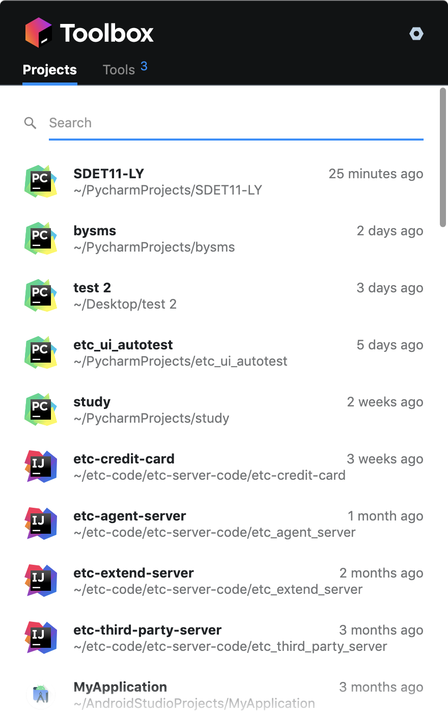

# 01-接口测试框架理论

## 测试框架基本能力

- 项目管理：pip、virtualenv
- 用例编写：pytest
- 领域能力：app、web、http
- 执行调度：pytest、pycharm、shell、jenkins
- 测试报告：allure2

### HTTP测试能力：

- 请求方法构造：get、post、put、delete、head
- 请求体构造：form、json、xml、binary
- 响应结果分析：status code、reponse body、json path、xpath

除此之外：还需要支持相关的环境管理与切换、数据驱动、参数化、接口的加解密等功能。

**requests框架特点：**

- 功能全面：http/https支持全面
- 使用简单：简单易用，不用关心底层细节
- 定制性高：借助于hook机制完成通用处理
- 发送http请求相当简单

官方文档：https://requests.readthedocs.io/zh_CN/latest/user/quickstart.html

项目开发管理工具：https://www.jetbrains.com/toolbox-app/，可以快速打开项目，非常便捷。

