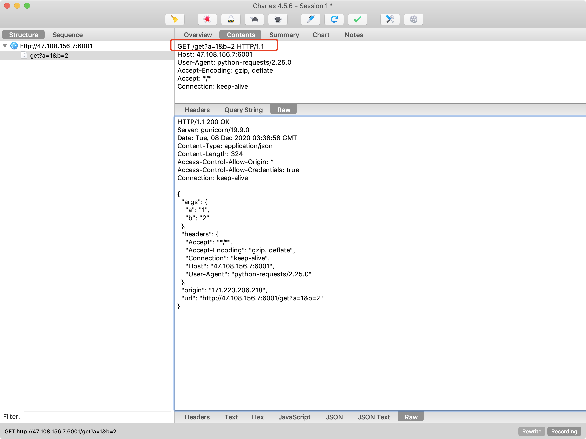

# 06-使用代理


如果需要使用代理，你可以通过为任意请求方法提供 proxies 参数来配置单个请求:

```
 proxies = {
        "http": "http://127.0.0.1:8888",
        "https": "http://127.0.0.1:8888",
    }
    payload = {'a': 1, "b": 2}
    r = requests.get("http://47.108.156.7:6001/get", payload, proxies=proxies)
    print(r.json())
```

返回结果如下：

{'args': {'a': '1', 'b': '2'}, 'headers': {'Accept': '*/*', 'Accept-Encoding': 'gzip, deflate', 'Connection': 'keep-alive', 'Host': '47.108.156.7:6001', 'User-Agent': 'python-requests/2.25.0'}, 'origin': '171.223.206.218', 'url': 'http://47.108.156.7:6001/get?a=1&b=2'}


这里使用了charles 作为代理，代理端口8888可以看到charls收到的代理请求及响应：

