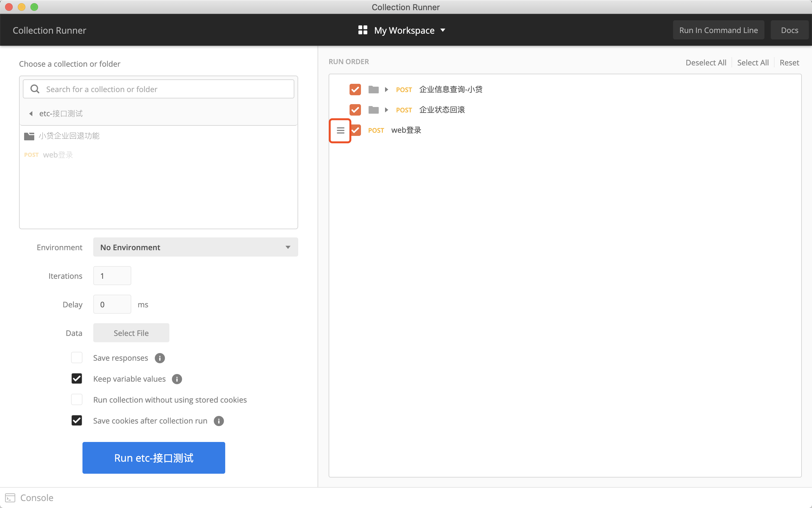
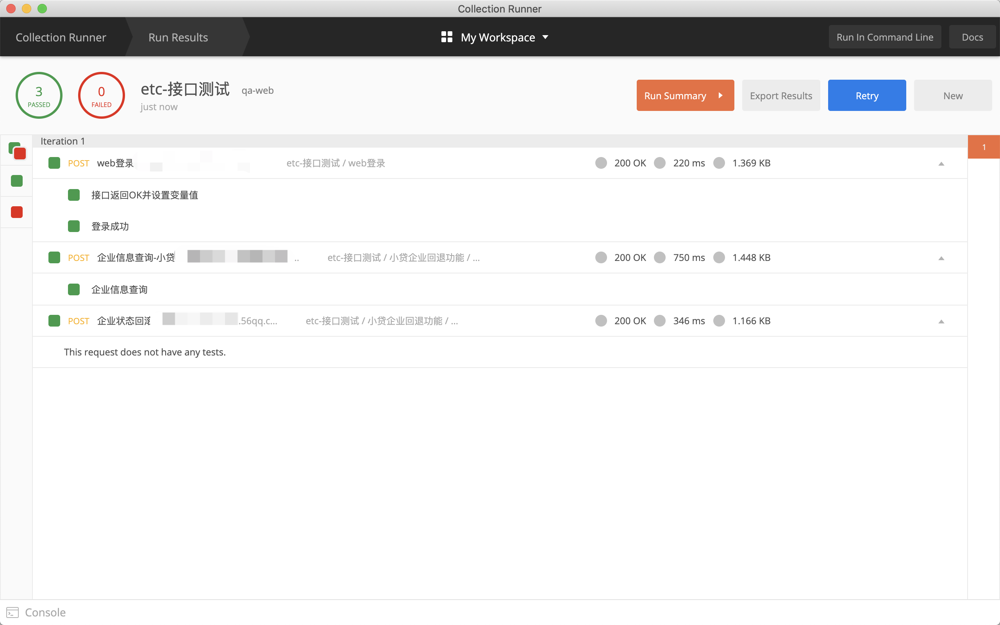

# 03-接口测试之postman


## 一、postman发送http请求


工具下载地址：https://www.postman.com/downloads/

打开app之后，进入主界面：


创建request请求，点击图上request区域：


输入本次请求的名称，以及备注信息，还可以选择请求是否加入集合中


发送请求步骤：

- 选择HTTP方法
- 输入请求的url地址
- 输入请求参数
- 点击send发送请求
- 查看响应结果

注意：

- 发送get请求，参数是直接在params栏进行输入
- 发送post请求，可以在params栏以及body栏目进行参数输入，根据服务端设置具体发送，同时body栏可以进行多种格式的传递
- Tests可以添加请求的断言，也可以加入特殊代码，比如设置环境变量代码


## 二、postman常用操作

官网介绍文档：https://learning.postman.com/docs/getting-started/introduction/

### 设置环境变量

- 环境
在测试工作中，我们在测试发送请求时，通常会遇到发送测试环境、线上环境的HTTP请求，但是各个环境相应的配置值不一样，这样就可以使用环境进行管理

查看环境：
点击眼睛图标后的Manage Environments 按钮


点击Add添加新的环境！


输入环境名称，点击添加即可。(下面是添加变量名即对应值的选项)


- 变量
在测试过程中，一些容易变化的值我们可以使用变量来进行存储。在postman中变量分：全局变量、集合变量、环境变量、数据变量、本地变量


如果在两个不同的范围内声明了具有相同名称的变量，则将使用范按优先级顺序获取变量中存储的值-例如，如果有一个全局变量和一个局部变量都名为username，则在请求时将使用该局部值运行

- 全局变量：使您可以访问集合，请求，测试脚本和环境之间的数据。全局变量在整个工作空间中都可用。
- 集合变量：可在集合中的所有请求中使用，并且独立于环境，因此请勿根据所选环境而更改。
- 环境变量：使您可以针对不同环境定制处理，例如本地开发与测试或生产。一次只能激活一个环境。
- 局部变量：是临时的，只能在您的请求脚本中访问。局部变量值的范围仅限于单个请求或收集运行，并且在运行完成后不再可用。
- 数据变量：来自外部CSV和JSON文件，以定义在通过Newman或Collection Runner运行集合时可以使用的数据集。


#### 定义变量
您可以通过多种方式定义变量，具体取决于您需要的是global / environment还是集合范围。


- 定义全局变量和环境变量
您可以使用Environment quick Look创建和编辑全局变量和环境变量。在下拉列表中选择目标环境，以快速查看其变量。您可以通过单击值来内联编辑现有变量的当前值。要添加变量，请单击环境或全局部分旁边的编辑。

或者通过管理环境添加


- 设置集合变量
您可以在创建集合时或之后的任何时间添加集合变量。要创建或编辑现有集合的变量，在选择集合集合左侧选择集合，打开查看更多动作（...）菜单，然后单击编辑。


然后点击variables，进行变量添加


- 脚本中定义变量
使用pm.globals来定义一个全局变量：
```
pm.globals.set("variable_key", "variable_value");
```
使用pm.collectionVariables定义集合变量：
```
pm.collectionVariables.set("variable_key", "variable_value");
```
使用pm.environment定义的环境变量（在当前选择的环境）：
```
pm.environment.set("variable_key", "variable_value");
```
您可以unset用来删除变量：
```
pm.environment.unset("variable_key");
```
定义局部变量：（局部变量是您使用以下语法在请求脚本中设置的临时值：）
```
pm.variables.set("variable_key", "variable_value");
```

- 访问变量
您可以使用双花括号在整个Postman用户界面中引用变量。
```
{{username}}
```
还可以在脚本中获取变量值：（您可以使用表示作用域级别和.get方法的对象在脚本中检索变量的当前值：）
```
//access a variable at any scope including local
pm.variables.get("variable_key");
//access a global variable
pm.globals.get("variable_key");
//access a collection variable
pm.collectionVariables.get("variable_key");
//access an environment variable
pm.environment.get("variable_key");
```

postman对code使用，有快捷的提示，点击对应的功能，会生成对应的code案例


- 动态变量


如何操作：(输入双花括号加$符合)


选择对应的函数，动态生成随机值。

```
要在预请求或测试脚本中使用动态变量，您需要使用pm.variables.replaceIn()，例如pm.variables.replaceIn('{{$randomFirstName}}')。
```

### 添加断言
您可以使用JavaScript为Postman API请求编写测试脚本。通过测试，您可以确保您的API能够按预期工作，确定服务之间的集成可靠运行，并验证新开发是否没有破坏任何现有功能。


验证状态码是否200：
```
pm.test("Status code is 200", function () {
    pm.response.to.have.status(200);
});

```
验证返回值为json格式中的某个字段的值：
```
pm.test("Your test name", function () {
    var jsonData = pm.response.json();
    pm.expect(jsonData.value).to.eql(100);
});
```


### 设置用例执行顺序

在测试过程中，有时会遇到需要设置请求执行顺序，在postman中有2种方式：

- 使用集合运行用例，可以手动进行排序请求顺序


按住目录符号，可以进行拖动排序，用例执行将按住顺序发送请求。

  
- 在Tests加入脚本指定下一次执行的请求，使用postman.setNextRequest方法：
```
postman.setNextRequest("企业信息查询-小贷")
```


注意：这里的方法内使用的名称是指集合中请求的命名。


### 运行请求集

通过集合加入一组指定的HTTP请求，通过postman中的Runner可以运行集合。


 点击runner即可，然后进入设置界面
 

选择对应要执行的集合，


- Envrionment ：选择用例执行的环境
- Iterations：选择用例执行的次数，就是请求发送次数
- delay：超时时间
- data：请求中使用到的数据文件

- RUN ORDER：右边的栏目可以勾选要执行的请求，也可以对执行顺序进行排序。


点击run ，即可运行，结果如下：

