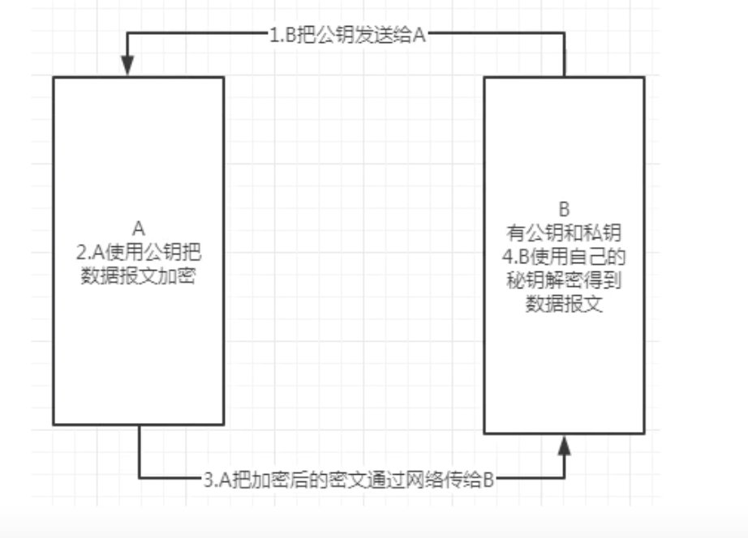
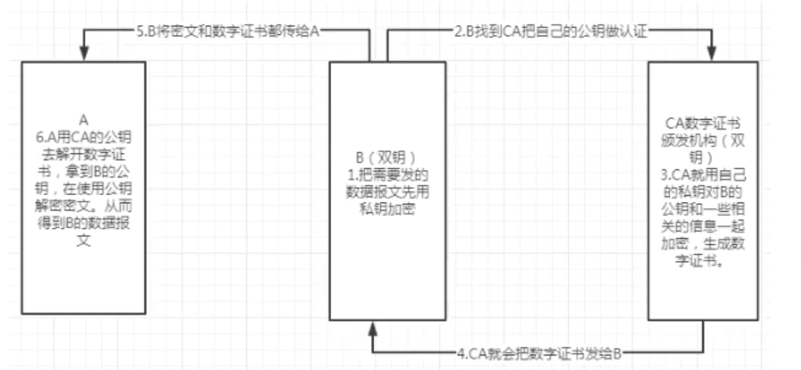
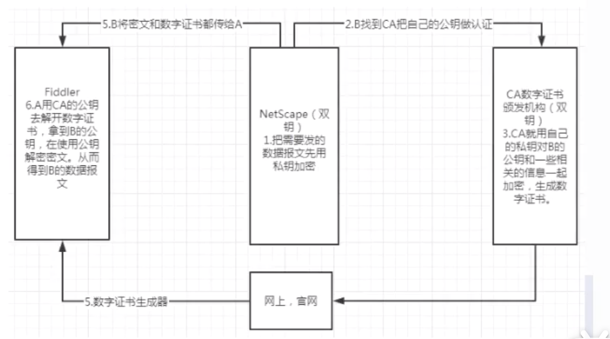
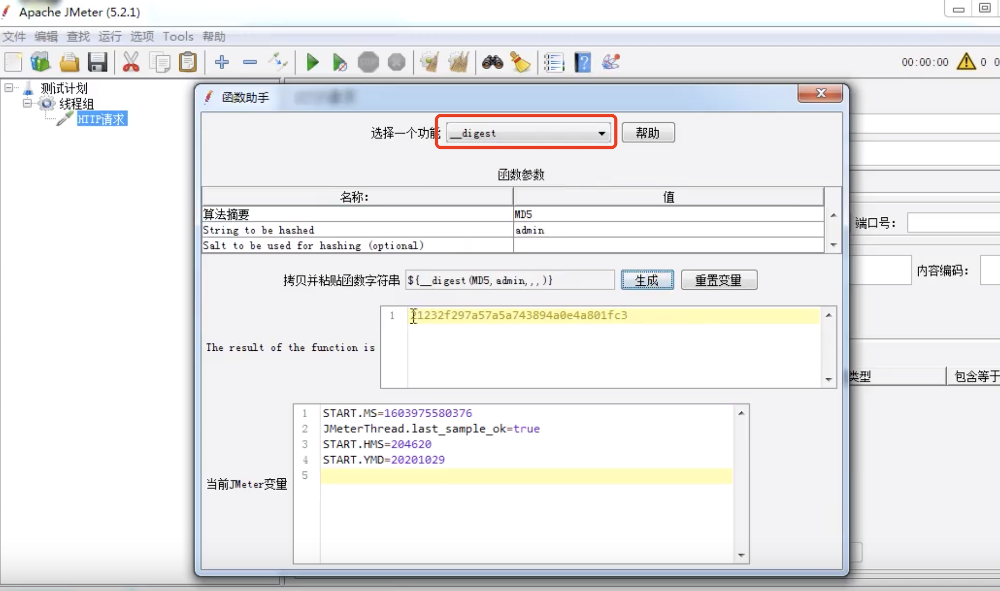
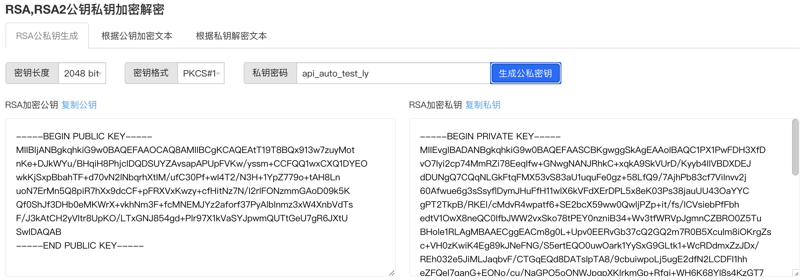

# 04-接口加解密理论


参考地址：https://www.bilibili.com/video/BV18y4y1q7SB?p=3


## 什么是加解密


加密：在网络上传输的原始数据（明文）经过加密后形成密文传输，防止被窃取。

解密： 将密文还原成原始数据。


## 加密方式分类


- 对称式加密：对加密和解密使用的是同一个密钥。
- 非对式加密：非对称式加密需要两个密钥（双钥），分别叫公钥和私钥，这两把密钥可以相互加解密（公钥加密私钥解密，私钥加密公钥解密）。公钥公开的，不需要保密，而私钥是保密的。


### 加密方式详解


1、对称加密技术：

- DES加密算法 ：比较低级
- AES加密算法 ：用于前后端分离架构的接口加密
- Base64加密算法


2、非对称加密技术（RSA加密算法）

场景1 ：公钥加密，私钥解密

两个用户，A和B，B有双钥，A想要把一个数据报文通过加密的方式发给B。




场景2: 私钥加密（也叫数字签名），公钥解密（也叫验证签名）

数字证书由来：因为公钥是公开的不安全，所以需要第三方的CA（数字证书颁发机构）对公钥加密，加密后的东西就叫：数字证书。数字证书包括：B用户基本信息及B的公钥信息。x509标准，就是有效期的一些规范。


CA：具备双钥，通过私钥加密。


验证签名：身份验证。




Fiddler不能直接抓取HTTPS协议的数据报文？需要安装一个数字证书。

https = http + ssl安全传输协议。

ssl安全传输协议：安全套接层，NetScape研发。




3、MD5（完全不考虑解密，也叫哈希算法，散列算法）


Postman:

```
//获取当前时间戳
var time = new Date().getTime()
console.log(time)
//使用MD5加密时间戳
var miwen = CryptoJS.MD5(time).toString().toUpperCase()
console.log(miwen)
```

Jmerter:




## 四、接口签名sign原理


什么是接口签名？

使用用户名、密码，时间戳和所有的排过序之后的参数组合起来，组合之后再加密得到一个字符串。字符串是唯一的有权访问第三方金融接口的鉴权码。=sign接口签名。


为什么要做接口签名？

1、防伪装攻击
2、防篡改攻击
3、防重放攻击
4、防数据泄漏


如何做接口签名，了解签名规则：

1、对所有请求的参数按key按照ascii码做升序排列。
{'c':3,'b':2,'a':1} 
{'a':1,'b':2,'c':3} 

2、把参数名和参数值连接成字符串：

a=1&b=2&c=3

3、用申请到的appid和appsecret连接到字符串的头部

appid:用户名
appsercet：密码

appid=admin&appsercret=123&a=1&b=2&c=3

4、用时间戳连接到字符串的尾部

appid=admin&appsercret=123&a=1&b=2&c=3&timestamp=124124252


5、然后再把这个字符串按照32位的MD5加密，加密后转化成大写。

E8F39EBC9C764AC8C82B2F88B07323A5， 10秒有效。


RSA生成双钥，可以借助Bejson工具：https://www.bejson.com/enc/rsa/




