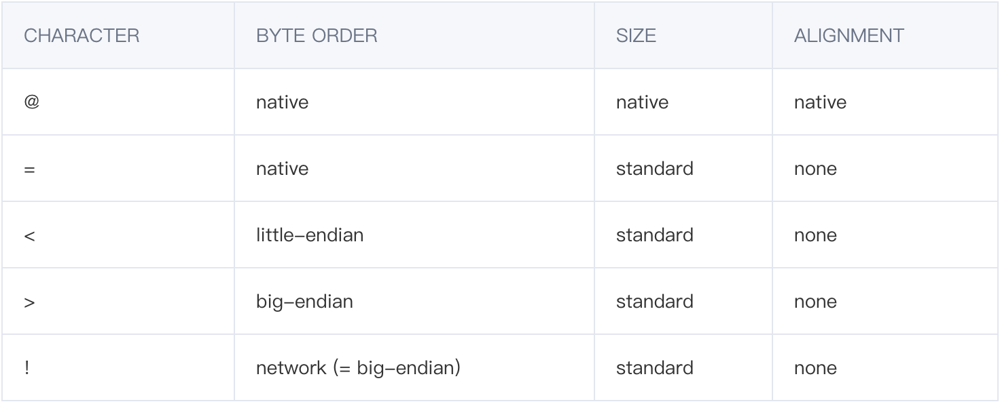

# 05-加解密实例


## 加解密规则

使用对称加密算法，AES、DES进行加解密。加密库官方文档：https://www.pycryptodome.org/en/latest/src/examples.html#encrypt-data-with-aes

使用对称加密的固定密钥，以及固定的hash值。采用加密算法，实现对请求的body数据进行加密和解密！

需要使用如下三方库:Crypto.Cipher中的AES、DES，struct用于构造数据特有包、gzip用于压缩

```
pip install pycryptodome

from Crypto.Cipher import AES
from Crypto.Cipher import DES
```


## 加解密实现

**加密：**
1、先将HTTP请求的body内容进行压缩，压缩的内容是编码成字节。

2、第一次加密，用token进行DES加密，得到一个加密后的密文

//第一次加密内容长度 + 8字节固定的keyhash(Long) + 8字节session id(Long)：顺序为keyhash(8字节 long)+ sessiond（8字节long）+ 第一次加密类容（长度为密文长度）

3、用加密后的密文和sid（sid在前），准备进行第二次加密。

4、使用第一次加密后的密文，使用准备好的密钥进行aes加密。

**解密：**

1、第一步使用对称加解密的密钥进行解密
2、第二步取出前八位的key_hash和8-16位的sid
3、第三步判断key_hash是否是本地的hash值，不一致则抛异常
4、第四步使用token进行解密，取出真实的数据

案例：

```
import gzip
import struct
import traceback

from Crypto.Cipher import AES
from Crypto.Cipher import DES

# 定义加密需要使用的全局常量：未登录的默认sid、st，aes加密的hash_key，以及对称加密的密钥(v3版本使用)

# v3对称加密密钥
AES_KEY = 'xxxxx'
# 未登录的默认sid、st
NO_SESSION_KEY = 'C86EA4369B61AE5E'
NON_SESSION_SID = -1
KEY_HASH = 11

# 获取AES分组长度为16（用于数据分组加密）
aBS = AES.block_size

# 获取DES分组长度为8（用于数据分组加密）
dBS = DES.block_size


# padding算法,不够128bit（对应16byte）需要补齐数据包，不足16位就补齐16位，差几就补充对应的次数（补充的值就是相差的值）
def pad(s, BS):
    return s + (BS - len(s) % BS) * chr((BS - len(s) % BS)).encode()


def unpad(s):
    # 获取原文，也就是需要对数据包去除自动补充的内容
    return s[0:-ord(s[-1:].decode())]  # 获取到自动添加的数值（也是重复次数），所以[0:-num] 去除后面重复添加的值


class AESUtil:
    """
    实现AES加解密算法
    """

    def __init__(self, aes_key):
        self.key = bytes.fromhex(aes_key)  # fromhex函数用来将输入的字符串转换成byte对象

    def encrypt_data(self, raw_data):
        """
       :param raw_data: 需要加密的原始data
       :return: 返回aes加密密文
       """
        raw = pad(raw_data, aBS)  # 将数据分组补齐
        cipher = AES.new(self.key, AES.MODE_ECB)  # 创建AES.cipher对象
        return cipher.encrypt(raw)

    def decrypt_data(self, raw_data):
        cipher = AES.new(self.key, AES.MODE_ECB)  # 创建AES.cipher对象
        raw = cipher.decrypt(raw_data)  # AES解密
        return unpad(raw)  # 还原原始数据包，去除自动添加的补位数据

    @classmethod
    def v3_encrypt_data(cls, bytes_data, session_id, token, key_hash, aes_key):
        """
        :param bytes_data: 需要加密的原始数据
        :param session_id: session_id
        :param token:    session中的token
        :param key_hash: 默认的hash值
        :param aes_key:  对称加密密钥
        :return:
        """
        try:
            inner_cipher_key = NO_SESSION_KEY
            sid = NON_SESSION_SID
            if sid > 0:
                sid = session_id
                inner_cipher_key = token
            # 第一步，将bytes_data 进行压缩
            gdata = gzip.compress(bytes_data.encode('utf-8'))
            # 第二步，使用token进行des加密，得到第一次加密后的密文数据
            des_data = DESUtil(inner_cipher_key).encrypt_data(gdata)
            # 第三步，组装格式化数据，用加密后的密文和sid（sid在前），准备进行第二次加密。
            format_str = ">qq" + str(len(des_data)) + "s"
            final_data = struct.pack(format_str, key_hash, sid, des_data)
            # 第四步，将组装好的数据使用AES进行加密
            return AESUtil(aes_key).encrypt_data(final_data)
        except Exception as e:
            traceback.print_exc(e)

    @classmethod
    def v3_decrypt_data(cls, data, token, key_hash, aes_key):
        """
        :param data: 解密数据
        :param token: session中的token
        :param key_hash: key_hash值
        :param aes_key:  对称加密密钥
        :return: 返回解密后明文
        """
        try:
            inner_cipher_key = NO_SESSION_KEY
            # 第一步使用对称加解密的密钥进行解密
            first_round = AESUtil(aes_key).decrypt_data(data)
            # 第二步取出前八位的key_hash和8-16位的sid
            key_id_in_data, sid = struct.unpack(">qq", first_round[:16])
            # 判断key_hash是否是本地的hash值
            if key_hash != key_id_in_data:
                raise Exception("bad data with keyid")
            if sid > 0:
                inner_cipher_key = token
            # 使用token进行解密，取出真实的数据
            return gzip.decompress(DESUtil(inner_cipher_key).decrypt_data(first_round[16:])).decode('utf-8')
        except Exception as e:
            traceback.print_exc(e)


class DESUtil:

    def __init__(self, aes_key):
        self.key = bytes.fromhex(aes_key)  # fromhex函数用来将输入的字符串转换成byte对象

    def encrypt_data(self, raw_data):
        raw = pad(raw_data, dBS)  # 数据包分组补齐
        cipher = DES.new(self.key, DES.MODE_ECB)  # 创建DES.cipher对象
        return cipher.encrypt(raw)

    def decrypt_data(self, raw_data):
        cipher = DES.new(self.key, DES.MODE_ECB)  # 创建DES.cipher对象
        raw = cipher.decrypt(raw_data)
        return unpad(raw)


if __name__ == '__main__':
    str1 = "abc12345"
    encrypt_data = AESUtil.v3_encrypt_data(str1, 6320001, "3411BCCE3FD3B956", KEY_HASH, AES_KEY)
    print(encrypt_data)
    # # print(type(encrypt_data))
    print(AESUtil.v3_decrypt_data(encrypt_data, "3411BCCE3FD3B956", KEY_HASH, AES_KEY))


```


## AES算法介绍

AES 算法是对称加密算法的一种，了解AES 算法可以从以下几方面入手：

- 密钥支持的长度
- 常用的工作模式
- Padding的填充模式


### 密钥

密钥是AES算法实现加解密的根本。对称加密算法之所以对称，是因为这类算法对明文的加密和解密需要使用同一个密钥。
AES 支持三种长度的密钥:

128bit (16B), 192bit(24B) , 256bit(32B)

使用效果:

AES256 安全性最高，AES128性能最优。本质是它们的加密处理轮数不同。


### ECB 模式

ECB 模式是最简单的块密码加密模式，加密前根据加密块大小（AES 128位）分成若干块，之后将每块使用相同的密钥单独加密，在该模式下，每个明文块的加密都是独立的，互不影响的。解密同理。

优势

简单
有利于并行计算

缺点

相同的明文块经过加密会变成相同的密文块，因此安全性较差。

### CBC 模式
CBC模式引入一个新的概念：初始向量IV。

IV的作用和MD5的"加盐"有些类似，目的是防止同样的明文块始终加密成相同的密文块。

CBC模式原理:

在每个明文块加密前会让那个明文块和IV向量先做异或操作。IV作为初始化变量，参与第一个明文块的异或，

后续的每个明文块和它前一个明文块所加密出的密文块相异或，这样相同的明文块加密出来的密文块显然不一样。

优势

安全性更高
缺点

无法并行计算，性能上不如ECB
引入初始向量IV，增加复杂度

常用的填充方式
AES 算法在对明文加密的时候，并不是把整个明文加密成一整段密文，而是把明文拆分成几组独立的明文块，每一个明文块的长度128bit（16B），最后不足128bit(16B)，会根据不同的Padding 填充模式进行填充，然后进行加密。

**总结：加密过程是先处理pading，后加密。解密过程是先进行分块解密，最后在处理Padding。**

例如：一段明文的长度198bit，按照128bit 拆分，第二个之后70bit，不足128bit，就需要对明文块进⾏填充（Padding）。

NoPadding

不做任何填充，要求明文必须是16字节的整数倍。

PKC5Padding(推荐)

明文块少于128bit（16B）,在明文块的末尾补足相应数量的字符，且每个字节的值等于缺少的字符数。

如 明文:{1,2,3,4,5,6,7,8, a,b,c},缺少5个字节，则补全为{1,2,3,4,5,6,7,8, a,b,c,5,5,5,5,5,5}

ISO10126Padding

明文块少于128bit（16B）,在明文块的末尾补足相应数量的字符，最后一个字符值等于缺少的字符数，其他字符填充随机数

如 明文{1,2,3,4,5,6,7,8, a,b,c},缺少5个字节，则补全为{1,2,3,4,5,6,7,8, a,b,c,e,i,o,p,k,5}

具体接口使用，请根据自己的业务需求去选择。


## Python中struct.pack()和struct.unpack()用法

参考文章：https://cloud.tencent.com/developer/article/1406350

```
#  按照给定的格式(fmt)，把数据封装成字符串(实际上是类似于c结构体的字节流)
pack(fmt, v1, v2, ...)

# 按照给定的格式(fmt)解析字节流string，返回解析出来的tuple
unpack(fmt, string)      

# 计算给定的格式(fmt)占用多少字节的内存
calcsize(fmt)
```

上述fmt中，支持的格式为：


注1.q和Q只在机器支持64位操作时有意思

注2.每个格式前可以有一个数字，表示个数

注3.s格式表示一定长度的字符串，4s表示长度为4的字符串，但是p表示的是pascal字符串

注4.P用来转换一个指针，其长度和机器字长相关

注5.最后一个可以用来表示指针类型的，占4个字节

为了同c中的结构体交换数据，还要考虑有的c或c++编译器使用了字节对齐，通常是以4个字节为单位的32位系统，故而struct根据本地机器字节顺序转换.可以用格式中的第一个字符来改变对齐方式.定义如下：





使用方法是放在fmt的第一个位置，就像’@5s6sif’

- struct.pack(fmt,v1,v2,…)
将v1,v2等参数的值进行一层包装，包装的方法由fmt指定。被包装的参数必须严格符合fmt。最后返回一个包装后的字符串。

-  struct.unpack(fmt,string)
顾名思义，解包。比如pack打包，然后就可以用unpack解包了。返回一个由解包数据(string)得到的一个元组(tuple), 即使仅有一个数据也会被解包成元组。其中len(string) 必须等于 calcsize(fmt)，这里面涉及到了一个calcsize函数。struct.calcsize(fmt)：这个就是用来计算fmt格式所描述的结构的大小。


struct的pack函数把任意数据类型变成bytes：

```
>>> import struct
>>> struct.pack('>I', 10240099)
b'\x00\x9c@c'
```
pack的第一个参数是处理指令，’>I’的意思是：

\>表示字节顺序是big-endian，也就是网络序，I表示4字节无符号整数。


## 验签模式


参考文档：https://pycryptodome.readthedocs.io/en/latest/src/api.html


案例：

```
import base64  # base64加解密算法包
import time
import requests
from Crypto.Hash import SHA          # 哈希算法包
from Crypto.PublicKey import RSA     # 非对称加解密算法包
from Crypto.Signature import PKCS1_v1_5  # 用于执行数字签名算法的包
"""
参考文档：https://pycryptodome.readthedocs.io/en/latest/src/api.html
"""


class Sign:

    @classmethod
    def sign(cls, params, private_key=None):
        # 将私钥进行编码转成字节
        key_bytes = bytes(private_key, encoding='utf-8')
        # Base64格式解码或编码，base64只能操作字节字符串或字节数组，得到的结果是一个字节字符串
        key_bytes = base64.b64decode(key_bytes)
        # 导入RSA密钥
        key = RSA.import_key(key_bytes)
        # 将http请求数据，按照key进行排序，组装格式数据key=&value的字符串
        data = Sign.__url_encode(params)
        # 加密哈希函数将任意二进制字符串作为输入，并产生类似随机的固定长度输出（称为摘要或哈希值）。
        hash_value = SHA.new(bytes(data, encoding='utf-8'))
        # 创建数字签名对象，传入私钥
        signer = PKCS1_v1_5.new(key)
        # sign方法基于消息生成签名
        signature = signer.sign(hash_value)
        # 将签名消息进行base64编码，然后从字节decode成字符串
        result = base64.b64encode(signature).decode()
        return result

    @classmethod
    def __url_encode(cls, params=None):
        if not isinstance(params, dict):
            raise Exception("传入的参数不是字典，请检查重新传入：" + params)
        # 将value为非字符串转换成字符串
        for k, v in params.items():
            if not isinstance(v, str):
                params[k] = str(v)
        data = {}
        # sign中会对request中的参数进行排序和解密出的数据进行对比，所以验证之前先进行排序
        for key in sorted(params.keys()):
            data[key] = params.get(key)
        from_data_list = [f"{key}={value}" for key, value in data.items()]
        encode_url = "&".join(from_data_list)
        print(encode_url)
        return encode_url


if __name__ == '__main__':
    private_key = 'xxxxx '
    url = "xxx"
    paramJson = { "color": 1, "debitCardType": "PREPAY_CARD"}
    data = {'paramJson': paramJson}
    sign_data = (Sign.sign(data, private_key))
    print(sign_data)
    time_now = (round(time.time() * 1000))
    print(time_now)
    header = {
        "_rdp": str(time_now),
        "x-ap-id": 'etc-credit',
        "x-sign-type": 'RSA',
        "x-sign": sign_data
    }
    r = requests.post(url, data=data, headers=header)
    print(r.json())

```